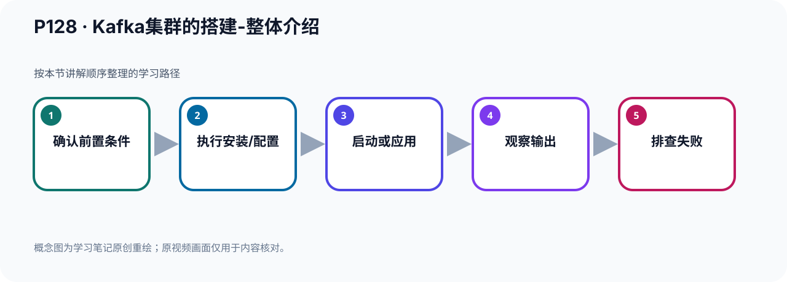

# P128：Kafka集群的搭建-整体介绍

> 笔记编号 128/156 · 时长 03:01 · [打开原视频 P128](https://www.bilibili.com/video/BV14J4m187jz?p=128)

[← P127: Kafka的Offset详解-消费者Offset代码演示总结](../08-storage-offsets/p127-Kafka的Offset详解-消费者Offset代码演示总结.md) · [返回本章](./README.md) · [P129: Kafka集群的搭建-准备3个Kafka →](../09-cluster-replication/p129-Kafka集群的搭建-准备3个Kafka.md)

## 先看结论

> 这节通过“Kafka集群的搭建-整体介绍”完成一条可验证的操作链：先核对前置条件，再执行配置或命令，最后用日志和运行结果确认环境真正可用。它服务于本章目标：搭建三节点集群，理解 Broker、Partition、Replica、ISR、LEO 与 HW 的协作关系。

## 老师怎么一步步讲

1. 第 1 步，围绕“Kafka集群的搭建-整体介绍”完成确认前置条件。
2. 第 2 步，围绕“Kafka集群的搭建-整体介绍”完成执行安装/配置。
3. 第 3 步，围绕“Kafka集群的搭建-整体介绍”完成启动或应用。
4. 第 4 步，围绕“Kafka集群的搭建-整体介绍”完成观察输出。
5. 第 5 步，围绕“Kafka集群的搭建-整体介绍”完成排查失败。

## 老师的补充说明

下面按原声顺序整理老师的完整讲解脉络。保留原因、案例、对比、操作过程、边界条件和口头提醒；删除重复语气词，并把长口语拆成适合阅读的短段落。

> 技术术语已经过统一校正；仍无法确认的人名或口头英文会保留原意，并通过右侧时间范围返回视频核对。

### 先明确：Kafka集群的搭建-整体介绍要解决什么 · 00:00–01:24

下面我们来看一下Kafka集群。关于Kafka集群我这里换了一张图。这张图我们打算在后面搭好集群之后我们再来解读。刚开始我们去解读的话，可能大家不是很好理解。我们先动作去搭单文之后再回过头来解读一下它集群。接下来我们开始去搭集群。那么Kafka集群有两种搭的方式。一种是基于ZooKeeper方式搭建集群，一种是基于KRaft的方式搭建集群。

集群就是我们搭多台Kafka，原来我们只有一个Kafka，是单机的Kafka，现在我们搭多个Kafka，比如说3个5个搭多个Kafka，这就是Kafka集群。两种方式，首先我们还是介绍基于ZooKeeper方式。这个是目前还是用的比较多的一种方式。KRaft方式是后面新出来的一种方式。先看ZooKeeper搭建方式。ZooKeeper搭建方式我们总结一下，就是三个步骤，三个步骤也非常简单，它搭起来还是很方便的。

第一步就是你去下载一个Kafka，它是一个压缩包，直接解压，解压之后你解压三份，就是我们解压三个Kafka，。

### 老师用例子进一步解释 · 01:25–02:24

相当于安装三个Kafka。

那么这里你可以搞三台机器，在每一台机器上安装一个Kafka，这是第一种办法，第一种办法就是我们在一台机器上，比如说我们在一个Nilio上，我搞三个Kafka，我解压三份Kafka，然后用不同的目录，用不同的端口，那么这个也可以，总之你要准备三个Kafka，或者是用三台机器，或者是在一台机器上安装三个Kafka，这样我们就可以搭建机群，这第一步，然后第二步来主要就是配一个文件，Kafka有个servo.pop的文件，第三步基本上就是测试的，启动然后测试，实际上我们基于ZooKeeper，这里面还有个搭建ZooKeeper机群，ZooKeeper机群属于ZooKeeper技术内容的范畴，所以这里我们就搭一个ZooKeeper，。

### 最后验证结果，并收束本节结论 · 02:24–02:58

ZooKeeper本身其实也需要搭个机群，那么关于ZooKeeper的机群，大家自己单独去搭建一下，我们这里要使用一个ZooKeeper，使用一个ZooKeeper，一手ZooKeeper机群也可以，那你搭三个ZooKeeper，那我们这里使用一个ZooKeeper，那我们就搭一个ZooKeeper，那么它的配置在我们Kamukka里面，就一个地址的问题，一个地址，你搭三个ZooKeeper，那你就写三个地址，你搭一个ZooKeeper，你写一个地址，所以区别很小，好，那么整体介绍我们介绍完了，下面我们就动手操作，动手去操作一下。

## 放进整套课

本节属于 **集群、副本机制与核心水位**。这一章要解决的是：搭建三节点集群，理解 Broker、Partition、Replica、ISR、LEO 与 HW 的协作关系。

这是一节动手课。不要只记命令，要把前置条件、操作步骤、关键参数和成功信号连成一条验证链。

### 记忆路线

```mermaid
flowchart LR
    N0["确认前置条件"]
    N1["执行安装/配置"]
    N0 --> N1
    N2["启动或应用"]
    N1 --> N2
    N3["观察输出"]
    N2 --> N3
    N4["排查失败"]
    N3 --> N4
```

## 用在工作里

| 项目 | 内容 |
|---|---|
| 先回答 | 先确认版本、目录、端口和依赖服务是否满足本节前置条件。 |
| 立刻做 | 按老师的顺序复现安装或配置，并记录每条命令的输入与输出。 |
| 留下证据 | 留下一份包含成功信号和失败排查过程的实验记录。 |

## 关键术语

- **Kafka：** Apache 开源的分布式事件流平台，常用于高吞吐消息传递、数据管道和流处理。
- **ZooKeeper：** 旧版 Kafka 用于集群元数据和控制器协调的外部服务。
- **KRaft：** Kafka 自带的 Raft 元数据仲裁模式，可在新架构中摆脱 ZooKeeper。

## 最容易踩的坑

只照抄命令而不核对当前目录、版本、端口和配置文件路径，最容易造成“命令没报错但服务不可用”。

## 自测

1. 不看笔记，用自己的话解释“Kafka集群的搭建-整体介绍”解决了什么问题。
2. 按顺序复述：确认前置条件、执行安装/配置、启动或应用、观察输出、排查失败。
3. 如果运行结果和老师不同，你会先检查哪三个输入或环境条件？

## 学完检查

- [ ] 我能不看视频复述本节完整思路
- [ ] 我能指出关键命令、配置、类或接口的作用
- [ ] 我能解释画面中的输入与输出为什么对应
- [ ] 我读完了老师的详细讲解正文，没有只看路线图和要点
- [ ] 我完成了本节自测或复现实验

## 需要核对原话时

[查看本节带时间戳的完整 ASR](./transcripts/p128-Kafka集群的搭建-整体介绍-ASR.md)。主笔记负责理解与实践；ASR 页面负责逐句完整性复核。
