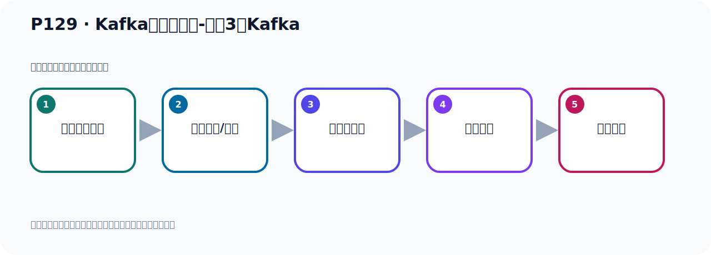

# P129：Kafka集群的搭建-准备3个Kafka

> 笔记编号 129/156 · 时长 03:37 · [打开原视频 P129](https://www.bilibili.com/video/BV14J4m187jz?p=129)

[← P128: Kafka集群的搭建-整体介绍](../09-cluster-replication/p128-Kafka集群的搭建-整体介绍.md) · [返回本章](./README.md) · [P130: Kafka集群的搭建-配置文件 →](../09-cluster-replication/p130-Kafka集群的搭建-配置文件.md)

## 这节到底讲什么

**核心主题：Kafka集群的搭建-准备3个Kafka。**

这是一节动手课。不要只记命令，要把前置条件、操作步骤、关键参数和成功信号连成一条验证链。
本节属于“集群、副本机制与核心水位”这一章；放在全章里看，它的作用是：搭建三节点集群，理解 Broker、Partition、Replica、ISR、LEO 与 HW 的协作关系。

## 本节路线

## 老师的完整讲解（按视频顺序校正）

> 下面保留老师的完整讲解顺序，并修正 Kafka、Java、ZooKeeper、
> Topic、Partition、Offset 等常见识别错误。它不是压缩摘要；原始 ASR 在后面单独保留。

### 1. 00:00–00:50

下面就开始搭建GigI UPUB的Kafka集群。第一步就是我们减压3个Kafka，准备3个Kafka。我这里打开训绩机。我训绩机其实我只有3个训绩机，我可以用这3个训绩机然后去搭，这也可以。我也可以在一个训绩机里面搭3个也可以，都可以。我现在只启动一个训绩机，我就在这个训绩机里面，这是个另一个训绩机，我在这里准备3个Kafka。我们通过这个工具连上去，连上去之后，我们去准备一下Kafka，Kafka在阿里，我们之前在这个硕物的下，你应该下了一个Kafka，最新版本的就是这个Kafka在这里，是吧？我们减压3个出来，。

### 2. 00:50–01:53

Tar-ZXVF，然后我们这个Kafka，然后下滑线2，先截到我们当前的这个木像，我们减减压，截一下，截到当前木像，好，截完了，截完了之后，我们得到这个不见夹，然后这不见夹，我们改个名字就MV，Kafka，然后下滑线，然后改个名字就Kafka，下滑线，更没1，这是我们第一个Kafka，对吧？好，没1，好，那我们到时Kafka都放了一个腿部下去，所以每移动一下，把这个移动下去，Kafka，下滑线，没1，更没1，没1，好，把移到UreLogo下去，好，移走了，现在在木像，没有了，没有了，没有之后我们再UreLogo下，。

### 3. 01:53–02:54

就有一个没1，我刚才为什么没有直接给它移过来呢？因为你直接把它移过来，你到时把我们之前的Kafka就冲突了，都是冲突覆盖了，把它弄冲突了，所以我们搞个新的，这是第一个，然后你再复制两份，Cp-RF，把它再复制两个，复制个0，2，3，我们这样就有三个Kafka了，它这个很简单，就复制一下，然后把它，我这个后面写错了，复制后面这一段写错了，那就复制一个0，1，把0，1复制一个0，2出来，复制一个叫0，2，复制了，复制了0，2，然后把0，1再复制个0，3，复制一个用Cp去复制，好，那现在我们的Kafka就有三份了，这些命令都是我们Midnix的一些基础车命令，。

### 4. 02:54–03:34

大家如果不会的话，你可以查一下，百度查一下，查一下什么意思，就复制，复制加个C，加RF，既可以复制目录，也可以复制文件，好，那这样的话，我就准备了三个Kafka，准备好了，那么这一步大家操作有没有问题，那么这一步的话，就是你对Midnix的命令只要熟悉一些，那么这一步操作，就是你把一个亚洲包给它解压三份，解压出来之后，然后复制三份，好，准备这三个Kafka，好，这一步就完成了，这是Kafka的，三个Kafka就准备好了，。

## 关键术语

- **Kafka：** Apache 开源的分布式事件流平台，常用于高吞吐消息传递、数据管道和流处理。

## 完整原声逐段记录

[查看本节带时间戳的本地 ASR](./transcripts/p129-Kafka集群的搭建-准备3个Kafka-ASR.md)。主笔记负责可读性和术语校正；ASR 页面负责完整性复核。

## 读完记住

- 本节主题是 **Kafka集群的搭建-准备3个Kafka**，它服务于本章目标：搭建三节点集群，理解 Broker、Partition、Replica、ISR、LEO 与 HW 的协作关系。
- 理解顺序是：确认前置条件 → 执行安装/配置 → 启动或应用 → 观察输出 → 排查失败。
- 学习时要同时核对老师的解释、画面中的配置/代码，以及最终运行结果。

## 最容易踩的坑

只照抄命令而不核对当前目录、版本、端口和配置文件路径，最容易造成“命令没报错但服务不可用”。

## 自测

1. 不看笔记，用自己的话解释“Kafka集群的搭建-准备3个Kafka”解决了什么问题。
2. 按顺序复述：确认前置条件、执行安装/配置、启动或应用、观察输出、排查失败。
3. 如果运行结果和老师不同，你会先检查哪三个输入或环境条件？

## 学完检查

- [ ] 我能不看视频复述本节完整思路
- [ ] 我能指出关键命令、配置、类或接口的作用
- [ ] 我能解释画面中的输入与输出为什么对应
- [ ] 我核对过完整 ASR，没有跳过老师的补充说明
- [ ] 我完成了本节自测或复现实验
