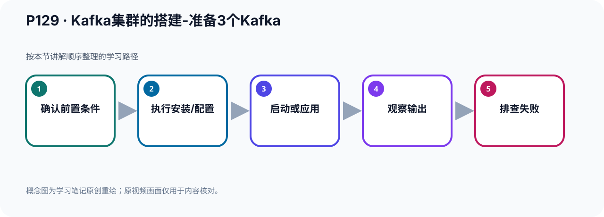

# P129：Kafka集群的搭建-准备3个Kafka

> 笔记编号 129/156 · 时长 03:37 · [打开原视频 P129](https://www.bilibili.com/video/BV14J4m187jz?p=129)

[← P128: Kafka集群的搭建-整体介绍](../09-cluster-replication/p128-Kafka集群的搭建-整体介绍.md) · [返回本章](./README.md) · [P130: Kafka集群的搭建-配置文件 →](../09-cluster-replication/p130-Kafka集群的搭建-配置文件.md)

## 先看结论

> 这节通过“Kafka集群的搭建-准备3个Kafka”完成一条可验证的操作链：先核对前置条件，再执行配置或命令，最后用日志和运行结果确认环境真正可用。它服务于本章目标：搭建三节点集群，理解 Broker、Partition、Replica、ISR、LEO 与 HW 的协作关系。

## 老师怎么一步步讲

1. 第 1 步，围绕“Kafka集群的搭建-准备3个Kafka”完成确认前置条件。
2. 第 2 步，围绕“Kafka集群的搭建-准备3个Kafka”完成执行安装/配置。
3. 第 3 步，围绕“Kafka集群的搭建-准备3个Kafka”完成启动或应用。
4. 第 4 步，围绕“Kafka集群的搭建-准备3个Kafka”完成观察输出。
5. 第 5 步，围绕“Kafka集群的搭建-准备3个Kafka”完成排查失败。

## 老师的补充说明

下面按原声顺序整理老师的完整讲解脉络。保留原因、案例、对比、操作过程、边界条件和口头提醒；删除重复语气词，并把长口语拆成适合阅读的短段落。

> 技术术语已经过统一校正；仍无法确认的人名或口头英文会保留原意，并通过右侧时间范围返回视频核对。

### 先明确：Kafka集群的搭建-准备3个Kafka要解决什么 · 00:00–01:28

下面就开始搭建GigI UPUB的Kafka集群。第一步就是我们减压3个Kafka，准备3个Kafka。我这里打开训绩机。我训绩机其实我只有3个训绩机，我可以用这3个训绩机然后去搭，这也可以。我也可以在一个训绩机里面搭3个也可以，都可以。我现在只启动一个训绩机，我就在这个训绩机里面，这是个另一个训绩机，我在这里准备3个Kafka。

我们通过这个工具连上去，连上去之后，我们去准备一下Kafka，Kafka在阿里，我们之前在这个硕物的下，你应该下了一个Kafka，最新版本的就是这个Kafka在这里，是吧？

我们减压3个出来，Tar-ZXVF，然后我们这个Kafka，然后下滑线2，先截到我们当前的这个木像，我们减减压，截一下，截到当前木像，好，截完了，截完了之后，我们得到这个不见夹，然后这不见夹，我们改个名字就MV，Kafka，然后下滑线，然后改个名字就Kafka，下滑线，更没1，这是我们第一个Kafka，对吧？

### 继续拆解执行安装/配置 · 01:28–02:34

没1，好，那我们到时Kafka都放了一个腿部下去，所以每移动一下，把这个移动下去，Kafka，下滑线，没1，更没1，没1，好，把移到UreLogo下去，好，移走了，现在在木像，没有了，没有了，没有之后我们再UreLogo下，就有一个没1，我刚才为什么没有直接给它移过来呢？

因为你直接把它移过来，你到时把我们之前的Kafka就冲突了，都是冲突覆盖了，把它弄冲突了，所以我们搞个新的，这是第一个，然后你再复制两份，Cp-RF，把它再复制两个，复制个0，2，3，我们这样就有三个Kafka了，它这个很简单，就复制一下，然后把它，我这个后面写错了，复制后面这一段写错了，那就复制一个0，1，。

### 最后验证结果，并收束本节结论 · 02:34–03:34

把0，1复制一个0，2出来，复制一个叫0，2，复制了，复制了0，2，然后把0，1再复制个0，3，复制一个用Cp去复制，好，那现在我们的Kafka就有三份了，这些命令都是我们Midnix的一些基础车命令，大家如果不会的话，你可以查一下，百度查一下，查一下什么意思，就复制，复制加个C，加RF，既可以复制目录，也可以复制文件，好，那这样的话，我就准备了三个Kafka，准备好了，那么这一步大家操作有没有问题，那么这一步的话，就是你对Midnix的命令只要熟悉一些，那么这一步操作，就是你把一个亚洲包给它解压三份，解压出来之后，然后复制三份，好，准备这三个Kafka，好，这一步就完成了，这是Kafka的，三个Kafka就准备好了，。

## 放进整套课

本节属于 **集群、副本机制与核心水位**。这一章要解决的是：搭建三节点集群，理解 Broker、Partition、Replica、ISR、LEO 与 HW 的协作关系。

这是一节动手课。不要只记命令，要把前置条件、操作步骤、关键参数和成功信号连成一条验证链。

### 记忆路线

```mermaid
flowchart LR
    N0["确认前置条件"]
    N1["执行安装/配置"]
    N0 --> N1
    N2["启动或应用"]
    N1 --> N2
    N3["观察输出"]
    N2 --> N3
    N4["排查失败"]
    N3 --> N4
```

## 用在工作里

| 项目 | 内容 |
|---|---|
| 先回答 | 先确认版本、目录、端口和依赖服务是否满足本节前置条件。 |
| 立刻做 | 按老师的顺序复现安装或配置，并记录每条命令的输入与输出。 |
| 留下证据 | 留下一份包含成功信号和失败排查过程的实验记录。 |

## 关键术语

- **Kafka：** Apache 开源的分布式事件流平台，常用于高吞吐消息传递、数据管道和流处理。

## 最容易踩的坑

只照抄命令而不核对当前目录、版本、端口和配置文件路径，最容易造成“命令没报错但服务不可用”。

## 自测

1. 不看笔记，用自己的话解释“Kafka集群的搭建-准备3个Kafka”解决了什么问题。
2. 按顺序复述：确认前置条件、执行安装/配置、启动或应用、观察输出、排查失败。
3. 如果运行结果和老师不同，你会先检查哪三个输入或环境条件？

## 学完检查

- [ ] 我能不看视频复述本节完整思路
- [ ] 我能指出关键命令、配置、类或接口的作用
- [ ] 我能解释画面中的输入与输出为什么对应
- [ ] 我读完了老师的详细讲解正文，没有只看路线图和要点
- [ ] 我完成了本节自测或复现实验

## 需要核对原话时

[查看本节带时间戳的完整 ASR](./transcripts/p129-Kafka集群的搭建-准备3个Kafka-ASR.md)。主笔记负责理解与实践；ASR 页面负责逐句完整性复核。
