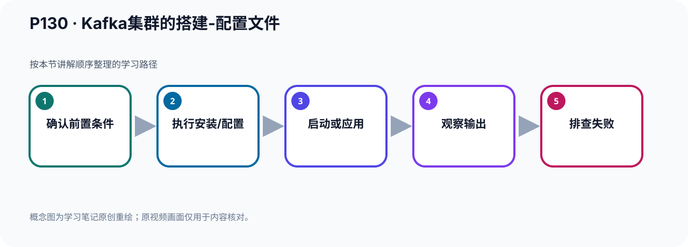

# P130：Kafka集群的搭建-配置文件

> 笔记编号 130/156 · 时长 06:27 · [打开原视频 P130](https://www.bilibili.com/video/BV14J4m187jz?p=130)

[← P129: Kafka集群的搭建-准备3个Kafka](../09-cluster-replication/p129-Kafka集群的搭建-准备3个Kafka.md) · [返回本章](./README.md) · [P131: Kafka集群的搭建-3台配置文件 →](../09-cluster-replication/p131-Kafka集群的搭建-3台配置文件.md)

## 先看结论

> 这节通过“Kafka集群的搭建-配置文件”完成一条可验证的操作链：先核对前置条件，再执行配置或命令，最后用日志和运行结果确认环境真正可用。它服务于本章目标：搭建三节点集群，理解 Broker、Partition、Replica、ISR、LEO 与 HW 的协作关系。

## 老师怎么一步步讲

1. 第 1 步，围绕“Kafka集群的搭建-配置文件”完成确认前置条件。
2. 第 2 步，围绕“Kafka集群的搭建-配置文件”完成执行安装/配置。
3. 第 3 步，围绕“Kafka集群的搭建-配置文件”完成启动或应用。
4. 第 4 步，围绕“Kafka集群的搭建-配置文件”完成观察输出。
5. 第 5 步，围绕“Kafka集群的搭建-配置文件”完成排查失败。

## 老师的补充说明

下面按原声顺序整理老师的完整讲解脉络。保留原因、案例、对比、操作过程、边界条件和口头提醒；删除重复语气词，并把长口语拆成适合阅读的短段落。

> 技术术语已经过统一校正；仍无法确认的人名或口头英文会保留原意，并通过右侧时间范围返回视频核对。

### 先明确：Kafka集群的搭建-配置文件要解决什么 · 00:00–00:48

3个Kafka准备好之后，接下来我们第二步就是配置Kafka。配置Kafka就是配它ServerProgram文件。这个配置我们看一下我们后面的PUT。有这么几步，我们看一下。首先我们这个3个Kafka，3个Kafka，它里面一个BrokerID，要给它一个不同的一个值。我们第一台倒是给个1，第二台给个2，第三台给个3。当然这个值只要不同就行，你倒是给个1、20、30，可以也可以。你给个100、200、300也可以。它们只要是有区分，ID不能重复就可以了。

这第一个，我们开始改这个配置文件，改这个Server点配置文件。

### 继续拆解执行安装/配置 · 00:48–01:29

打开，我们这个时候就准备一下。首先我们进入到这里面去。我们就Kafka-01进来。进来以后，在它呢，靠位置目录下，有一个Server点破的文件。配置文件，VMServer，打开这个文件。打回来之后，我们看一下，就在这里面一个ID。这个ID就是我们服务器给它取一个ID，ID不能重复。我们第一台，我们写个1，也可以写个100、200都行。只要区分析就可以了。这个配好了。

### 老师用例子进一步解释 · 01:29–02:29

那接下来我们就开始配第二个，第一个配好了。这个Proc，这个ID，它的取值范围是0到255之间，这个注意一下。不能起300，刚才我说300，0到255之间。它约定的，这个值在这个范围内，我看看它的重视里面有没有说明这一点。它必须是一个维的一个值，每个Proc有个维的值，它这里没有说明。没有说明它有一个约定，就是它里面的值在此0到255之间，取这个值就可以了。然后在第一步，第二步我们就开始配置这个三台的Listner，Listner就是它里面的这个AP这一段，AP这一段。

那么这段呢？这个就是我们先听到这个AP，那我们先0.0.0.0就行了。比如说你这个机上如果有多张网卡，那可能这个AP是变化的，所以我们在这一方面起来0.0.0。

### 对比不同情况，明确条件和边界 · 02:29–03:44

但是Listner就是这个，就这个配置下。我们复制一下，复制一下，然后这里加上。那我这些呢？0.0.0.0，好，这就是这一台，不好了。那么这一台呢？我给它端口来给它一个9091，在第一台我们9091，到第二台9092，第三台9093，去分一下。因为我们是在一台电脑上，所以我们要去分一下，所以我们第一台就是9091，改一下9091。9091，对吧？那这个配置啊。然后接下来，在三张里面要配一下Advice的Listner，那么这两台就配上你复制的真实IP，对外，共外界去访问的。

对吧？我们当时，客户通常要去访问它，那么通过这IP去访问，那么第一台是9091，第二台是9092。我们的IP是11.128，那我们的IP是11.128，那就是下面这个配置啊，改一下。那就是这个配置，它现在没有，我们需要自己人工具写一个，好，复制一下。

### 最后验证结果，并收束本节结论 · 03:45–06:21

那这一方呢，我们改上来就是，192.168.11.128，好，这个没这一台的啊，这个配好了。那这个就第一台就配好了，是吧？三台分别配置它吗？这配的，然后接下来我想走。

然后呢，第三步，就是配置那个消息存放的日志的路径，那么第一台我当时配在这里面来，后面加个杠9091，加个这个名字，好，那就配那个日志路径，日志路径在那里面，我想走一下，我想走一下，好，这个日志路径在这里吧，我们第一台，好，这个加个杠9091，那么第一台，好，这个配好了，然后然后就第四步了啊，这个配好了，然后第四步，第四步呢，我们要配这个如Kipa这个连接地址，那现在如Kipa我们倒是只装一台，所以我们倒是连接本地的人2181就可以了。

那这个是连接如Kipa地址，我想走一下，如Kipa地址，如Kipa，好，在里面，好，那我就连本地的，那本地它本来已经是多个HOST了，那没有问题，这不用动，不用改，这不用改就可以了。那连如Kipa，如果说你如Kipa是集群的话，那你这个地址就写三个，兜号分隔，兜号兜号分隔写三个，现在我们如Kipa只准备搭一个，那我们就写一个，一个AP端口，如果你写有三个如Kipa，你倒是兜号分隔写三个就可以了。

那这就好，我们这个文件就配好了，第一个机器的文件配好了，它总共配四个地方，对吧，博弯ID，然后这个监听的这个AP端口，然后对外公开的AP端口，然后呢，就是我们这个日志的路径，避免重复，所以每个这个服务器的日志路径要改一下，避免重复，991，这个992，这个应该是993这样，避免重复，好，第四个就是配一个如Kipa的地址，好，那我们就先把这个上面这个也让不举写出，因为这个日志都是写在这个幕下的，写在幕下的，到你重复的话，倒是相互覆盖了，这个日志没见相互覆盖了，出问题了，对吧，所以我们给它区分一下，好，那这样的话呢，我们第一台的servo.servo.pro的文件就配置好了，然后我们就把第二台第三台一次配置一下就可以了。

## 放进整套课

本节属于 **集群、副本机制与核心水位**。这一章要解决的是：搭建三节点集群，理解 Broker、Partition、Replica、ISR、LEO 与 HW 的协作关系。

这是一节动手课。不要只记命令，要把前置条件、操作步骤、关键参数和成功信号连成一条验证链。

### 记忆路线

```mermaid
flowchart LR
    N0["确认前置条件"]
    N1["执行安装/配置"]
    N0 --> N1
    N2["启动或应用"]
    N1 --> N2
    N3["观察输出"]
    N2 --> N3
    N4["排查失败"]
    N3 --> N4
```

## 用在工作里

| 项目 | 内容 |
|---|---|
| 先回答 | 先确认版本、目录、端口和依赖服务是否满足本节前置条件。 |
| 立刻做 | 按老师的顺序复现安装或配置，并记录每条命令的输入与输出。 |
| 留下证据 | 留下一份包含成功信号和失败排查过程的实验记录。 |

## 关键术语

- **Kafka：** Apache 开源的分布式事件流平台，常用于高吞吐消息传递、数据管道和流处理。
- **Broker：** 运行 Kafka 服务的节点；多个 Broker 组成 Kafka 集群。

## 最容易踩的坑

只照抄命令而不核对当前目录、版本、端口和配置文件路径，最容易造成“命令没报错但服务不可用”。

## 自测

1. 不看笔记，用自己的话解释“Kafka集群的搭建-配置文件”解决了什么问题。
2. 按顺序复述：确认前置条件、执行安装/配置、启动或应用、观察输出、排查失败。
3. 如果运行结果和老师不同，你会先检查哪三个输入或环境条件？

## 学完检查

- [ ] 我能不看视频复述本节完整思路
- [ ] 我能指出关键命令、配置、类或接口的作用
- [ ] 我能解释画面中的输入与输出为什么对应
- [ ] 我读完了老师的详细讲解正文，没有只看路线图和要点
- [ ] 我完成了本节自测或复现实验

## 需要核对原话时

[查看本节带时间戳的完整 ASR](./transcripts/p130-Kafka集群的搭建-配置文件-ASR.md)。主笔记负责理解与实践；ASR 页面负责逐句完整性复核。
