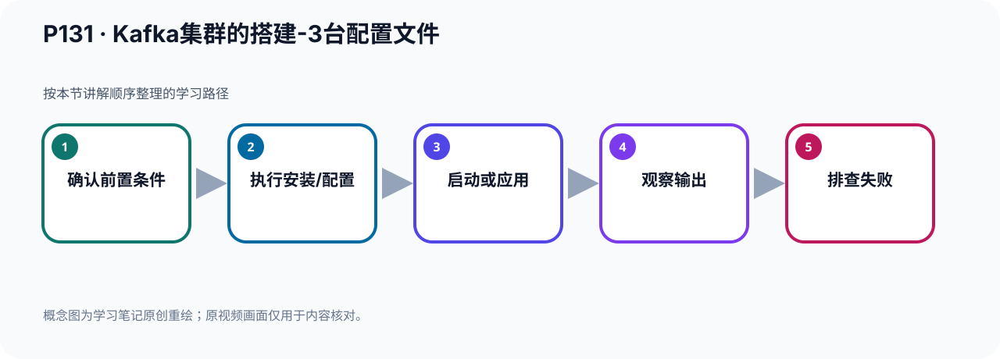

# P131：Kafka集群的搭建-3台配置文件

> 笔记编号 131/156 · 时长 05:43 · [打开原视频 P131](https://www.bilibili.com/video/BV14J4m187jz?p=131)

[← P130: Kafka集群的搭建-配置文件](../09-cluster-replication/p130-Kafka集群的搭建-配置文件.md) · [返回本章](./README.md) · [P132: Kafka集群的测试-运行Zookeeper →](../09-cluster-replication/p132-Kafka集群的测试-运行Zookeeper.md)

## 先看结论

> 这节通过“Kafka集群的搭建-3台配置文件”完成一条可验证的操作链：先核对前置条件，再执行配置或命令，最后用日志和运行结果确认环境真正可用。它服务于本章目标：搭建三节点集群，理解 Broker、Partition、Replica、ISR、LEO 与 HW 的协作关系。

## 老师怎么一步步讲

1. 第 1 步，围绕“Kafka集群的搭建-3台配置文件”完成确认前置条件。
2. 第 2 步，围绕“Kafka集群的搭建-3台配置文件”完成执行安装/配置。
3. 第 3 步，围绕“Kafka集群的搭建-3台配置文件”完成启动或应用。
4. 第 4 步，围绕“Kafka集群的搭建-3台配置文件”完成观察输出。
5. 第 5 步，围绕“Kafka集群的搭建-3台配置文件”完成排查失败。

## 老师的补充说明

下面按原声顺序整理老师的完整讲解脉络。保留原因、案例、对比、操作过程、边界条件和口头提醒；删除重复语气词，并把长口语拆成适合阅读的短段落。

> 技术术语已经过统一校正；仍无法确认的人名或口头英文会保留原意，并通过右侧时间范围返回视频核对。

### 先明确：Kafka集群的搭建-3台配置文件要解决什么 · 00:00–01:02

刚才我们配的是第一台，接下来我们把第二台和第三台也配置一下。那图呢也是这几个配置。第一台我们配置好之后呢，就给它保存一下。第一台保存。保存了。然后我们开始配第二台。第二台能退出第一台。那我进入到Kafka V2。这个目录下，进入Kafka V1的目录下。VM打开设备文件，也是要改这个地方。第一个就是VolkAD。那么第二台我们这里是2。再往下就它的AP。那我们就是复制一下这一段。那么它指示多少呢？就是0.0。0.0.0.0.0。我们第二台是9092，我们看一下。

第二台就一台9091，再9092。这要该活了。

### 继续拆解执行安装/配置 · 01:02–02:14

然后下面就是它那个对外公开的这个IP，把它修改一下。那我给修改了这几个人的，再操作一下。那我把它复制之后呢，然后在这个地方。三起来。那我们这里面写上真实的IP，192，168。这是IP，这样可以了。第三个地方就是看一下，我们这边刻进啊，这个改完了，然后就是这边改好了，对吧？好像就是那个日志目录，加上ZooKeeper。ZooKeeper这个呢，我们就一台机器，所以不用动了，就改一下日志目录就可以了。日志目录。那这个地方我们加一个杠，9092。

那么9092改好之后呢，我们第二台其实也就修改好了。那我们就保存一下，第二台就好了啊。然后改第三台，那我们修到第三台。

### 继续拆解启动或应用 · 02:14–03:26

Kafka杠03，就到抗防部落下。VM打开社会文件，打开。第三台，那我们这里写个3。AD13，好，然后它的。端口，接听端口。复制一下，在这个位置。那这里写上0.0.0.0。然后下面这个复制一份，然后改上。我上面这个0.0，这里边应该是9093啊，我们9093，啊，9093啊。这个沾一下，那么它也是9093。它写上真实的一题，192.168.11.128。这样我们就把它改好了。改好之后，下面是改那个日志的目录，这一部分呢，更9093。再往下就没有了，看一下。

没有了，就在几个地方啊，修改。修改好之后，保存一下，保存一下。

### 继续拆解观察输出 · 03:26–04:30

那我们这三个文件就改好了啊，改好之后啊，我们把这边这个字关一下，我们搞三个冲突啊，分别对应一下。对应一下，好，这三个，那我这个冲突关掉一个吧。那三个冲突啊，分别看一下。第一个冲突，有罗卡，Kafka，杠雷伊，这个里面进来。就能看不下，好，把它的这个文件再检查一下，看有没有问题啊。它这个2181没问题。这个日志，9091没问题，日志9091。这个地方其实还不对啊，这个地方是9092，这边应该是9091，幸好我检查一下，这是9091。这边也是9091。

在我上，它是1，这边是1没问题。这是1，好，第一台是没问题的，我们检查一下。然后第二台，我们在这里去打开啊。那就是有罗卡，Kafka，杠雷伊，。

### 最后验证结果，并收束本节结论 · 04:30–05:40

卡废格目录下，好，这里面是VM打开，稍微文件，打开，好，它这是9092，这个没问题啊，在我上呢，好，9092，9092没问题。在我上，它是1，好，这台是正常的没问题。然后我们在第三台上再检查一下，看有没有问题。用着罗卡，Kafka，杠雷伊3，好，进入到康复目录下，VM，稍微把这个文件打开，打开，它这方是9093，好，正常的没问题。然后我下呢，啊，我下就没有了，我下就Kafka，是吧，啊，我下就RuCube，啊，RuCube，没问题。这是9093，啊，9093没问题。

在9093，9093，然后上面的AD是3，好，那我们这块呢，都好了，好，都好了，保存一下。那这样的话，我这三台卡复卡呢，按照我们这四个配置项，就给它改好了啊，总共有四个地方需要配，一二三四，四个地方，好，全部改好了，那我们的三个卡复卡的配置就准备好了。

## 放进整套课

本节属于 **集群、副本机制与核心水位**。这一章要解决的是：搭建三节点集群，理解 Broker、Partition、Replica、ISR、LEO 与 HW 的协作关系。

这是一节动手课。不要只记命令，要把前置条件、操作步骤、关键参数和成功信号连成一条验证链。

### 记忆路线

```mermaid
flowchart LR
    N0["确认前置条件"]
    N1["执行安装/配置"]
    N0 --> N1
    N2["启动或应用"]
    N1 --> N2
    N3["观察输出"]
    N2 --> N3
    N4["排查失败"]
    N3 --> N4
```

## 用在工作里

| 项目 | 内容 |
|---|---|
| 先回答 | 先确认版本、目录、端口和依赖服务是否满足本节前置条件。 |
| 立刻做 | 按老师的顺序复现安装或配置，并记录每条命令的输入与输出。 |
| 留下证据 | 留下一份包含成功信号和失败排查过程的实验记录。 |

## 关键术语

- **Kafka：** Apache 开源的分布式事件流平台，常用于高吞吐消息传递、数据管道和流处理。
- **ZooKeeper：** 旧版 Kafka 用于集群元数据和控制器协调的外部服务。

## 最容易踩的坑

只照抄命令而不核对当前目录、版本、端口和配置文件路径，最容易造成“命令没报错但服务不可用”。

## 自测

1. 不看笔记，用自己的话解释“Kafka集群的搭建-3台配置文件”解决了什么问题。
2. 按顺序复述：确认前置条件、执行安装/配置、启动或应用、观察输出、排查失败。
3. 如果运行结果和老师不同，你会先检查哪三个输入或环境条件？

## 学完检查

- [ ] 我能不看视频复述本节完整思路
- [ ] 我能指出关键命令、配置、类或接口的作用
- [ ] 我能解释画面中的输入与输出为什么对应
- [ ] 我读完了老师的详细讲解正文，没有只看路线图和要点
- [ ] 我完成了本节自测或复现实验

## 需要核对原话时

[查看本节带时间戳的完整 ASR](./transcripts/p131-Kafka集群的搭建-3台配置文件-ASR.md)。主笔记负责理解与实践；ASR 页面负责逐句完整性复核。
