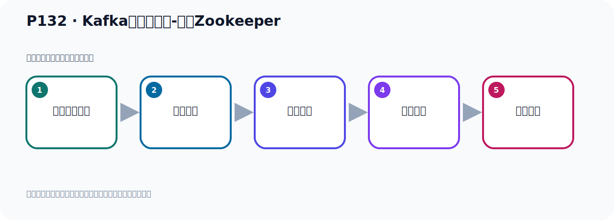

# P132：Kafka集群的测试-运行Zookeeper

> 笔记编号 132/156 · 时长 05:47 · [打开原视频 P132](https://www.bilibili.com/video/BV14J4m187jz?p=132)

[← P131: Kafka集群的搭建-3台配置文件](../09-cluster-replication/p131-Kafka集群的搭建-3台配置文件.md) · [返回本章](./README.md) · [P133: Kafka集群的测试-运行3台Kafka →](../09-cluster-replication/p133-Kafka集群的测试-运行3台Kafka.md)

## 这节到底讲什么

**核心主题：Kafka集群的测试-运行Zookeeper。**

这节用实验验证前面的配置或机制。重点是记录输入、预期、实际输出，以及两者不一致时如何定位。
本节属于“集群、副本机制与核心水位”这一章；放在全章里看，它的作用是：搭建三节点集群，理解 Broker、Partition、Replica、ISR、LEO 与 HW 的协作关系。

## 本节路线

## 老师的完整讲解（按视频顺序校正）

> 下面保留老师的完整讲解顺序，并修正 Kafka、Java、ZooKeeper、
> Topic、Partition、Offset 等常见识别错误。它不是压缩摘要；原始 ASR 在后面单独保留。

### 1. 00:00–00:53

前面就把Kafka配置三台都配完了。配完之后，下面就向于开始启动测试。测试之前，首先我们要启动个ZooKeeper。ZooKeeper是单台的，我们只准备一个ZooKeeper。ZooKeeper我们之前在电脑上已经安送过的，在我们课件的前面，前面的课程中已经介绍过安装。现在我们去启动它，好，那我们去操作，那就回到我们这个地方。首先我们在ZooKeeper，我们在这里，开个窗口，我们看一下在UserLocker目的下，我们之前单独安装ZooKeeper，就是这里，单独安装ZooKeeper。我这一方有个这个东西，给它删一下，。

### 2. 00:54–01:47

有个这个目的删一下，好，现在正常了，删上，那我们这里有个ZooKeeper在这里，好，我们进去，ZooKeeperbin 目录下，进来，然后在这里去启动ZooKeeper，这个ZooKeeper之前是准备好的，那我们在这里ZK，SR，点SH，然后来Start，好，这就是启动ZooKeeper，那我们这次回车，好，回到之后我们PS查一下，那么ZooKeeper就启动好了，PS，然后ZooKeeper，Z，OK，好，ZooKeeper有了，ZooKeeper有以后，我们通过这个工具先联想，看这个ZooKeeper正不正常，那我们在这里，在我们india这边可以联想，点这里，。

### 3. 01:47–02:35

点这里我们点一下这个设置，编辑上设置，好，那我们ZooKeeper是这个IPG然后这个端口，没问题，这个IPG然后这个端口，好，我们点一下测试一下，看能不能点下去，可以点下去，好，我们点一下OK，OK，那这个OK，我们到这个ZooKeeper，它的端口多少呢，这个管理端口，管理端口我们之前我记得好像是809级，我看一下，那ZooKeeper在它的配置面键中，在这个CountFM目录下，是吧，它一个Roo点CF基本键，打开，这是管理端口，是9089，都没换一下，9089，好，这是管理端口，9089，那我们这里写一个9089，好，这样，应用一下，。

### 4. 02:36–03:35

那这是我们的年纪，没问题，OK，好，那现在我们在这里面点一下刷新，看它里面有没有东西呢，它里面现在有这些信息，它里面有Block，然后有Topic，这应该是之前的，这边有些Topic，我们看看把之前这个Topic我们给删掉一下，我们弄个干净的，那我这里可以删一下，点删除，删掉，然后呢，这个Block里面这个Topic我们删一下，看能不能全部选择一下的删掉，它不能一个个删，那我们只能，不能批掉删我们只能一个个删，这个删掉，决定，好，然后这个删一下，不要有这些Topic，我们弄个干净的，Block，Topic，哈乐，这个，这是之前产生的一些Topic，之前我们连过这个这个ZooKeeper，。

### 5. 03:39–04:30

或者说这样太慢，我们可以怎么办呢，有一个快捷办法，去删这个数据，是有个快捷办法，我们保证这个文件保存，有什么快捷办法呢，首先把ZooKeeper给关掉，先关一下ZTAS server，点SH，然后是锣补，关掉，好，先把ZooKeeper关掉了，偏是查一下，偏是查一下，没有了，对吧，然后它的这个信息实际上，你可以看配置文件，我们看一下CAD ROOT，这个点CFG文件，它那个信息是存在哪里的，它是存在这个目录下的，你把这个目录下数据给删了，它其实就删掉了，把这些东西删掉，我们现在进入这个目录看一下，因为它数据是存放在这个目录的，ZooKeeper它存放在这里的，。

### 6. 04:30–05:27

好，那我们进入这个目录看一下，对吧，那里面有什么VoC2，其实把它删掉，那么信息就干净了，把它删掉一下，好，删掉了对吧，好，删掉之后，我们再进入ZooKeeper里面去，那这个是ZooKeeper就是个干净的，并不下，我们再来启动，刚才我已经把它关了，我现在启动一下，是大桃，好，是大桃，启动，好，启动了，偏是查一下，启动对吧，启动以后我们再扣弯，再去联一下，这边去联一下，好，我这边可以刷新一下，刷新，刷新，刷新之后你发现这里面干净的，就剩一个原来它里面墨镇的节点，我们ZooKeeper是3.9.2，就是这一个了，就没有之前那些东西的，好，。

### 7. 05:27–05:44

这样我们就比较干净，干净ZooKeeper，好，那这样我们的ZooKeeper就给它启动并且准备好了，ZooKeeper的启动和准废，那么这个之前我们安装好的，所以我们启动一下就可以了，把自己的粒子信息给删一下，然后启动，好，那接下来我们一起弄卡卡，。

## 关键术语

- **Kafka：** Apache 开源的分布式事件流平台，常用于高吞吐消息传递、数据管道和流处理。
- **Topic：** 事件的逻辑分类。生产者向 Topic 写数据，消费者从 Topic 读取数据。
- **ZooKeeper：** 旧版 Kafka 用于集群元数据和控制器协调的外部服务。

## 完整原声逐段记录

[查看本节带时间戳的本地 ASR](./transcripts/p132-Kafka集群的测试-运行Zookeeper-ASR.md)。主笔记负责可读性和术语校正；ASR 页面负责完整性复核。

## 读完记住

- 本节主题是 **Kafka集群的测试-运行Zookeeper**，它服务于本章目标：搭建三节点集群，理解 Broker、Partition、Replica、ISR、LEO 与 HW 的协作关系。
- 理解顺序是：准备测试条件 → 执行操作 → 读取结果 → 对照预期 → 形成结论。
- 学习时要同时核对老师的解释、画面中的配置/代码，以及最终运行结果。

## 最容易踩的坑

测试前残留的 Topic、Offset、缓存或旧进程会污染结果；每次实验都要先确认初始状态。

## 自测

1. 不看笔记，用自己的话解释“Kafka集群的测试-运行Zookeeper”解决了什么问题。
2. 按顺序复述：准备测试条件、执行操作、读取结果、对照预期、形成结论。
3. 如果运行结果和老师不同，你会先检查哪三个输入或环境条件？

## 学完检查

- [ ] 我能不看视频复述本节完整思路
- [ ] 我能指出关键命令、配置、类或接口的作用
- [ ] 我能解释画面中的输入与输出为什么对应
- [ ] 我核对过完整 ASR，没有跳过老师的补充说明
- [ ] 我完成了本节自测或复现实验
