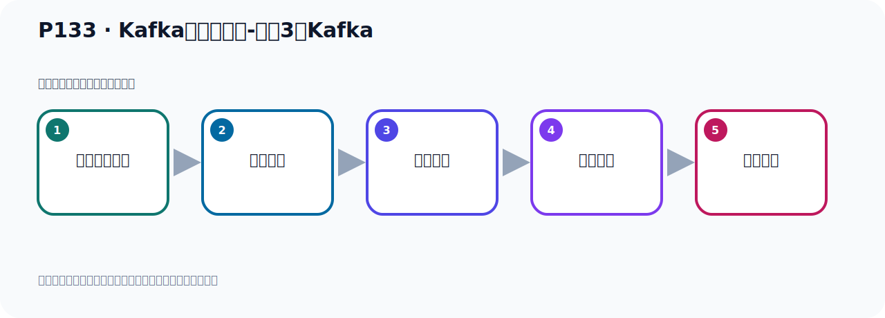

# P133：Kafka集群的测试-运行3台Kafka

> 笔记编号 133/156 · 时长 04:29 · [打开原视频 P133](https://www.bilibili.com/video/BV14J4m187jz?p=133)

[← P132: Kafka集群的测试-运行Zookeeper](../09-cluster-replication/p132-Kafka集群的测试-运行Zookeeper.md) · [返回本章](./README.md) · [P134: Kafka集群的测试-SpringBoot连接集群Kafka →](../09-cluster-replication/p134-Kafka集群的测试-SpringBoot连接集群Kafka.md)

## 这节到底讲什么

**核心主题：Kafka集群的测试-运行3台Kafka。**

这节用实验验证前面的配置或机制。重点是记录输入、预期、实际输出，以及两者不一致时如何定位。
本节属于“集群、副本机制与核心水位”这一章；放在全章里看，它的作用是：搭建三节点集群，理解 Broker、Partition、Replica、ISR、LEO 与 HW 的协作关系。

## 本节路线

## 老师的完整讲解顺序（ASR 辅助复核）

> 下面按时间顺序保留经过基础术语替换的 ASR，方便核对老师是否提到某个细节。
> 人名、命令、代码和英文参数仍可能识别错误；准确结论以本节白话说明、代码块和实操速查表为准。

### 1. 00:00–00:57

我们的ZooKeeper启动好之后，我们下面就开始启动我们这个三个Kafka。那就分别切换到它的并不录像，启动这个命令去启动。那下面就去操作，那我们在这里呢。这第一台我们看一下目录吧。这人一是第一台。第一台那么启动，那就是ZK，不是ZK，Kafka、Server、S start。跟上一台目录下的config下的Server配置文件。再我们启动，回车就启动了。启动之后我们看一下它有没有把那个存放数据的目录创建好。TMP下有没有创建的目录来看一下。它创建的这个存放数据的目录已经创建了。那就没有问题，可以了。第一台启动没报错，然后第二台。

### 2. 00:57–01:58

看一下目录，再点二没问题。然后我们也试一下，Kafka、Server、S start。上一台目录下config、Server、配置文件启动。好，这是第二台，然后启动也是正常的，你看没有报错，是吧？上面这个是它的一个配置信息，这个地方不是错误，这是配置信息。你看这是一个config values，好，左边，这是右边，好，第三台，看第三台。第三台再点没问题，好，那我们就是Kafka、Server、S start。上一台目录下config、Server、配置文件，好，启动。三台，那这的话我们这个三台配置文件，它就启动好了，三个Kafka就启动好了，好，启动好了。

### 3. 01:58–02:44

启动之后，我们可以通过工具给它连上去，就像ZooKeeper一样，我们可以连一下试一下，对吧？那就在我们这边用工具连一下，之前这次连了ZooKeeper，我们这个时候，它启动之后，我们看ZooKeeper有没有什么变化刷新一下，这个时候你看ZooKeeper里边会多些信息，它之前只有一个这个节点，那么这些都是新增的，这些，这些叫元数据，这些，它下面有这个元数的信息，这些值这些，好，这是我们这个强制后的一个效果，一个情况，这样子，集群的ID，那有这些信息啊，block有这些信息，好的，密，好，那现在我们就是这是ZooKeeper的一个情况，这样的，。

### 4. 02:44–03:34

然后我们接下来在这个地方连一下Kafka，那这里可以连一下啊，要Kafka，我们之前的那个历史的Kafka，我已经给它关了，那个已经关了，这个应该不用开它了，我们已经关掉了，我们现在在点个新的，点创建新连接，那我们这个怎么连呢，我们可能是连一个，可能是这个地方是192.168.11.128，好，这个是名字，这个名字随便写啊，我们以端口为名字啊，好，最多是下面这个地方，这第一台是991，991是吧，991，好，那我们点一下这个这个测试，看里面的连续去测一下，它这个提示连成功，好，第一台连上去了，点一下OK，好，那么第一台，第一台里面刷新一下，目前里面是没有信息的啊，没有Topic，没有信息，好，那么第二台第三台你可以分别去连一下，都可以，。

### 5. 03:35–04:25

点一下，好，第二台呢，我们再点一下，点一下那么992，这个端口992，992，好，点测试，连上去了，连成功了，这边显示这个成功啊，也要去了，好，我们OK一下，这第二台，第二台刷新一下，目前没有Topic，然后点，这点第三台，那么再写一下，第三台993，那993，然后再点测试，连上去了，OK，好，那么这就是我们三台啊，那么三台，三台的这个，这个Kafka，我们都给它连上去了，连上去了，目前里面是没有信息的啊，没有信息的，好，那我们这样的话呢，我们相与于把这个，棘取的一个环境，就给它，起了好了，那下一步呢，就是我们去测试这个环境，是不是能够正常运行，。

## 关键术语

- **Kafka：** Apache 开源的分布式事件流平台，常用于高吞吐消息传递、数据管道和流处理。
- **Topic：** 事件的逻辑分类。生产者向 Topic 写数据，消费者从 Topic 读取数据。
- **ZooKeeper：** 旧版 Kafka 用于集群元数据和控制器协调的外部服务。

## 完整原声逐段记录

[查看本节带时间戳的本地 ASR](./transcripts/p133-Kafka集群的测试-运行3台Kafka-ASR.md)。主笔记负责可读性和术语校正；ASR 页面负责完整性复核。

## 读完记住

- 本节主题是 **Kafka集群的测试-运行3台Kafka**，它服务于本章目标：搭建三节点集群，理解 Broker、Partition、Replica、ISR、LEO 与 HW 的协作关系。
- 理解顺序是：准备测试条件 → 执行操作 → 读取结果 → 对照预期 → 形成结论。
- 学习时要同时核对老师的解释、画面中的配置/代码，以及最终运行结果。

## 最容易踩的坑

测试前残留的 Topic、Offset、缓存或旧进程会污染结果；每次实验都要先确认初始状态。

## 自测

1. 不看笔记，用自己的话解释“Kafka集群的测试-运行3台Kafka”解决了什么问题。
2. 按顺序复述：准备测试条件、执行操作、读取结果、对照预期、形成结论。
3. 如果运行结果和老师不同，你会先检查哪三个输入或环境条件？

## 学完检查

- [ ] 我能不看视频复述本节完整思路
- [ ] 我能指出关键命令、配置、类或接口的作用
- [ ] 我能解释画面中的输入与输出为什么对应
- [ ] 我核对过完整 ASR，没有跳过老师的补充说明
- [ ] 我完成了本节自测或复现实验
