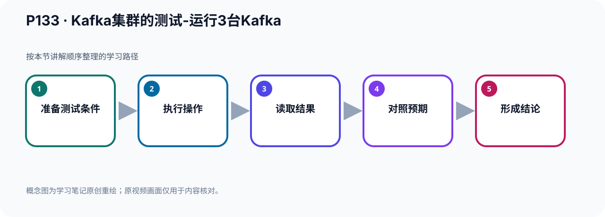

# P133：Kafka集群的测试-运行3台Kafka

> 笔记编号 133/156 · 时长 04:29 · [打开原视频 P133](https://www.bilibili.com/video/BV14J4m187jz?p=133)

[← P132: Kafka集群的测试-运行Zookeeper](../09-cluster-replication/p132-Kafka集群的测试-运行Zookeeper.md) · [返回本章](./README.md) · [P134: Kafka集群的测试-SpringBoot连接集群Kafka →](../09-cluster-replication/p134-Kafka集群的测试-SpringBoot连接集群Kafka.md)

## 先看结论

> 这节围绕“Kafka集群的测试-运行3台Kafka”做实验验证，重点不是看见一次成功，而是说清输入、预期、实际输出以及不一致时的排查顺序。它服务于本章目标：搭建三节点集群，理解 Broker、Partition、Replica、ISR、LEO 与 HW 的协作关系。

## 老师怎么一步步讲

1. 第 1 步，围绕“Kafka集群的测试-运行3台Kafka”完成准备测试条件。
2. 第 2 步，围绕“Kafka集群的测试-运行3台Kafka”完成执行操作。
3. 第 3 步，围绕“Kafka集群的测试-运行3台Kafka”完成读取结果。
4. 第 4 步，围绕“Kafka集群的测试-运行3台Kafka”完成对照预期。
5. 第 5 步，围绕“Kafka集群的测试-运行3台Kafka”完成形成结论。

## 老师的补充说明

下面按原声顺序整理老师的完整讲解脉络。保留原因、案例、对比、操作过程、边界条件和口头提醒；删除重复语气词，并把长口语拆成适合阅读的短段落。

> 技术术语已经过统一校正；仍无法确认的人名或口头英文会保留原意，并通过右侧时间范围返回视频核对。

### 先明确：Kafka集群的测试-运行3台Kafka要解决什么 · 00:00–00:45

我们的ZooKeeper启动好之后，我们下面就开始启动我们这个三个Kafka。那就分别切换到它的并不录像，启动这个命令去启动。那下面就去操作，那我们在这里呢。这第一台我们看一下目录吧。这人一是第一台。第一台那么启动，那就是ZK，不是ZK，Kafka、Server、S start。跟上一台目录下的config下的Server配置文件。再我们启动，回车就启动了。启动之后我们看一下它有没有把那个存放数据的目录创建好。

### 跟着老师操作，并观察运行结果 · 00:45–01:21

TMP下有没有创建的目录来看一下。它创建的这个存放数据的目录已经创建了。那就没有问题，可以了。第一台启动没报错，然后第二台。看一下目录，再点二没问题。然后我们也试一下，Kafka、Server、S start。上一台目录下config、Server、配置文件启动。这是第二台，然后启动也是正常的，你看没有报错，是吧？上面这个是它的一个配置信息，这个地方不是错误，这是配置信息。

### 跟着老师操作，并观察运行结果 · 01:22–02:44

你看这是一个config values，好，左边，这是右边，好，第三台，看第三台。第三台再点没问题，好，那我们就是Kafka、Server、S start。上一台目录下config、Server、配置文件，好，启动。三台，那这的话我们这个三台配置文件，它就启动好了，三个Kafka就启动好了，好，启动好了。启动之后，我们可以通过工具给它连上去，就像ZooKeeper一样，我们可以连一下试一下，对吧？

那就在我们这边用工具连一下，之前这次连了ZooKeeper，我们这个时候，它启动之后，我们看ZooKeeper有没有什么变化刷新一下，这个时候你看ZooKeeper里边会多些信息，它之前只有一个这个节点，那么这些都是新增的，这些，这些叫元数据，这些，它下面有这个元数的信息，这些值这些，好，这是我们这个强制后的一个效果，一个情况，这样子，集群的ID，那有这些信息啊，block有这些信息，好的，密，好，那现在我们就是这是ZooKeeper的一个情况，这样的，。

### 最后验证结果，并收束本节结论 · 02:44–04:25

然后我们接下来在这个地方连一下Kafka，那这里可以连一下啊，要Kafka，我们之前的那个--listKafka，我已经给它关了，那个已经关了，这个应该不用开它了，我们已经关掉了，我们现在在点个新的，点创建新连接，那我们这个怎么连呢，我们可能是连一个，可能是这个地方是192.168.11.128，好，这个是名字，这个名字随便写啊，我们以端口为名字啊，好，最多是下面这个地方，这第一台是991，991是吧，991，好，那我们点一下这个这个测试，看里面的连续去测一下，它这个提示连成功，好，第一台连上去了，点一下OK，好，那么第一台，第一台里面刷新一下，目前里面是没有信息的啊，没有Topic，没有信息，好，那么第二台第三台你可以分别去连一下，都可以，点一下，好，第二台呢，我们再点一下，点一下那么992，这个端口992，

992，好，点测试，连上去了，连成功了，这边显示这个成功啊，也要去了，好，我们OK一下，这第二台，第二台刷新一下，目前没有Topic，然后点，这点第三台，那么再写一下，第三台993，那993，然后再点测试，连上去了，OK，好，那么这就是我们三台啊，那么三台，三台的这个，这个Kafka，我们都给它连上去了，连上去了，目前里面是没有信息的啊，没有信息的，好，那我们这样的话呢，我们相与于把这个，棘取的一个环境，就给它，起了好了，那下一步呢，就是我们去测试这个环境，是不是能够正常运行，。

## 放进整套课

本节属于 **集群、副本机制与核心水位**。这一章要解决的是：搭建三节点集群，理解 Broker、Partition、Replica、ISR、LEO 与 HW 的协作关系。

这节用实验验证前面的配置或机制。重点是记录输入、预期、实际输出，以及两者不一致时如何定位。

### 记忆路线

```mermaid
flowchart LR
    N0["准备测试条件"]
    N1["执行操作"]
    N0 --> N1
    N2["读取结果"]
    N1 --> N2
    N3["对照预期"]
    N2 --> N3
    N4["形成结论"]
    N3 --> N4
```

## 用在工作里

| 项目 | 内容 |
|---|---|
| 先回答 | 先写下测试输入、前置状态和预期结果。 |
| 立刻做 | 执行测试并同时观察日志、Topic、Partition 与 Offset 变化。 |
| 留下证据 | 留下实际结果、差异原因和重新验证的证据。 |

## 关键术语

- **Kafka：** Apache 开源的分布式事件流平台，常用于高吞吐消息传递、数据管道和流处理。
- **Topic：** 事件的逻辑分类。生产者向 Topic 写数据，消费者从 Topic 读取数据。
- **ZooKeeper：** 旧版 Kafka 用于集群元数据和控制器协调的外部服务。

## 最容易踩的坑

测试前残留的 Topic、Offset、缓存或旧进程会污染结果；每次实验都要先确认初始状态。

## 自测

1. 不看笔记，用自己的话解释“Kafka集群的测试-运行3台Kafka”解决了什么问题。
2. 按顺序复述：准备测试条件、执行操作、读取结果、对照预期、形成结论。
3. 如果运行结果和老师不同，你会先检查哪三个输入或环境条件？

## 学完检查

- [ ] 我能不看视频复述本节完整思路
- [ ] 我能指出关键命令、配置、类或接口的作用
- [ ] 我能解释画面中的输入与输出为什么对应
- [ ] 我读完了老师的详细讲解正文，没有只看路线图和要点
- [ ] 我完成了本节自测或复现实验

## 需要核对原话时

[查看本节带时间戳的完整 ASR](./transcripts/p133-Kafka集群的测试-运行3台Kafka-ASR.md)。主笔记负责理解与实践；ASR 页面负责逐句完整性复核。
