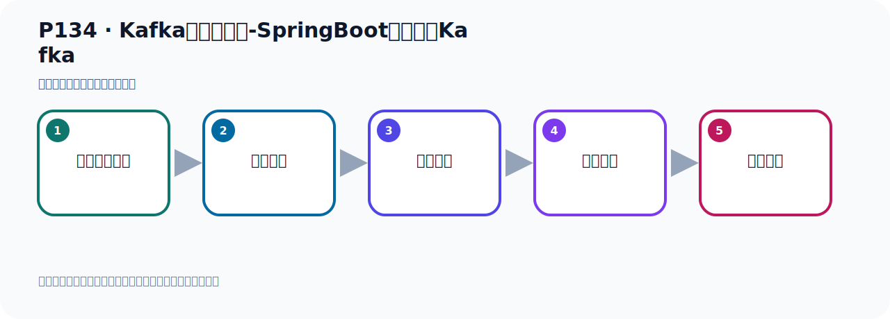

# P134：Kafka集群的测试-SpringBoot连接集群Kafka

> 笔记编号 134/156 · 时长 06:36 · [打开原视频 P134](https://www.bilibili.com/video/BV14J4m187jz?p=134)

[← P133: Kafka集群的测试-运行3台Kafka](../09-cluster-replication/p133-Kafka集群的测试-运行3台Kafka.md) · [返回本章](./README.md) · [P135: Kafka集群的测试-SpringBoot连接集群Kafka收发消息 →](../09-cluster-replication/p135-Kafka集群的测试-SpringBoot连接集群Kafka收发消息.md)

## 这节到底讲什么

**核心主题：Kafka集群的测试-SpringBoot连接集群Kafka。**

这节用实验验证前面的配置或机制。重点是记录输入、预期、实际输出，以及两者不一致时如何定位。
本节属于“集群、副本机制与核心水位”这一章；放在全章里看，它的作用是：搭建三节点集群，理解 Broker、Partition、Replica、ISR、LEO 与 HW 的协作关系。

## 本节路线

## 老师的完整讲解（按视频顺序校正）

> 下面保留老师的完整讲解顺序，并修正 Kafka、Java、ZooKeeper、
> Topic、Partition、Offset 等常见识别错误。它不是压缩摘要；原始 ASR 在后面单独保留。

### 1. 00:00–01:06

我们的Kafka环境已经启动好了。好，下面就去测试。在测试之前，我们可以看一下启动好的Kafka环境。这是第一台，你可以看到它里面其实有一个集群的AD。在这一堆配置的上面。它有一个集群AD，就是ClustAD。就是01H3ZGG，这个AD，这是集群的AD。那么三台集群AD，它的集群AD都是相同的。它们在一个集群，它有个统一的AD，这是集群AD。这第一台是这个字。那么第二台的话，它也是这个字。我们在这边可以看一下。第二台，第二台看这里的也是01H3ZGG，也是这个字。第三台，第三台这一台也是这个字。第三台，第三台里面是01H3ZGG。

### 2. 01:06–02:04

它们的集群AD是同一个，说明它们在一个集合中，在一个集群中。如果它不相同，那么它不在一个集群中。同时我们可以通过Rukibo这边，也可以看到。Rukibo这边它有个叫Clust，然后里面有个AD。这个AD的字也是01H3ZGG，也是这个字。它们三台Kafka是在一个集群中，通过这个可以判断一下。下面我们去连接测试一下我们这个Kafka集群，我们就在这里写个代码，要随步的程序连接我们的Kafka，三台的集群Kafka。这个是我们写个08这个程序。我们连一下，在这里我们把它给了三条，然后破文件把它里面的名字改一下，改了08，替换成08，替换一下。

### 3. 02:06–03:04

替换完之后，我们把破文件它里面也有个名字也改一下，这个破文件从这个名字改成08，好，改完了，把破文文件然后天间我们完成，刚才是这个属性文件改一下，好，改完之后，现在我们去连Kafka的时候，我们这个地方怎么办呢？之前是单台这样去连的，这个服务器地址可以写一个list，它里面是传一个list，这个属性点进去，它上面有个说明，就是一个iP加端口，一个iP加端口到一个list，豆河分隔，所以可以写多个，那就是我们豆河分隔，第一台我们是9091，因为豆河，那第二台是92，那是93，9293，好，那么这是93，然后这是92，好，92，。

### 4. 03:04–03:53

那这样的话我们就是连到这个Kafka机取上去了，好，然后我们这个接近器什么什么手动模式这个我先不要，我们自动让它确认吧，不要这个了，好，然后接下来我们就干本了，我们就去项目求之后，我们去创建一个这个主题，我们看看它能不能创建多个副本，因为我们知道我们创建副本的时候，你如果只有一个节点，你只能创建一个副本，如果你用三个节点，那应该可以创建三个副本，我们一起可以写个3，对吧，好，那这是我们从之前这边考虑一个配置类，配类，好，复制一下这个配置类，然后沾到这里，沾过来，好，这个配置类对吧，这个配置类我们看一下，我们写一个Topic可，。

### 5. 03:53–04:48

比如说我们叫Kanas的集群Topic可，这个名字，那我们这个分区数，分区数我们是给它三分吧，然后最多是这个副本数，我们删三个节点给它三，之前我们说你给个大于1的值，它是会报错的，对不对，我们之前课程中记得过，我们可以看一下，大概在前面我们找找那个当时我记得有一个地方给它也测试过，证明你看，设置副本个数不能为雷，也不能大于几点个数，否则将不能创建Topic可，当时有这么一句话，好，我们可以在这里写一下了，是吧，你设置副本个数你不能是雷，你至少是一个，你单击的话是写1，所以你也不能大于几点个数，我们如果一个Kafka，那我们设置1，。

### 6. 04:48–05:30

那我三个Kafka，那我设置3，你不能大于它，你可以等于它，否则你就创新失败，那现在我们是三个Kafka，那我们写个3，那我现在这个项目起码之后呢，它就这个B就会被十分容计出手化，出手化之后呢，它就会创建了一个Topic可，classicalTopic可，然后呢，三个副本，对吧，如果它凭个称的程度上说明我们这个节点，服务器这个Kafka集群节点是没有问题的，好，那这个是我们通过内封把它创建一下，这个消费者来这边呢，暂时注释掉，先别消费了，先别消费，我们先通过内放运行，让这个B加载，加载之后它就创建Topic可了，好，那这个是我们右键的运行下这个类方法，。

### 7. 05:30–06:13

类方法起码之后它会加载这个配置类，配置里面这个B就会出手化，然后呢就会创建这个Topic可，然后给它设置了三个副本，那你看我们程序没有报错了，正常的，对吧，没有报错，好，没有报错正常的那就是它已经创建成功了，好，创建成功了，那此时我们这个Kafka集群啊，没有问题，那我们可以在这边再刷新看一下，再如KB来刷新一下，刷新一下之后来在Blueprogram里面多一个Topic可了，Topic可，然后ClubTopic可，然后它的分区呢我们是给它三个分区的，我们这里是三个分区吧，它分区是三个分区啊，一个分区，两个分区，三个分区，三个分区，然后它的副本数三个，。

### 8. 06:13–06:31

组副本一个，从副本两个，加在一起是三个副本，现在是这么一个情况，好，那再次我们的这个一个测试啊，通过创建这个Topic可的方式呢，设置副本的方式，我们可以设置三个副本，那我们说明三分几点是正成的。

## 关键术语

- **Kafka：** Apache 开源的分布式事件流平台，常用于高吞吐消息传递、数据管道和流处理。
- **Topic：** 事件的逻辑分类。生产者向 Topic 写数据，消费者从 Topic 读取数据。

## 完整原声逐段记录

[查看本节带时间戳的本地 ASR](./transcripts/p134-Kafka集群的测试-SpringBoot连接集群Kafka-ASR.md)。主笔记负责可读性和术语校正；ASR 页面负责完整性复核。

## 读完记住

- 本节主题是 **Kafka集群的测试-SpringBoot连接集群Kafka**，它服务于本章目标：搭建三节点集群，理解 Broker、Partition、Replica、ISR、LEO 与 HW 的协作关系。
- 理解顺序是：准备测试条件 → 执行操作 → 读取结果 → 对照预期 → 形成结论。
- 学习时要同时核对老师的解释、画面中的配置/代码，以及最终运行结果。

## 最容易踩的坑

测试前残留的 Topic、Offset、缓存或旧进程会污染结果；每次实验都要先确认初始状态。

## 自测

1. 不看笔记，用自己的话解释“Kafka集群的测试-SpringBoot连接集群Kafka”解决了什么问题。
2. 按顺序复述：准备测试条件、执行操作、读取结果、对照预期、形成结论。
3. 如果运行结果和老师不同，你会先检查哪三个输入或环境条件？

## 学完检查

- [ ] 我能不看视频复述本节完整思路
- [ ] 我能指出关键命令、配置、类或接口的作用
- [ ] 我能解释画面中的输入与输出为什么对应
- [ ] 我核对过完整 ASR，没有跳过老师的补充说明
- [ ] 我完成了本节自测或复现实验
