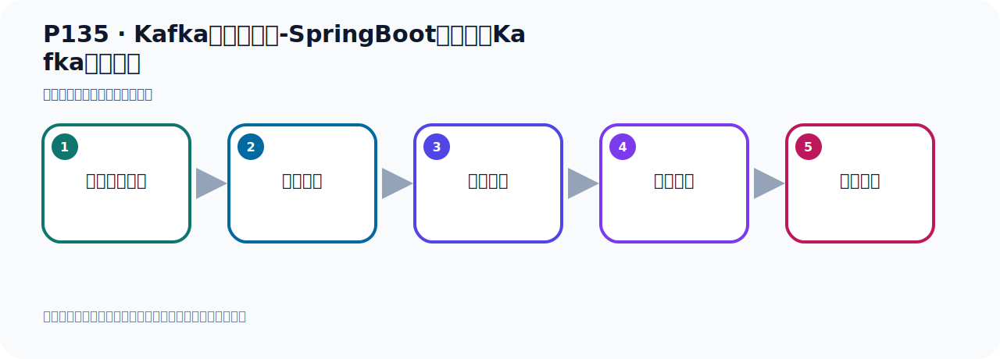

# P135：Kafka集群的测试-SpringBoot连接集群Kafka收发消息

> 笔记编号 135/156 · 时长 05:42 · [打开原视频 P135](https://www.bilibili.com/video/BV14J4m187jz?p=135)

[← P134: Kafka集群的测试-SpringBoot连接集群Kafka](../09-cluster-replication/p134-Kafka集群的测试-SpringBoot连接集群Kafka.md) · [返回本章](./README.md) · [P136: Kafka的集群架构分析 →](../09-cluster-replication/p136-Kafka的集群架构分析.md)

## 这节到底讲什么

**核心主题：Kafka集群的测试-SpringBoot连接集群Kafka收发消息。**

这节用实验验证前面的配置或机制。重点是记录输入、预期、实际输出，以及两者不一致时如何定位。
本节属于“集群、副本机制与核心水位”这一章；放在全章里看，它的作用是：搭建三节点集群，理解 Broker、Partition、Replica、ISR、LEO 与 HW 的协作关系。

## 本节路线

## 老师的完整讲解（按视频顺序校正）

> 下面保留老师的完整讲解顺序，并修正 Kafka、Java、ZooKeeper、
> Topic、Partition、Offset 等常见识别错误。它不是压缩摘要；原始 ASR 在后面单独保留。

### 1. 00:00–01:05

我们的三个副本已经创建好之后，Kafka集群节点是可以使用的，可以创建三个副本。接下来我们去做一个发消息和收消息，我们在这个地方就去监控消息。Topic我们寫一个Topic叫做ClassTopic，我们是个名字，监听这里。分组我们叫ClassT Group，到去消息消息，发消息的话就在我们这个地方发消息。好，我们就发一条吧，发两条也可以，就发两条，不用改，Topic要改一下，改成ClassTopic，好，去发消息。那我现在就把这个第一步我去，我去什么呢？我去把这个住坑，我先不接收，先不接收，我先去发一下，然后我后面再接收，分讲出操作。

### 2. 01:05–01:58

好，先去发一下，那就在这里发一下消息，调这个方法，好，那这里来运行一下，再去发送消息，看看能否正常的发送消息。好，那么发了之后，这个是正常的，可以发出去，可以看到，没有日志，没有问题。好，那这个时候你可以在我们这个Kafka这个位置，其实也可以看一下，我们之前不是把这三台都连上去了吗？你可以在这里刷新一下，刷下之后展开Topic，我们看着Topic，那这个时候我们发两消息，你看这里面在这个分区有两消息。同时，它这边还有什么Lead，还有这个副本，是吧？好，那么这些参数，我们后面去介绍那个图的手，再给大家去讲解这些参数，就是我们在这个课件中，我们提了一个图，就是在这个地方，。

### 3. 02:01–02:57

集群的手，有张图，在，好，这个图，好，后面在介绍，这些参数，那就是两条发出去的，从这里可以看到，那这边我们刷新看一下，刷新。那看一下呢，Topic，也可以看到，看到，是吧，两条，这个这个刷新一下，刷新，再展开看一下呢，可以看到两条消息，那我们的消息呢，就发出去了，发出去以后啊，下面去收消息啊，那去收消息的话呢，我们怎么去收呢，那就是把那监期打开，好，监期打开呢，那么他末日情况下是吧，他起了之后，他是从最新的位置开始接收消息，那我们现在这个服务器上面，他那个位置一到这个，他有一两条消息，那么从二这个位置开始接收消息，但是他二以后没有消息，所以我们需要从那个，什么，最早的位置开始读，到这边我们要配置一下，就配置一下那个Listener，。

### 4. 02:58–03:56

第一个那个，那个reset是吧，是Cosmo，从之前那边，考虑一下那个配置啊，从最早位置开始读，就是哪个呢，最早位置开始读，那这里没有，我们换一个地方找一下啊，把那段配置来考虑一下，从最早位置开始读，好，这地方，他在Cosmo下面，好，把他关掉，把这个关掉，我们在这个地方加一个Cosmo，考虚，啊，空虾上有，但是你加个配置性的，从最早位置开始读，这样才可以读到啊，不然读不到，好，那我们这个时候呢，在启动消费的，消费的他已经，啊，组织打开了，打开之后呢，我们看一下啊，是我们零七零八这个程序啊，打开，我先把所有关一下，看看啊，好，他是在这里是吧，他的配置，从最早开始读，好，没有毛病，没有毛病之后，我们这个时候呢，启动这个密方法开始运行，好，。

### 5. 03:56–04:51

运行，让他去来接收消息，看一下，雷布林接到这两条消息，好，那么接收消息的时候，我们看看他是提上一个什么错误，我看啊，这是参数啊，这个不能解析方法参数，这是在，啊，在这个方法啊，啊，在我可能多了个参数，为什么呢，我这个方法里面多了个参数啊，什么参数啊，就是这个ack，对吧，我们现在是自动提交，那不需要这个参数，自动提交啊，不需要这个参数，所以ack要去掉，不是手动提交，所以去掉，去了之后，现在运行啊，现在运行，他有可能刚才那个运行啊，有可能是把那个o上的已经提交了，我们看一下，现在能不能读到啊，因为他运行之后，这个分组可能已经把那个o上的提交了，所以这个时候呢，你看，预期预期就拿不到消息了，那么换个分组啊，。

### 6. 04:52–05:38

换个分组啊，他应该就可以拿到消息了，因为之前那个分组啊，在上一支运行的时候，虽然他部署了，但是呢，他已经把那个o帅的啊，已经给，给更新的，更新的，已经向那个服务器端提交了，所以他已经有那个o帅的了，所以导致我们消息点没法从第一条消费，我换个分组，这个时候应该可以消费了，再说，再找一下，看看那两个消息能不能接到，好，那么这个是你看，两条消息就接到了，那我们这个急取呢，呃，搭建好之后呢，我们这个收发消息都是正常的，啊，这方面是正常的，好，那我们下部来就是分析一下他里面的一些，啊，一些这个副本啊，一些这个分区啊，副本，再说有分析，那测试啊，收发消息都是正常的，。

## 关键术语

- **Kafka：** Apache 开源的分布式事件流平台，常用于高吞吐消息传递、数据管道和流处理。
- **Topic：** 事件的逻辑分类。生产者向 Topic 写数据，消费者从 Topic 读取数据。

## 完整原声逐段记录

[查看本节带时间戳的本地 ASR](./transcripts/p135-Kafka集群的测试-SpringBoot连接集群Kafka收发消息-ASR.md)。主笔记负责可读性和术语校正；ASR 页面负责完整性复核。

## 读完记住

- 本节主题是 **Kafka集群的测试-SpringBoot连接集群Kafka收发消息**，它服务于本章目标：搭建三节点集群，理解 Broker、Partition、Replica、ISR、LEO 与 HW 的协作关系。
- 理解顺序是：准备测试条件 → 执行操作 → 读取结果 → 对照预期 → 形成结论。
- 学习时要同时核对老师的解释、画面中的配置/代码，以及最终运行结果。

## 最容易踩的坑

测试前残留的 Topic、Offset、缓存或旧进程会污染结果；每次实验都要先确认初始状态。

## 自测

1. 不看笔记，用自己的话解释“Kafka集群的测试-SpringBoot连接集群Kafka收发消息”解决了什么问题。
2. 按顺序复述：准备测试条件、执行操作、读取结果、对照预期、形成结论。
3. 如果运行结果和老师不同，你会先检查哪三个输入或环境条件？

## 学完检查

- [ ] 我能不看视频复述本节完整思路
- [ ] 我能指出关键命令、配置、类或接口的作用
- [ ] 我能解释画面中的输入与输出为什么对应
- [ ] 我核对过完整 ASR，没有跳过老师的补充说明
- [ ] 我完成了本节自测或复现实验
