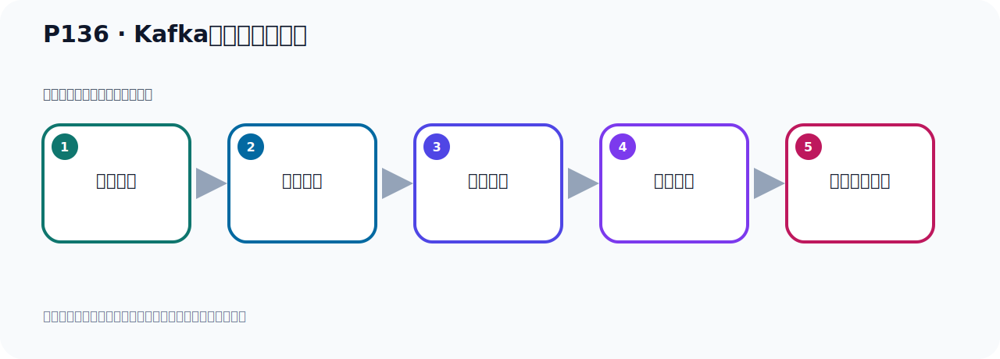
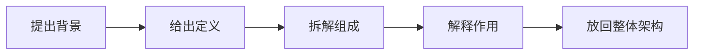

# P136：Kafka的集群架构分析

> 笔记编号 136/156 · 时长 04:19 · [打开原视频 P136](https://www.bilibili.com/video/BV14J4m187jz?p=136)

[← P135: Kafka集群的测试-SpringBoot连接集群Kafka收发消息](../09-cluster-replication/p135-Kafka集群的测试-SpringBoot连接集群Kafka收发消息.md) · [返回本章](./README.md) · [P137: Kafka的集群架构分区和副本机制 →](../09-cluster-replication/p137-Kafka的集群架构分区和副本机制.md)

## 这节到底讲什么

**核心主题：Kafka的集群架构分析。**

这是一节概念课。老师先交代背景，再给出定义、组成和作用，最后把概念放回 Kafka 整体架构。
本节属于“集群、副本机制与核心水位”这一章；放在全章里看，它的作用是：搭建三节点集群，理解 Broker、Partition、Replica、ISR、LEO 与 HW 的协作关系。

## 本节路线

## 老师的完整讲解（按视频顺序校正）

> 下面保留老师的完整讲解顺序，并修正 Kafka、Java、ZooKeeper、
> Topic、Partition、Offset 等常见识别错误。它不是压缩摘要；原始 ASR 在后面单独保留。

### 1. 00:00–00:52

前面我们把Kafka的集群搭建好之后，并且通过代码测试都是正常的，收发消息都是正常的。下面我们就去看一下集群里面的这张图，我们画的这个图，就是这张图。这个图我在这边打开我原始的图，在这里，和这个一模一样，就是这样图。我们看一下这个图，首先它有三个角色，左边是生产者，右边是消费者。中间就所谓Kafka集群，三个角色。下面就所谓的ZooKeeper，或者是KRaft，它是做一个分布式的协调，存储一些元数据。整个就是这么四个部分，生产者、消费者，然后Kafka集群还有ZooKeeper，我们现在用的是ZooKeeper方式的集群，那么这里面依在一个ZooKeeper。

### 2. 00:53–01:43

然后我们这边有几个线，一个是复制消息，一个是读取消息，一个是发送消息，有这么三个颜色的一个线。那我们就可以看一下，那你生产者发消息是这个黄色的线，发消息是这个黄色的线，发消息，那么它可以往这边去发消息，发消息的话，它是发到主副本上，我们发消息读写主副本，从副本它是附在什么，同步数据，所以它读写主副本，所以这个时候你看，它发消息这个黄色线到主副本，这是Leader副本，然后这个黄色线到这，这也是Leader副本，然后这个是生产者，他发的时候呢，发的这个也是Leader副本，当着黄色线，那么这个生产者发的这个也是主副本，发送都是主副本，发的主副本。

### 3. 01:43–02:39

然后呢，就是我们这个消费者，消费者，消费者他去消费的时候就读消息，读消息这个预设的这个线，预设这个线你看，他也是从主副本读消息，你来讲去读消息，他也是一样从主副本去读消息，好，那这边你看，这个消费者那么他也是主副本读消息，好，那下面这个我这个线没话，那你说他要读消息，那么从这个主副本去读消息，那这里面相当于这里一该还有一线，有个蓝色线，就相当于这个线，我们又把它复制一个，好，复制一个，那你说，这个主副本，主副本，好，那么读的话呢，它就是这个，它就读的话，这样去读。好，我把这个线稍微整理一下，好，那这个地方有点太大，对吧，这样啊，好，那这边，把它稍微往上来一点点。

### 4. 02:43–03:46

好，这个线啊，差不多吧，这样子。好，这就是他读消息，读的这样去读的，或者说把这个线放到这个位置。不同位置呢，这是他读消息，从主副本去读消息，主副本去读消息。好，这是我们这个读消息，对吧，好，那么中间这个黑色这个线，是吧，黑色虚线，这个虚线就是复制消息，复制消息，你看，对于我们这个主副本，分区一，分区 0，分区 0，这主副本，那么我们这个从副本，分区 0这个从副本，重上这些复制消息，然后这个分区 0的这个从副本，也是从他这边去复制消息，复制消息。那下面这个是主副本，主副本，他往这边复制，让他往这边复制。好，那么这个是主副本，他往这里复制，然后他往这里复制，复制他。好，那么这是主副本，对吧，主副本，那么他往这里复制，然后他往这里复制。好，在我们这个图，整个这个图呢，所有的这个部件我们看完了。

### 5. 03:46–04:17

消费者那边呢，消费者我们都是分组的。这个消费者呢，你这个组里面你可以，只有一个消费者也可以，你有两个消费者也可以，你有三个五个八个消费者都可以，因为消费者消费的时候呢，我们都会指一个分组，因为你不指一个分组的话，你这个程序整个运行都会报错。好，所以我们这里有个消费组，消费组，I，I这个消费组，这是I这个消费组，是吧，蓝园海消费组，这个B，B这个消费组，好，这个消费组。如果整个图呢，这个里面的所有的部件，我们看完了。

## 关键术语

- **Kafka：** Apache 开源的分布式事件流平台，常用于高吞吐消息传递、数据管道和流处理。
- **ZooKeeper：** 旧版 Kafka 用于集群元数据和控制器协调的外部服务。
- **KRaft：** Kafka 自带的 Raft 元数据仲裁模式，可在新架构中摆脱 ZooKeeper。

## 关键画面核对

架构图包含 Producer、三个 Broker、多个 Topic/Partition 的 Leader/Follower，以及两个Consumer Group；读写请求围绕分区 Leader，Follower 负责副本同步。

[查看课程关键画面核对总表](../../sources/visual-checks.md)。

## 完整原声逐段记录

[查看本节带时间戳的本地 ASR](./transcripts/p136-Kafka的集群架构分析-ASR.md)。主笔记负责可读性和术语校正；ASR 页面负责完整性复核。

## 读完记住

- 本节主题是 **Kafka的集群架构分析**，它服务于本章目标：搭建三节点集群，理解 Broker、Partition、Replica、ISR、LEO 与 HW 的协作关系。
- 理解顺序是：提出背景 → 给出定义 → 拆解组成 → 解释作用 → 放回整体架构。
- 学习时要同时核对老师的解释、画面中的配置/代码，以及最终运行结果。

## 最容易踩的坑

不要只背术语定义；需要同时说清它解决什么问题、与哪些组件交互、失效时会出现什么现象。

## 自测

1. 不看笔记，用自己的话解释“Kafka的集群架构分析”解决了什么问题。
2. 按顺序复述：提出背景、给出定义、拆解组成、解释作用、放回整体架构。
3. 如果运行结果和老师不同，你会先检查哪三个输入或环境条件？

## 学完检查

- [ ] 我能不看视频复述本节完整思路
- [ ] 我能指出关键命令、配置、类或接口的作用
- [ ] 我能解释画面中的输入与输出为什么对应
- [ ] 我核对过完整 ASR，没有跳过老师的补充说明
- [ ] 我完成了本节自测或复现实验
