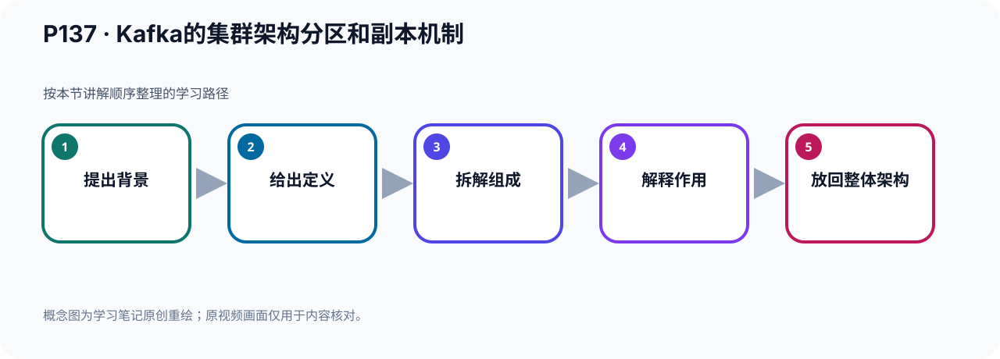

# P137：Kafka的集群架构分区和副本机制

> 笔记编号 137/156 · 时长 03:28 · [打开原视频 P137](https://www.bilibili.com/video/BV14J4m187jz?p=137)

[← P136: Kafka的集群架构分析](../09-cluster-replication/p136-Kafka的集群架构分析.md) · [返回本章](./README.md) · [P138: Kafka的集群架构分区和多副本机制分析 →](../09-cluster-replication/p138-Kafka的集群架构分区和多副本机制分析.md)

## 先看结论

> 这节通过“Kafka的集群架构分区和副本机制”回答概念从哪里来、由什么组成、解决什么问题，以及它在 Kafka 整体架构中的位置。它服务于本章目标：搭建三节点集群，理解 Broker、Partition、Replica、ISR、LEO 与 HW 的协作关系。

## 老师怎么一步步讲

1. 第 1 步，围绕“Kafka的集群架构分区和副本机制”完成提出背景。
2. 第 2 步，围绕“Kafka的集群架构分区和副本机制”完成给出定义。
3. 第 3 步，围绕“Kafka的集群架构分区和副本机制”完成拆解组成。
4. 第 4 步，围绕“Kafka的集群架构分区和副本机制”完成解释作用。
5. 第 5 步，围绕“Kafka的集群架构分区和副本机制”完成放回整体架构。

## 老师的补充说明

下面按原声顺序整理老师的完整讲解脉络。保留原因、案例、对比、操作过程、边界条件和口头提醒；删除重复语气词，并把长口语拆成适合阅读的短段落。

> 技术术语已经过统一校正；仍无法确认的人名或口头英文会保留原意，并通过右侧时间范围返回视频核对。

### 先明确：Kafka的集群架构分区和副本机制要解决什么 · 00:00–01:07

整个图里面的部件，我们看文了。看文之后，首先第一个就叫Topic。我们这些Topic，你看这里有Topic A。Topic A，这也是叫Topic A，这也是叫Topic A。这里有个Topic B，下面是Topic C，Topic C，Topic C。我们的Kafka首先需要有一个Topic。接下来就是Topic有分区。有分区，我们一个看。首先看Topic A的几个分区。Topic A目前只有两个分区，一个是PartyC、一个是Party1。

就两个，它没有三个分区，现在它只有两个分区。这是两个分区，让我们看一下Topic B的几个分区。Topic B它只有一个分区，就是PartyC、只有一个分区。它只有一个分区吧，一个分区。Topic C的几个分区，它也只有一个分区，就是PartyC、它只有一个分区。我们只要看一个的形容，下面这些都一样，我们就看这个，就看这个上面这个，Topic A，。

### 跟着老师操作，并观察运行结果 · 01:07–02:19

看一下Topic A就行了。Topic A的话，你可以看一下，它有两个分区，一个Pn，一个P1。每个分区它有主书本和重复本。你看，这个分区有几个复本的，三个复本，分区有三个复本，三个复本其中一个主书本，加上两个重复本，总共是三个复本，三个复本。那你说这个是主书本，这是重复本，这是重复本，这是我们分区类，它那个情况。那么分区一，PartyC1它也有三个复本，一个主书本，这是主书本，然后两个重复本，再两个重复本，有个重复本，是这个情况。

那么这次目前我们看了这个图，看了这个图，这个图它是这样一个效果，那接下来我们来看一下，我们刚才测试的我们的那个分区，Topic A和分区的一个情况，那我们这个程序它是有一个Topic A，Topic A下有三个分区，三个分区，然后呢有三个复本，。

### 最后验证结果，并收束本节结论 · 02:19–03:23

最后这个是复本，你看，这单词，最后这个是复本的意思，复本。那就是我们这个程序，其实是有一个Topic，它下面呢有三个分区，那就是一个，两个，三个。

每个分区它有三个复本，三个复本，主书本，是吧，一个主书本，加上两个重复本，那么这个分区也是一样，一个主书本，两个重复本，是这样的，这是我们这个程序的一个情况，那我们这个图的情况呢，画的少一点，这个图画的少一点，这个图啊，它，一个Topic，它只有两个分区，然后有三个复本，一个Topic下有两个分区，每个分区有三个复本，是这样的，那你换了它就只有一个Topic，好，它下面呢，有两个分区，是吧，好，这个分区下来，有三个复本，是吧，好，这个分区下来，有三个复本，这样，好，这个分区下也是呢，有三个复本，这样，这个情况，好，以上啊，我们就把这个图给大家解释清楚了，解释清楚了，。

## 放进整套课

本节属于 **集群、副本机制与核心水位**。这一章要解决的是：搭建三节点集群，理解 Broker、Partition、Replica、ISR、LEO 与 HW 的协作关系。

这是一节概念课。老师先交代背景，再给出定义、组成和作用，最后把概念放回 Kafka 整体架构。

### 记忆路线

```mermaid
flowchart LR
    N0["提出背景"]
    N1["给出定义"]
    N0 --> N1
    N2["拆解组成"]
    N1 --> N2
    N3["解释作用"]
    N2 --> N3
    N4["放回整体架构"]
    N3 --> N4
```

## 用在工作里

| 项目 | 内容 |
|---|---|
| 先回答 | 先用一句话说明这个概念解决的问题。 |
| 立刻做 | 把它与 Topic、Partition、Broker、Producer 或 Consumer 的关系画出来。 |
| 留下证据 | 用一个正常场景和一个失败场景检验自己是否真正理解。 |

## 关键术语

- **Kafka：** Apache 开源的分布式事件流平台，常用于高吞吐消息传递、数据管道和流处理。
- **Topic：** 事件的逻辑分类。生产者向 Topic 写数据，消费者从 Topic 读取数据。

## 最容易踩的坑

不要只背术语定义；需要同时说清它解决什么问题、与哪些组件交互、失效时会出现什么现象。

## 自测

1. 不看笔记，用自己的话解释“Kafka的集群架构分区和副本机制”解决了什么问题。
2. 按顺序复述：提出背景、给出定义、拆解组成、解释作用、放回整体架构。
3. 如果运行结果和老师不同，你会先检查哪三个输入或环境条件？

## 学完检查

- [ ] 我能不看视频复述本节完整思路
- [ ] 我能指出关键命令、配置、类或接口的作用
- [ ] 我能解释画面中的输入与输出为什么对应
- [ ] 我读完了老师的详细讲解正文，没有只看路线图和要点
- [ ] 我完成了本节自测或复现实验

## 需要核对原话时

[查看本节带时间戳的完整 ASR](./transcripts/p137-Kafka的集群架构分区和副本机制-ASR.md)。主笔记负责理解与实践；ASR 页面负责逐句完整性复核。
