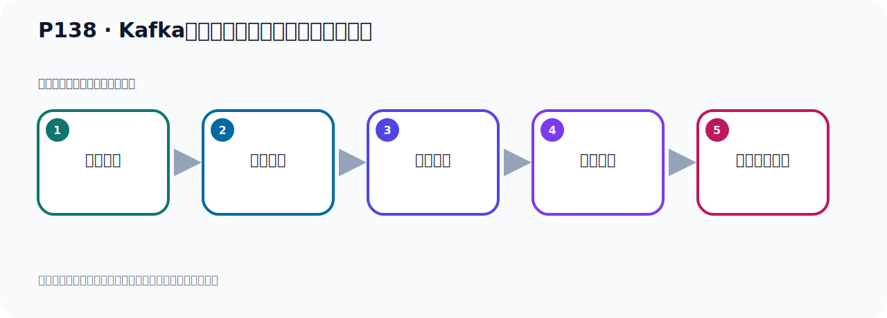

# P138：Kafka的集群架构分区和多副本机制分析

> 笔记编号 138/156 · 时长 02:40 · [打开原视频 P138](https://www.bilibili.com/video/BV14J4m187jz?p=138)

[← P137: Kafka的集群架构分区和副本机制](../09-cluster-replication/p137-Kafka的集群架构分区和副本机制.md) · [返回本章](./README.md) · [P139: Kafka的集群架构分区和多副本机制分析 →](../09-cluster-replication/p139-Kafka的集群架构分区和多副本机制分析.md)

## 这节到底讲什么

**核心主题：Kafka的集群架构分区和多副本机制分析。**

这是一节概念课。老师先交代背景，再给出定义、组成和作用，最后把概念放回 Kafka 整体架构。
本节属于“集群、副本机制与核心水位”这一章；放在全章里看，它的作用是：搭建三节点集群，理解 Broker、Partition、Replica、ISR、LEO 与 HW 的协作关系。

## 本节路线

## 老师的完整讲解（按视频顺序校正）

> 下面保留老师的完整讲解顺序，并修正 Kafka、Java、ZooKeeper、
> Topic、Partition、Offset 等常见识别错误。它不是压缩摘要；原始 ASR 在后面单独保留。

### 1. 00:00–01:04

我们刚才分析了这张图，那么这张图就是我们Kafka集群它的多副本架构。它的每个分区有多个副本，那我们看一下我们的这个程序，比如说现在我们以我们这个程序为例，我们有一个Topic，有一个Topic。Topic下我们有三个分区，有P类，然后有P1，P类就是Partition类，Partition1和Partition2。它下面有三个分区，那么副本是什么意思呢？副本就是你的每个分区我有几个备份，对吧？那么这个复本是3，那表示P类它有三个备份，倒是有一个备份，是吧？P1也是一样，三个备份，因为它的复本是3，三个备份，P2也是一样。

### 2. 01:04–02:20

最终是这个效果，这样应该比较清楚了，比较清晰了，对吧？我们有个Topic，这是一个Topic，Topic下有多个分区，你可以是一个分区，你也可以是两个分区，可以是三个分区，或者四个分区，或者五个分区，对吧？你可以有多个分区，然后每个分区你可以指定它有几个复本，那么这个复本个数不能是类也不能大于节点个数，这个复本个数是不能大于节点个数，我们现在不说三排复本，那这个复本数只能是3，你不能大于节点个数，它也不能是类，这个复本个数也不能是类，你如果只有一个节点，那我们写1，写个1。好，就这个情况，分区的个数你可以两个三个五个八个，分区它没有要求，它分区你不指定，它默认是一个分区，那就只有一个P类，我们现在指定了三个，那么它有三个分区，你也可以指定四个分区，也可以指定五个分区，好，然后后面的复本，就你注意一下，复本不能是类，一般是复本，一般是等于节点个数，。

### 3. 02:20–02:36

你有几个节点，这个复本数就写几，我们是三个节点，那复本数就写三，这就是我们这个情况，好，那通过这个图，应该可以清楚了解我们这个程序，它的一个多复本架构，集取住的多复本架构。

## 关键术语

- **Kafka：** Apache 开源的分布式事件流平台，常用于高吞吐消息传递、数据管道和流处理。
- **Topic：** 事件的逻辑分类。生产者向 Topic 写数据，消费者从 Topic 读取数据。
- **Partition：** Topic 的物理分片，是 Kafka 并行度、顺序性和扩展能力的基本单位。

## 完整原声逐段记录

[查看本节带时间戳的本地 ASR](./transcripts/p138-Kafka的集群架构分区和多副本机制分析-ASR.md)。主笔记负责可读性和术语校正；ASR 页面负责完整性复核。

## 读完记住

- 本节主题是 **Kafka的集群架构分区和多副本机制分析**，它服务于本章目标：搭建三节点集群，理解 Broker、Partition、Replica、ISR、LEO 与 HW 的协作关系。
- 理解顺序是：提出背景 → 给出定义 → 拆解组成 → 解释作用 → 放回整体架构。
- 学习时要同时核对老师的解释、画面中的配置/代码，以及最终运行结果。

## 最容易踩的坑

不要只背术语定义；需要同时说清它解决什么问题、与哪些组件交互、失效时会出现什么现象。

## 自测

1. 不看笔记，用自己的话解释“Kafka的集群架构分区和多副本机制分析”解决了什么问题。
2. 按顺序复述：提出背景、给出定义、拆解组成、解释作用、放回整体架构。
3. 如果运行结果和老师不同，你会先检查哪三个输入或环境条件？

## 学完检查

- [ ] 我能不看视频复述本节完整思路
- [ ] 我能指出关键命令、配置、类或接口的作用
- [ ] 我能解释画面中的输入与输出为什么对应
- [ ] 我核对过完整 ASR，没有跳过老师的补充说明
- [ ] 我完成了本节自测或复现实验
