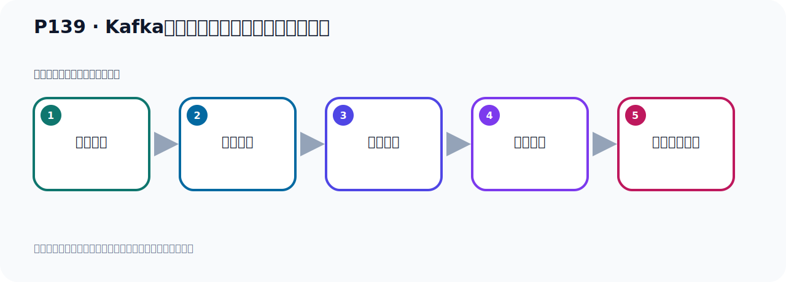

# P139：Kafka的集群架构分区和多副本机制分析

> 笔记编号 139/156 · 时长 04:17 · [打开原视频 P139](https://www.bilibili.com/video/BV14J4m187jz?p=139)

[← P138: Kafka的集群架构分区和多副本机制分析](../09-cluster-replication/p138-Kafka的集群架构分区和多副本机制分析.md) · [返回本章](./README.md) · [P140: Kafka的集群架构分区和多副本机制分析 →](../09-cluster-replication/p140-Kafka的集群架构分区和多副本机制分析.md)

## 这节到底讲什么

**核心主题：Kafka的集群架构分区和多副本机制分析。**

这是一节概念课。老师先交代背景，再给出定义、组成和作用，最后把概念放回 Kafka 整体架构。
本节属于“集群、副本机制与核心水位”这一章；放在全章里看，它的作用是：搭建三节点集群，理解 Broker、Partition、Replica、ISR、LEO 与 HW 的协作关系。

## 本节路线

## 老师的完整讲解（按视频顺序校正）

> 下面保留老师的完整讲解顺序，并修正 Kafka、Java、ZooKeeper、
> Topic、Partition、Offset 等常见识别错误。它不是压缩摘要；原始 ASR 在后面单独保留。

### 1. 00:00–00:48

好，我们知道这个抚美数呢，一般都是和服务器几点数保持一次，我们三个几点写三个抚美，那我们分区数其实无所谓，分区数你是三个服务器，你三个分区，你五个分区行不行，也可以，你两个分区行不行，也可以。那我们给他测试一下，其实也可以，你看我们现在是三个服务器，分区我就两个行不行，可以的，没有问题，我们测试一下，那我把这个消费者先提一下，消费者的注释掉，先别消费，那我们通过这个配置，我们写个Class的2，建一个新的Topic课，那么这个Topic课下，那就相当于我们一个Topic课，这是Topic课，对吧，好，他下面有两个分区，P-ray和P-e的，。

### 2. 00:49–01:40

P-ray和P-e的两个分区，好，然后他副本数是三，那就是这个分区，他有三个副本，是吧，一个两个三个，好，那么这个分区也是一样，是吧，一个两个三个，三个副本，好，那就变成这个样子了，那我们先去测试跑一下，把这个Topic课给他创建一下，好，创建一下，那我们这里来，运行测试方法，好，这个地方我们运行一下，好，运行，你看程序是可以正常跑起来的，可以跑起来，跑起来以后呢，我们这个时候可以看一下这个图，我们有个什么，我们有个卡布的这个图，这里是吧，它图能每次三个几点是吧，随便找到几点就可以啊，刷新一下，刷新，好，它出的那个，Colorto比较二，展开之后你看，现在它只有两个分区吗，两个分区，。

### 3. 01:40–02:38

但是它的副本有三个，有三个副本，你看我们这个Colorto比较一，它三个分区，那为Tobico2点个分区，分区个数，你是能够点个三个五个八个都可以，副本数一般是等于夫妻几点个数，好，是这个情况，好，那现在我们看了这个地方，我们可以看一下我们的这个什么，我们的这个图啊，就是Kafka这个插件，这个插件，ID也插件，你看了这个数据，它什么意思啊，你能够看这个原来这个Kafka这个Tobico，那它什么意思啊，首先这是我们原来这个Tobico1，它有三个分区，这个好理解吧，这是个Tobico，Tobico下来有三个分区，我们先画一下啊，首先这是一个Tobico吧，Tobico，Tobico下来，这个时候有三个分区，三个分区，一个是吧，两个，然后三个，。

### 4. 02:38–03:20

然后呢，每个分区有三个副本呢，你看啊，它三个副本是不是里面有三个副本啊，就是这个，那么这个R31什么意思啊，二，就是我们配置击取的时候，我们在这个servo.proplicet文件里面配那个blocal ID，blocal ID啊，有个ID那个参数，那个参数我们第一台机器我们写是一，第二台机器我们写是二，第三台机器写是三，对不对，当时配置击取的时候我们用三台机器吧，每个机器都有一个唯一的ID，那个ID我们说不能重复，是吧，你可以是一，可以是二，可以是三，也可以是一是二十或者三十，不重复就可以，好，那么这个里面的R31啊，就代表你这三台服务器那个blocal ID啊，。

### 5. 03:20–04:06

那表示第二台，第一台，第三台，总之就是三台服务器，那就是在这三台服务器上分别有一个副本，分别有个副本，那么它的主副本是哪里的，主副本叫Lid在E这个节点上，在E这个节点上，也就是说主副本在E这个节点上，在第一台机器上，就在E上，好，那么你这个，这是P0这个飞驱，那么P1这个飞驱呢，它也有三个飞驱，三个副本，对吧，因为我们程序本设计是三个嘛，都是三个嘛，所以三个副本，三个副本，然后主副本也在E这个节点上，好，那么二呢，这个P2这个飞驱，它也有三个副本，然后主副本也在E这个节点上，好，那有同学问，我们这主副本如果当期怎么办呢，。

### 6. 04:06–04:12

主副本这个节点比如说就是不如过E这个服务器，第一台服务器当期怎么办，。

## 关键术语

- **Kafka：** Apache 开源的分布式事件流平台，常用于高吞吐消息传递、数据管道和流处理。
- **Topic：** 事件的逻辑分类。生产者向 Topic 写数据，消费者从 Topic 读取数据。

## 完整原声逐段记录

[查看本节带时间戳的本地 ASR](./transcripts/p139-Kafka的集群架构分区和多副本机制分析-ASR.md)。主笔记负责可读性和术语校正；ASR 页面负责完整性复核。

## 读完记住

- 本节主题是 **Kafka的集群架构分区和多副本机制分析**，它服务于本章目标：搭建三节点集群，理解 Broker、Partition、Replica、ISR、LEO 与 HW 的协作关系。
- 理解顺序是：提出背景 → 给出定义 → 拆解组成 → 解释作用 → 放回整体架构。
- 学习时要同时核对老师的解释、画面中的配置/代码，以及最终运行结果。

## 最容易踩的坑

不要只背术语定义；需要同时说清它解决什么问题、与哪些组件交互、失效时会出现什么现象。

## 自测

1. 不看笔记，用自己的话解释“Kafka的集群架构分区和多副本机制分析”解决了什么问题。
2. 按顺序复述：提出背景、给出定义、拆解组成、解释作用、放回整体架构。
3. 如果运行结果和老师不同，你会先检查哪三个输入或环境条件？

## 学完检查

- [ ] 我能不看视频复述本节完整思路
- [ ] 我能指出关键命令、配置、类或接口的作用
- [ ] 我能解释画面中的输入与输出为什么对应
- [ ] 我核对过完整 ASR，没有跳过老师的补充说明
- [ ] 我完成了本节自测或复现实验
