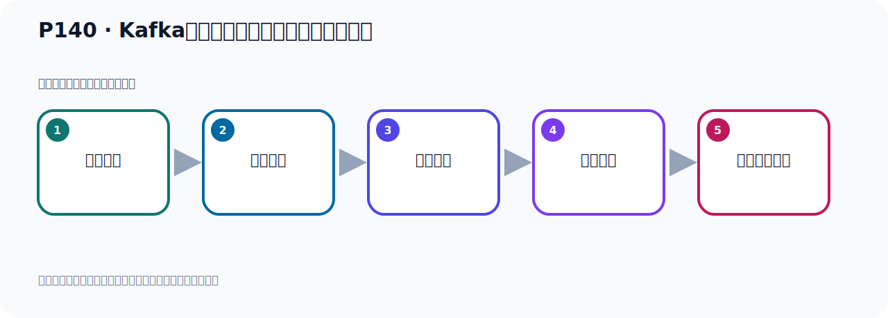

# P140：Kafka的集群架构分区和多副本机制分析

> 笔记编号 140/156 · 时长 05:57 · [打开原视频 P140](https://www.bilibili.com/video/BV14J4m187jz?p=140)

[← P139: Kafka的集群架构分区和多副本机制分析](../09-cluster-replication/p139-Kafka的集群架构分区和多副本机制分析.md) · [返回本章](./README.md) · [P141: Kafka集群架构的多副本架构 →](../09-cluster-replication/p141-Kafka集群架构的多副本架构.md)

## 这节到底讲什么

**核心主题：Kafka的集群架构分区和多副本机制分析。**

这是一节概念课。老师先交代背景，再给出定义、组成和作用，最后把概念放回 Kafka 整体架构。
本节属于“集群、副本机制与核心水位”这一章；放在全章里看，它的作用是：搭建三节点集群，理解 Broker、Partition、Replica、ISR、LEO 与 HW 的协作关系。

## 本节路线

## 先用白话读懂

一个 Partition 的副本中只有 Leader 负责客户端读写，Follower 复制数据。Leader 所在 Broker 宕机后，Kafka 会从合格的同步副本中选出新 Leader。`kafka-topics.sh --describe` 的结果要分别看 Partition、Leader、Replicas 和 ISR，不能只看副本总数。

## 老师的完整讲解（按视频顺序校正）

> 下面保留老师的完整讲解顺序，并修正 Kafka、Java、ZooKeeper、
> Topic、Partition、Offset 等常见识别错误。它不是压缩摘要；原始 ASR 在后面单独保留。

### 1. 00:00–00:50

这就是第一台服务器宕机。宕机的话，Kafka会内部进行故障转移。当时你就是说，你这个1这个故障，1这个副本，这个宕机了吗？1这个副本宕机了，我们可以成为话想。就是1这个宕机了，宕机，1这个宕机了，那你现在是不是没有主负的？因为主副本是负责读和写的，从副本它是不负责读和写的，从副本只负责数据复制，对吧？那你这个主副本这个节点宕机，宕机，那么这个时候它就在这个二三里面会选一个主副本。在二三里面会选一个主副本，比如说二是主副本，那就是到时的二是主副本。你到时读写数据，从二这个副本去读写就可以了，它是这样的。

### 2. 00:50–01:45

好，那么这是我们第一个Topic，我们看第二个Topic点过来，你看一下，它这个和第一个人区别的，第二个，它首先有一个Topic，然后这个Topic下来有两个Partition，第一个，第二个，Pn和Pd两个分区，好，每个分区下，是吧？每个分区下有三个副本，因为我们程序是三个副本，所以它这里有三个副本，你看，每个Partition有三个副本，每个分区有三个副本，好，那么三个副本，Pn它的主副本在第一台服务器上，P1的主副本在第二台服务器上，这个Vid是主副本在哪个节点上，这个Vid1，这个Vid2就是我们Broker ID，D代服务器Broker ID是1，D代服务器Broker ID是2，。

### 3. 01:45–02:40

第三台服务器Broker ID是3，所以我们这个主副本就是2，然后主副本就是在第二台机上，那么这个Pn的主副本在第一台机上，好，这是我们这个数据的情况，我们还可以通过一个命令也可以查看，和这个效果差不多，我们可以查看一下，比如说我们打开一个命令在这里，在下面，好，就是我这边有一个这个命令，查看你这个Topic的一个详情，可以通过这个命令去查看一下，好，看一下，我们把命令复制一下，你看，首先通过KafkaTopic是这个脚本，然后连上你的服务器，这个服务器你随便连一台都可以，我就连个9091或者9092或者9093都可以，然后下面是描述一下describe，描述一下Topic，然后Topic呢，可拉斯特Topic，。

### 4. 02:40–03:37

描述一下我们这个Topic，好，那我们去执行这个命令去描述一下，好，去描述一下，我们看一下，好，我们在这个地方看一下，在我们Kafka这个bin 目录，我们找到这里来执行一下，执行，执行之后，它和我们刚才看它的效果其实是一样的，首先我们有个Topic，对吧，然后它的分区个数是3，你看，副本个数也是3，这是我们的分区是3，副本也是3，所以你看我们这个Topic它有三个分区，你看，这个托个名字，三个分区，分别是P0，然后P1和P2，三个分区，P0P1P2，好，那么这个三个分区里面分别有三个副本，2，三个副本，这个2，3，1，3，1，2，1，2，3，。

### 5. 03:37–04:23

好，那你不用看这个顺序，这个顺序，然后你要看它哪个是副本，它有三个副本是吧，三个副本，这个三个副本里面，包含了副本和从副本，也就是说，主副本加上从副本，加上从副本，等于你的整个副本个数，等于这个3，等于副本个数，那就是这个三个副本里面，有个从副本，有个主副本，主副本在哪里面呢，主副本在伏西1上面，在Broker1上面吧，也就是你那个伏西，这个BrokerAZ等于1的那个机器，在第一台机器上，好，这是我们这个情况，刚才看了是一样的，是吧，刚才看了是一样的，好，后面还有一个这个参数，这个参数是什么意思呢，就是，与主副本保持同步的有哪些副本，那就是我们1232，。

### 6. 04:23–05:17

就是三个节点的数据，现在都是同步的，这边是同步，我们后面再解释一下，这个，这样一个属性，什么意思啊，ISR，和我们主副本保持同步的，保持同步的副本，也就是说，现在这三个副本都是同步状态，好，这是我们后面这个，这个属性，这个参数的意思，那现在看了是第一个，我们再看一下第二个这个Topic，找一下，找一下之后呢，你发现我们第一个Topic，它只有两个分区，然后它有三个副本，哪个是主副本，第一个分区，就P0，它的主副本在第一台机器上，然后P这个分区，它的主副本在第二台机器上，对吧，好，目前这个三个副本都是同步状态，都是同步的，好，那以上呢，。

### 7. 05:17–05:47

就是我们这个集群的一个状态，这是我们Kafka这个多副本架构，它是基于这种机制啊，多副本架构，就这个图，一个主副本，多个从副本，通常情况下呢，我们这个副本的个数，等于节点个数，等于节点个数，好，这是Kafka，多副本架构，多副本架构。

## 关键术语

- **Kafka：** Apache 开源的分布式事件流平台，常用于高吞吐消息传递、数据管道和流处理。
- **Topic：** 事件的逻辑分类。生产者向 Topic 写数据，消费者从 Topic 读取数据。
- **Partition：** Topic 的物理分片，是 Kafka 并行度、顺序性和扩展能力的基本单位。
- **Broker：** 运行 Kafka 服务的节点；多个 Broker 组成 Kafka 集群。
- **ISR：** 与 Leader 保持足够同步的副本集合，是副本选举和可靠性判断的重要依据。

## 完整原声逐段记录

[查看本节带时间戳的本地 ASR](./transcripts/p140-Kafka的集群架构分区和多副本机制分析-ASR.md)。主笔记负责可读性和术语校正；ASR 页面负责完整性复核。

## 读完记住

- 本节主题是 **Kafka的集群架构分区和多副本机制分析**，它服务于本章目标：搭建三节点集群，理解 Broker、Partition、Replica、ISR、LEO 与 HW 的协作关系。
- 理解顺序是：提出背景 → 给出定义 → 拆解组成 → 解释作用 → 放回整体架构。
- 学习时要同时核对老师的解释、画面中的配置/代码，以及最终运行结果。

## 最容易踩的坑

不要只背术语定义；需要同时说清它解决什么问题、与哪些组件交互、失效时会出现什么现象。

## 自测

1. 不看笔记，用自己的话解释“Kafka的集群架构分区和多副本机制分析”解决了什么问题。
2. 按顺序复述：提出背景、给出定义、拆解组成、解释作用、放回整体架构。
3. 如果运行结果和老师不同，你会先检查哪三个输入或环境条件？

## 学完检查

- [ ] 我能不看视频复述本节完整思路
- [ ] 我能指出关键命令、配置、类或接口的作用
- [ ] 我能解释画面中的输入与输出为什么对应
- [ ] 我核对过完整 ASR，没有跳过老师的补充说明
- [ ] 我完成了本节自测或复现实验
