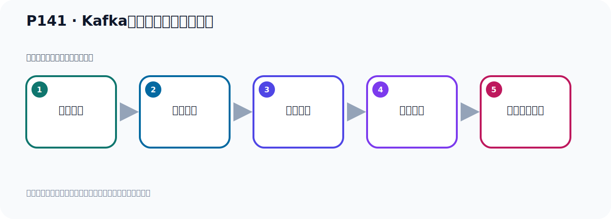

# P141：Kafka集群架构的多副本架构

> 笔记编号 141/156 · 时长 08:37 · [打开原视频 P141](https://www.bilibili.com/video/BV14J4m187jz?p=141)

[← P140: Kafka的集群架构分区和多副本机制分析](../09-cluster-replication/p140-Kafka的集群架构分区和多副本机制分析.md) · [返回本章](./README.md) · [P142: Kafka中的12个核心概念梳理 →](../09-cluster-replication/p142-Kafka中的12个核心概念梳理.md)

## 这节到底讲什么

**核心主题：Kafka集群架构的多副本架构。**

这是一节概念课。老师先交代背景，再给出定义、组成和作用，最后把概念放回 Kafka 整体架构。
本节属于“集群、副本机制与核心水位”这一章；放在全章里看，它的作用是：搭建三节点集群，理解 Broker、Partition、Replica、ISR、LEO 与 HW 的协作关系。

## 本节路线

## 老师的完整讲解（按视频顺序校正）

> 下面保留老师的完整讲解顺序，并修正 Kafka、Java、ZooKeeper、
> Topic、Partition、Offset 等常见识别错误。它不是压缩摘要；原始 ASR 在后面单独保留。

### 1. 00:00–00:58

下面再看一张图，这张图来自于网络上，这是一张网络图片。这个图依然是多富美架构。我们再分析下这张图，让我们对多富美架构有更多了解、更多认识，或者加深对它认识。这个图有四个Broker，Broker1、Broker2、Broker3、Broker4有四个。也就是它有四个Kafka服务器，有四台机器，四个机器。这里面，申展者、消费者，他都是从Lid副本去收发消息、读消息、写消息。这里面他使用Torbiker，谁用Torbiker？Torbiker肯定就一个Torbiker。这个图里的话就是一个Torbiker，或者叫TorbikerA。

### 2. 00:58–01:49

那么Torbiker下有几个分区呢？可能是第一步要有Torbiker，Torbiker下有几个分区，我们看一下有几个分区。那么你可以看到他有P1、有P3、这有P1、P2、P3，然后P1、P2、P2、P3，那么他有几个分区，三个。当他证成了写法一开始P1、P1、P2，但是他写的是P1、P1、P3，当然这样也行，那么总共有三个分区，那一会画一下，有三个分区，有P1、P1、P2、P3、有三个分区，这个Torbiker下有三个分区，然后就看这个分区有几个副本来，就是每个分区有几个副本，那我们数一下几个副本。那你看一下，我们这个P1、这个分区，比如说这个P1、P1这个分区，。

### 3. 01:49–02:49

他有几个副本，他有Lid的副本，是吧？P1、Lid的副本，有第一个Flower副本，然后P1、第二个Flower副本，好，下面这是P1、P2、P3、P3，好，P1有三个，那个时候他有三个来，三个副本，三个副本有一个主副本，有两个从副本，一个Lid的副本，两个Flower副本，就这样子，你看P2，这个是P2，P2有几个副本，P2，P2的话你看，这个是P2，这个是P2，好，这是Lid的副本，这是P2，这是P2，好，其他地方已经没有P2了，那么也是三个，一个主副本，两个从副本，好，P2也是三个，一个，两个，三个，也是三个，是吧？

### 4. 02:49–03:40

好，那P3呢？一个也是三个吧，看一下P3，你看P3的主副本在这里，主委P3在这里，好，P3在第一个，然后第二个，是吧？第二个，好，第三个，第三个，好，P3也是三个，那么他下面也有三个，这个副本，一个主副本，两个从副本，对吧？好，这里是我们这个图，这个图有四个Broker，然后有个主题，这个主题像有三个分区，每个分区有三个副本，三个副本包含一个主副本，两个从副本，这就是我们这张图的解析，那你看我们的这个生产者，或者是消费者，生产者或消费者，生产者或消费者，他都是，你看这个线条啊，他的箭头是吧？从这个主副本读消息和写消息，然后这个也是一样，。

### 5. 03:40–04:39

生产的消费者，从这个主副本读消息写消息，那这边也是一样，从主副本读消息和写消息，好，这里我们这个图的一个分析，那你看啊，这个主副本，他是怎么分的呢？他主副本就一直放在这个机器上，还是放在这个机器上呢？还是在这个机器上呢？那么这个是卡布达内部，他去根据当前服务器的一个负载情况，他去选择的，把哪个这个分区的主副本放在哪台机器上？由他去选择，对吧？那你看，我们现在是把这个PE，就第一个分区，他主副本在第一台机器上，第二个分区，他的主副本在第二台机器上，那么第三个分区，他的主副本在第三台机器上，而第四台机器上，是这样的，那其实你也可以这样啊，就说，你第一台分区主副本在这里，。

### 6. 04:39–05:31

第二台分区主副本你也可以放在这个机器上，也是可以的，第三台，第三个分区的主副本，你也可以放在这个机器上，也是可以的，这个是Kafka，他去选择的，根据负载情况呢，他去进行分退的，所以主副本放在哪台机器上，这是不确定的，就像我们之前这边，我们的这个主题，这个主题，他的主副本都在第一台机器上，那么这个主题，他的主副本都在第一个分区的主副本，在第一台机器上，第二个分区的主副本在第二台机器上，是吧，他这个分配啊，不是确定的啊，不是确定的，所以就是有可能在这个机器上，主副本可以在这个机器上，也可能在这个机器上，也可能在这个机器上，。

### 7. 05:32–06:24

然后呢，他的重复本，重复本和当前的主副本，不会在一个节点上，你比如说，你P1这个分区，P1分区，他的主副本在这个机器上，那么他对的你和重复本，肯定不会在这个机器上，不会和他在同一台机器上，就是说，我来重复本和我主副本不会在同一台机器上，那么P1他的这个重复本，你看，在这个机器上，在这个机器上，当然你也可以在这个机器上，在这个机器上，是吧，也可以，或者说，你这个P1的主副本，你可以在这里，在这里，然后P1的主本也可以在这里，在这里，都可以，在另外的两台机器上就可以了，好，那所以呢，我们就可以总结一下啊，在这里插入一个这个文本框，插入文本框，。

### 8. 06:25–07:41

好，我们放在，就放这个，放这位置啊，好，那就是什么呢，这个主副本，主副本，这个究竟放在哪个Borock中，是由这个卡巴卡内部，内部的机子，决定的，这是第一个，他放哪个卡巴卡中，就是说，这个主副本放在哪个Borock中，是由Borock，由卡巴卡内部的机子决定的，他决定的，那是第一点啊，第二点的就是，那么重复本，重复本，和这个主副本，和主副本，不在一个级点上啊，不在，不在同一个呢，同一个Borock上，好，我们可以总结聊点吧，聊点啊，首先这个主副本，他放哪里，是由Borock来去决定的，第二个，重复本和主副本，他不会在同一个级点上，不在同一个Borock上，。

### 9. 07:42–08:33

以这边主副本在这里，那主副本可以在另外几个机机上，所以重复本和主副本，不会在同一个级点上，当然我们说是针对同一个分区，比如说针对同一个分区，P这个分区，主副本已经在这个机机上了，那么重复本可以是在另外的这个机机上，那么针对P2这个分区，他的主副本已经在第二台机机上了，那么他的重复本可以是在另外的这个三台机机上，对于P3这个分区，他的主副本在第四台机机上，那么他的重复本，可以是在前面这三台机上，这就是这边的情况，以上我们就把Kafka集群多副本架构给大家分析完了，那么这个就是我们Kafka的多副本架构，。

## 关键术语

- **Kafka：** Apache 开源的分布式事件流平台，常用于高吞吐消息传递、数据管道和流处理。
- **Broker：** 运行 Kafka 服务的节点；多个 Broker 组成 Kafka 集群。

## 完整原声逐段记录

[查看本节带时间戳的本地 ASR](./transcripts/p141-Kafka集群架构的多副本架构-ASR.md)。主笔记负责可读性和术语校正；ASR 页面负责完整性复核。

## 读完记住

- 本节主题是 **Kafka集群架构的多副本架构**，它服务于本章目标：搭建三节点集群，理解 Broker、Partition、Replica、ISR、LEO 与 HW 的协作关系。
- 理解顺序是：提出背景 → 给出定义 → 拆解组成 → 解释作用 → 放回整体架构。
- 学习时要同时核对老师的解释、画面中的配置/代码，以及最终运行结果。

## 最容易踩的坑

不要只背术语定义；需要同时说清它解决什么问题、与哪些组件交互、失效时会出现什么现象。

## 自测

1. 不看笔记，用自己的话解释“Kafka集群架构的多副本架构”解决了什么问题。
2. 按顺序复述：提出背景、给出定义、拆解组成、解释作用、放回整体架构。
3. 如果运行结果和老师不同，你会先检查哪三个输入或环境条件？

## 学完检查

- [ ] 我能不看视频复述本节完整思路
- [ ] 我能指出关键命令、配置、类或接口的作用
- [ ] 我能解释画面中的输入与输出为什么对应
- [ ] 我核对过完整 ASR，没有跳过老师的补充说明
- [ ] 我完成了本节自测或复现实验
