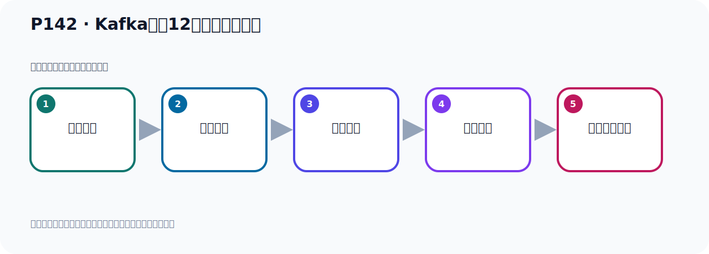
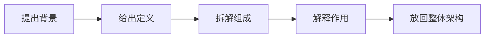

# P142：Kafka中的12个核心概念梳理

> 笔记编号 142/156 · 时长 02:50 · [打开原视频 P142](https://www.bilibili.com/video/BV14J4m187jz?p=142)

[← P141: Kafka集群架构的多副本架构](../09-cluster-replication/p141-Kafka集群架构的多副本架构.md) · [返回本章](./README.md) · [P143: Kafka中的12个核心概念-ISR副本 →](../09-cluster-replication/p143-Kafka中的12个核心概念-ISR副本.md)

## 这节到底讲什么

**核心主题：Kafka中的12个核心概念梳理。**

这是一节概念课。老师先交代背景，再给出定义、组成和作用，最后把概念放回 Kafka 整体架构。
本节属于“集群、副本机制与核心水位”这一章；放在全章里看，它的作用是：搭建三节点集群，理解 Broker、Partition、Replica、ISR、LEO 与 HW 的协作关系。

## 本节路线

## 老师的完整讲解（按视频顺序校正）

> 下面保留老师的完整讲解顺序，并修正 Kafka、Java、ZooKeeper、
> Topic、Partition、Offset 等常见识别错误。它不是压缩摘要；原始 ASR 在后面单独保留。

### 1. 00:00–00:46

下面我们把Kafka的一些重要概念作为一个梳理。那么这些概念里面有一些是在之前已经介绍过的，有一些还没有介绍过。那么介绍过的我们复习一下，没有介绍过的我们后面再统一介绍一下。好，那首先我们Kafka，首先它有个叫服务器，那么服务器我们叫Broker。这个我们的前面反复提到过，Broker就是我们的服务器，Kafka服务器。好，然后Kafka的中呢，首先我们要出一个主题，主题叫Tombik。我们的消息啊，都要放在一个主题中，也出了一个主题，你可以出了一个两个三个多个主题，每个主题里面倒是可以放消息。好，那我们这个消息这个数据呢，就叫Event，叫事件，叫Event，。

### 2. 00:46–01:38

这个Event这个事件啊，就是我们的消息啊，数据，就Event。好，然后呢，就是生产者，生产者或丢少，那就是发消息的，生产者，然后消费者，counselor，它是接收消息的。好，然后消息的时候呢，你要指定一个消息组，你在消费消息的时候，要指定一个消费组，否则的话呢，你的程序会报错，那么这个消费组啊，就是这个消费组ID，叫GoProID，counselor，GoProID消费组。好，接下来就是分区，分区呢，是我们这个主题里面的，一个主题下，有一个或者多个分区，分区叫PartyC，然后就是偏一调，偏一调叫Offset，那么偏一调啊，它分为生产者偏一调，还有消费者偏一调，。

### 3. 01:38–02:35

生产者就是发消息的，对每个消息有个编号，顺序增长的，那么消费消息的时候呢，我消费了哪一调了，也有一个记度，有个记度我到哪一调了，那么这是消费者的偏量，然后就是副本，副本呢，分为主副本和从副本，主副本叫Lead副本，从副本叫Flower副本，这是副本，就是我们的每个分区，你可以有一个或多个副本，每个分区，我们的每个分区啊，都可以有一个或多个副本，好，那么这些概念啊，在前面呢，我们都同意介绍过，到这里为止啊，我们都全部介绍过了，那下面呢，还有三个概念，还没有介绍过，那我们下面呢，会把这三个概念，再做一个统一的呢，这个分析，那么他们代表什么意思，我们再做一个统一分析，好，上面这些都已经分析过了，。

### 4. 02:35–02:46

然后做到说明，我们接下来看一下下面的这三个概念，那么统一析啊，这是十二个，统一析是十二个概念。

## 关键术语

- **Kafka：** Apache 开源的分布式事件流平台，常用于高吞吐消息传递、数据管道和流处理。
- **Event：** Kafka 中的一条业务记录，通常由 key、value、时间戳和 headers 等组成。
- **Broker：** 运行 Kafka 服务的节点；多个 Broker 组成 Kafka 集群。
- **Offset：** 事件在 Partition 中的位置编号，也是消费者记录消费进度的依据。

## 完整原声逐段记录

[查看本节带时间戳的本地 ASR](./transcripts/p142-Kafka中的12个核心概念梳理-ASR.md)。主笔记负责可读性和术语校正；ASR 页面负责完整性复核。

## 读完记住

- 本节主题是 **Kafka中的12个核心概念梳理**，它服务于本章目标：搭建三节点集群，理解 Broker、Partition、Replica、ISR、LEO 与 HW 的协作关系。
- 理解顺序是：提出背景 → 给出定义 → 拆解组成 → 解释作用 → 放回整体架构。
- 学习时要同时核对老师的解释、画面中的配置/代码，以及最终运行结果。

## 最容易踩的坑

不要只背术语定义；需要同时说清它解决什么问题、与哪些组件交互、失效时会出现什么现象。

## 自测

1. 不看笔记，用自己的话解释“Kafka中的12个核心概念梳理”解决了什么问题。
2. 按顺序复述：提出背景、给出定义、拆解组成、解释作用、放回整体架构。
3. 如果运行结果和老师不同，你会先检查哪三个输入或环境条件？

## 学完检查

- [ ] 我能不看视频复述本节完整思路
- [ ] 我能指出关键命令、配置、类或接口的作用
- [ ] 我能解释画面中的输入与输出为什么对应
- [ ] 我核对过完整 ASR，没有跳过老师的补充说明
- [ ] 我完成了本节自测或复现实验
