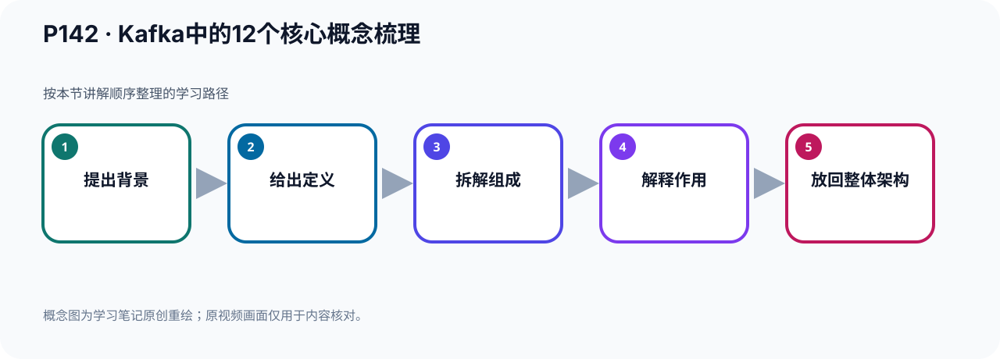
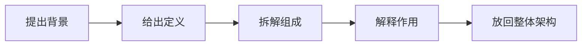

# P142：Kafka中的12个核心概念梳理

> 笔记编号 142/156 · 时长 02:50 · [打开原视频 P142](https://www.bilibili.com/video/BV14J4m187jz?p=142)

[← P141: Kafka集群架构的多副本架构](../09-cluster-replication/p141-Kafka集群架构的多副本架构.md) · [返回本章](./README.md) · [P143: Kafka中的12个核心概念-ISR副本 →](../09-cluster-replication/p143-Kafka中的12个核心概念-ISR副本.md)

## 先看结论

> 这节通过“Kafka中的12个核心概念梳理”回答概念从哪里来、由什么组成、解决什么问题，以及它在 Kafka 整体架构中的位置。它服务于本章目标：搭建三节点集群，理解 Broker、Partition、Replica、ISR、LEO 与 HW 的协作关系。

## 老师怎么一步步讲

1. 第 1 步，围绕“Kafka中的12个核心概念梳理”完成提出背景。
2. 第 2 步，围绕“Kafka中的12个核心概念梳理”完成给出定义。
3. 第 3 步，围绕“Kafka中的12个核心概念梳理”完成拆解组成。
4. 第 4 步，围绕“Kafka中的12个核心概念梳理”完成解释作用。
5. 第 5 步，围绕“Kafka中的12个核心概念梳理”完成放回整体架构。

## 老师的补充说明

下面按原声顺序整理老师的完整讲解脉络。保留原因、案例、对比、操作过程、边界条件和口头提醒；删除重复语气词，并把长口语拆成适合阅读的短段落。

> 技术术语已经过统一校正；仍无法确认的人名或口头英文会保留原意，并通过右侧时间范围返回视频核对。

### 先明确：Kafka中的12个核心概念梳理要解决什么 · 00:00–00:46

下面我们把Kafka的一些重要概念作为一个梳理。那么这些概念里面有一些是在之前已经介绍过的，有一些还没有介绍过。那么介绍过的我们复习一下，没有介绍过的我们后面再统一介绍一下。那首先我们Kafka，首先它有个叫服务器，那么服务器我们叫Broker。这个我们的前面反复提到过，Broker就是我们的服务器，Kafka服务器。然后Kafka的中呢，首先我们要出一个主题，主题叫Tombik。

我们的消息啊，都要放在一个主题中，也出了一个主题，你可以出了一个两个三个多个主题，每个主题里面倒是可以放消息。那我们这个消息这个数据呢，就叫Event，叫事件，叫Event，。

### 对比不同情况，明确条件和边界 · 00:46–01:38

这个Event这个事件啊，就是我们的消息啊，数据，就Event。然后呢，就是生产者，生产者或丢少，那就是发消息的，生产者，然后消费者，counselor，它是接收消息的。然后消息的时候呢，你要指定一个消息组，你在消费消息的时候，要指定一个消费组，否则的话呢，你的程序会报错，那么这个消费组啊，就是这个消费组ID，叫GoProID，counselor，GoProID消费组。

接下来就是分区，分区呢，是我们这个主题里面的，一个主题下，有一个或者多个分区，分区叫PartyC，然后就是偏一调，偏一调叫Offset，那么偏一调啊，它分为生产者偏一调，还有消费者偏一调，。

### 最后验证结果，并收束本节结论 · 01:38–02:46

生产者就是发消息的，对每个消息有个编号，顺序增长的，那么消费消息的时候呢，我消费了哪一调了，也有一个记度，有个记度我到哪一调了，那么这是消费者的偏量，然后就是副本，副本呢，分为主副本和从副本，主副本叫Lead副本，从副本叫Flower副本，这是副本，就是我们的每个分区，你可以有一个或多个副本，每个分区，我们的每个分区啊，都可以有一个或多个副本，好，那么这些概念啊，在前面呢，我们都同意介绍过，到这里为止啊，我们都全部介绍过了，那下面呢，还有三个概念，还没有介绍过，那我们下面呢，会把这三个概念，再做一个统一的呢，这个分析，那么他们代表什么意思，我们再做一个统一分析，好，上面这些都已经分析过了，然后做到说明，我们接下来看一下下面的这三个概念，那么统一析啊，这是十二个，统一析是十二个概念。

## 放进整套课

本节属于 **集群、副本机制与核心水位**。这一章要解决的是：搭建三节点集群，理解 Broker、Partition、Replica、ISR、LEO 与 HW 的协作关系。

这是一节概念课。老师先交代背景，再给出定义、组成和作用，最后把概念放回 Kafka 整体架构。

### 记忆路线

```mermaid
flowchart LR
    N0["提出背景"]
    N1["给出定义"]
    N0 --> N1
    N2["拆解组成"]
    N1 --> N2
    N3["解释作用"]
    N2 --> N3
    N4["放回整体架构"]
    N3 --> N4
```

## 用在工作里

| 项目 | 内容 |
|---|---|
| 先回答 | 先用一句话说明这个概念解决的问题。 |
| 立刻做 | 把它与 Topic、Partition、Broker、Producer 或 Consumer 的关系画出来。 |
| 留下证据 | 用一个正常场景和一个失败场景检验自己是否真正理解。 |

## 关键术语

- **Kafka：** Apache 开源的分布式事件流平台，常用于高吞吐消息传递、数据管道和流处理。
- **Event：** Kafka 中的一条业务记录，通常由 key、value、时间戳和 headers 等组成。
- **Broker：** 运行 Kafka 服务的节点；多个 Broker 组成 Kafka 集群。
- **Offset：** 事件在 Partition 中的位置编号，也是消费者记录消费进度的依据。

## 最容易踩的坑

不要只背术语定义；需要同时说清它解决什么问题、与哪些组件交互、失效时会出现什么现象。

## 自测

1. 不看笔记，用自己的话解释“Kafka中的12个核心概念梳理”解决了什么问题。
2. 按顺序复述：提出背景、给出定义、拆解组成、解释作用、放回整体架构。
3. 如果运行结果和老师不同，你会先检查哪三个输入或环境条件？

## 学完检查

- [ ] 我能不看视频复述本节完整思路
- [ ] 我能指出关键命令、配置、类或接口的作用
- [ ] 我能解释画面中的输入与输出为什么对应
- [ ] 我读完了老师的详细讲解正文，没有只看路线图和要点
- [ ] 我完成了本节自测或复现实验

## 需要核对原话时

[查看本节带时间戳的完整 ASR](./transcripts/p142-Kafka中的12个核心概念梳理-ASR.md)。主笔记负责理解与实践；ASR 页面负责逐句完整性复核。
