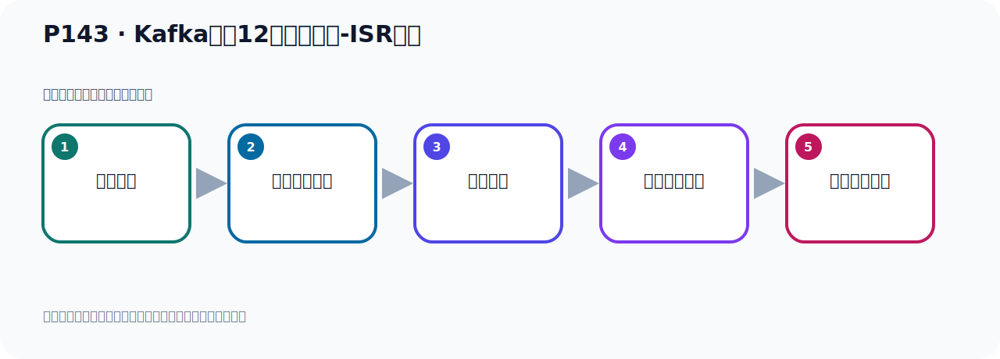

# P143：Kafka中的12个核心概念-ISR副本

> 笔记编号 143/156 · 时长 03:06 · [打开原视频 P143](https://www.bilibili.com/video/BV14J4m187jz?p=143)

[← P142: Kafka中的12个核心概念梳理](../09-cluster-replication/p142-Kafka中的12个核心概念梳理.md) · [返回本章](./README.md) · [P144: Kafka中的12个核心概念-ISR副本 →](../09-cluster-replication/p144-Kafka中的12个核心概念-ISR副本.md)

## 这节到底讲什么

**核心主题：Kafka中的12个核心概念-ISR副本。**

这节围绕位置与进度展开。一定要区分日志中的位置、各副本的末端位置、可见水位和消费者提交进度。
本节属于“集群、副本机制与核心水位”这一章；放在全章里看，它的作用是：搭建三节点集群，理解 Broker、Partition、Replica、ISR、LEO 与 HW 的协作关系。

## 本节路线

## 老师的完整讲解顺序（ASR 辅助复核）

> 下面按时间顺序保留经过基础术语替换的 ASR，方便核对老师是否提到某个细节。
> 人名、命令、代码和英文参数仍可能识别错误；准确结论以本节白话说明、代码块和实操速查表为准。

### 1. 00:00–01:06

Kafka中有这样12个核心概念，下面我们看一下ASR-FUBA，这个概念。那ASR-FUBA它是什么呢？它就是在同步中的FUBA，它的意味着缩写是ASR，是由这三个单词的构成的，手字母构成的。In Synchronize Replicate，这个手字母的一个缩写，就是在同步中的FUBA，在同步中，也就是它正在和主FUBA进行同步。所以ASR-FUBA它是包含主FUBA和所有與LEADERFUBA保持同步的FollowerFUBA，这就是我们ASR-FUBA。那我们知道，我们的一个写请求，首先是由LEADERFUBA去处理的，当然你读请求也是LEADERFUBA处理，LEADERFUBA复复的读和写操作，读写操作都是LEADERFUBA处理。

### 2. 01:06–01:59

那么你把数据写到LEADERFUBA之后，FollowerFUBA它就会从LEADERFUBA拿取你所写入的消息，那么这个过程中它肯定会有一定的延迟，也就是把这个消息同步到重复本的时候有延迟，那么这些的话就导致我们重复本保存到这个消息，它越微的少于主复本的消息。但是，只要你没有超过这个预指，我们都是可以容忍的。但是如果一个Follower这个复门，这个重复本出现异常，比如说它好久都不同步了，它的5分钟10分钟都不同步了，或者说这个重复本它荡机了，或者是因为网络断开了等等这个原因，长时间这个重复本都不去同步重复本数据，那么这个时候，。

### 3. 02:00–02:59

主复本就要把这个重复本给踢除掉，就相当于以这个重复本是有问题的，以一直都不来同步数据。那么Kafka来，他就通过一个叫ASI这个集合来维护一个什么来，可用并且消息量于主复本相差不多的复本集合，那么这个复本集合就是ASI复本集合，所以这个ASI复本，它是整个复本集合一个指级，有可能这个ASI复本就是整个我们说的复本，包括主复本，包括重复本，但也有可能这个ASI复本里面它又少了一个复本，因为这个复本因为它荡机了，或者说这个复本因为它这个好久没有同步数据了，那么它就会把踢除掉，所以我们ASI复本是我们整个复本的一个指级，它有可能和整个复本一样多，也有可能少于我们的整个复本，。

### 4. 03:00–03:02

好，这就是我们ASI复本，。

## 关键术语

- **Kafka：** Apache 开源的分布式事件流平台，常用于高吞吐消息传递、数据管道和流处理。
- **Replica：** Partition 的副本。Leader 对外服务，Follower 负责同步并提供故障接管基础。
- **ISR：** 与 Leader 保持足够同步的副本集合，是副本选举和可靠性判断的重要依据。

## 完整原声逐段记录

[查看本节带时间戳的本地 ASR](./transcripts/p143-Kafka中的12个核心概念-ISR副本-ASR.md)。主笔记负责可读性和术语校正；ASR 页面负责完整性复核。

## 读完记住

- 本节主题是 **Kafka中的12个核心概念-ISR副本**，它服务于本章目标：搭建三节点集群，理解 Broker、Partition、Replica、ISR、LEO 与 HW 的协作关系。
- 理解顺序是：消息写入 → 形成日志位置 → 副本同步 → 更新可见水位 → 记录消费进度。
- 学习时要同时核对老师的解释、画面中的配置/代码，以及最终运行结果。

## 最容易踩的坑

“Offset”不是一个全局数字；它必须放在具体 Topic、Partition、消费者组或副本语境中解释。

## 自测

1. 不看笔记，用自己的话解释“Kafka中的12个核心概念-ISR副本”解决了什么问题。
2. 按顺序复述：消息写入、形成日志位置、副本同步、更新可见水位、记录消费进度。
3. 如果运行结果和老师不同，你会先检查哪三个输入或环境条件？

## 学完检查

- [ ] 我能不看视频复述本节完整思路
- [ ] 我能指出关键命令、配置、类或接口的作用
- [ ] 我能解释画面中的输入与输出为什么对应
- [ ] 我核对过完整 ASR，没有跳过老师的补充说明
- [ ] 我完成了本节自测或复现实验
