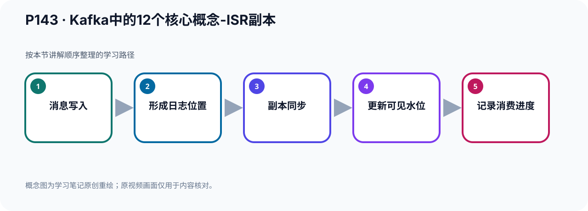

# P143：Kafka中的12个核心概念-ISR副本

> 笔记编号 143/156 · 时长 03:06 · [打开原视频 P143](https://www.bilibili.com/video/BV14J4m187jz?p=143)

[← P142: Kafka中的12个核心概念梳理](../09-cluster-replication/p142-Kafka中的12个核心概念梳理.md) · [返回本章](./README.md) · [P144: Kafka中的12个核心概念-ISR副本 →](../09-cluster-replication/p144-Kafka中的12个核心概念-ISR副本.md)

## 先看结论

> 这节用“Kafka中的12个核心概念-ISR副本”区分日志位置、消费进度、副本末端和可见边界，避免把不同语境中的 Offset 混成一个数字。它服务于本章目标：搭建三节点集群，理解 Broker、Partition、Replica、ISR、LEO 与 HW 的协作关系。

## 老师怎么一步步讲

1. 第 1 步，围绕“Kafka中的12个核心概念-ISR副本”完成消息写入。
2. 第 2 步，围绕“Kafka中的12个核心概念-ISR副本”完成形成日志位置。
3. 第 3 步，围绕“Kafka中的12个核心概念-ISR副本”完成副本同步。
4. 第 4 步，围绕“Kafka中的12个核心概念-ISR副本”完成更新可见水位。
5. 第 5 步，围绕“Kafka中的12个核心概念-ISR副本”完成记录消费进度。

## 老师的补充说明

下面按原声顺序整理老师的完整讲解脉络。保留原因、案例、对比、操作过程、边界条件和口头提醒；删除重复语气词，并把长口语拆成适合阅读的短段落。

> 技术术语已经过统一校正；仍无法确认的人名或口头英文会保留原意，并通过右侧时间范围返回视频核对。

### 先明确：Kafka中的12个核心概念-ISR副本要解决什么 · 00:00–01:30

Kafka中有这样12个核心概念，下面我们看一下ASR-FUBA，这个概念。那ASR-FUBA它是什么呢？它就是在同步中的FUBA，它的意味着缩写是ASR，是由这三个单词的构成的，手字母构成的。In Synchronize Replicate，这个手字母的一个缩写，就是在同步中的FUBA，在同步中，也就是它正在和主FUBA进行同步。所以ASR-FUBA它是包含主FUBA和所有與LEADERFUBA保持同步的FollowerFUBA，这就是我们ASR-FUBA。

那我们知道，我们的一个写请求，首先是由LEADERFUBA去处理的，当然你读请求也是LEADERFUBA处理，LEADERFUBA复复的读和写操作，读写操作都是LEADERFUBA处理。那么你把数据写到LEADERFUBA之后，FollowerFUBA它就会从LEADERFUBA拿取你所写入的消息，那么这个过程中它肯定会有一定的延迟，也就是把这个消息同步到重复本的时候有延迟，那么这些的话就导致我们重复本保存到这个消息，它越微的少于主复本的消息。

### 老师用例子进一步解释 · 01:31–02:15

但是，只要你没有超过这个预指，我们都是可以容忍的。但是如果一个Follower这个复门，这个重复本出现异常，比如说它好久都不同步了，它的5分钟10分钟都不同步了，或者说这个重复本它荡机了，或者是因为网络断开了等等这个原因，长时间这个重复本都不去同步重复本数据，那么这个时候，主复本就要把这个重复本给踢除掉，就相当于以这个重复本是有问题的，以一直都不来同步数据。那么Kafka来，他就通过一个叫ASI这个集合来维护一个什么来，。

### 最后验证结果，并收束本节结论 · 02:16–03:02

可用并且消息量于主复本相差不多的复本集合，那么这个复本集合就是ASI复本集合，所以这个ASI复本，它是整个复本集合一个指级，有可能这个ASI复本就是整个我们说的复本，包括主复本，包括重复本，但也有可能这个ASI复本里面它又少了一个复本，因为这个复本因为它荡机了，或者说这个复本因为它这个好久没有同步数据了，那么它就会把踢除掉，所以我们ASI复本是我们整个复本的一个指级，它有可能和整个复本一样多，也有可能少于我们的整个复本，好，这就是我们ASI复本，。

## 放进整套课

本节属于 **集群、副本机制与核心水位**。这一章要解决的是：搭建三节点集群，理解 Broker、Partition、Replica、ISR、LEO 与 HW 的协作关系。

这节围绕位置与进度展开。一定要区分日志中的位置、各副本的末端位置、可见水位和消费者提交进度。

### 记忆路线

```mermaid
flowchart LR
    N0["消息写入"]
    N1["形成日志位置"]
    N0 --> N1
    N2["副本同步"]
    N1 --> N2
    N3["更新可见水位"]
    N2 --> N3
    N4["记录消费进度"]
    N3 --> N4
```

## 用在工作里

| 项目 | 内容 |
|---|---|
| 先回答 | 先说明当前 Offset 属于生产者、消费者组还是某个副本。 |
| 立刻做 | 用命令或代码观察写入、提交、重启前后的数值变化。 |
| 留下证据 | 留下 Topic、Partition、Group 与 Offset 的对应关系图。 |

## 关键术语

- **Kafka：** Apache 开源的分布式事件流平台，常用于高吞吐消息传递、数据管道和流处理。
- **Replica：** Partition 的副本。Leader 对外服务，Follower 负责同步并提供故障接管基础。
- **ISR：** 与 Leader 保持足够同步的副本集合，是副本选举和可靠性判断的重要依据。

## 最容易踩的坑

“Offset”不是一个全局数字；它必须放在具体 Topic、Partition、消费者组或副本语境中解释。

## 自测

1. 不看笔记，用自己的话解释“Kafka中的12个核心概念-ISR副本”解决了什么问题。
2. 按顺序复述：消息写入、形成日志位置、副本同步、更新可见水位、记录消费进度。
3. 如果运行结果和老师不同，你会先检查哪三个输入或环境条件？

## 学完检查

- [ ] 我能不看视频复述本节完整思路
- [ ] 我能指出关键命令、配置、类或接口的作用
- [ ] 我能解释画面中的输入与输出为什么对应
- [ ] 我读完了老师的详细讲解正文，没有只看路线图和要点
- [ ] 我完成了本节自测或复现实验

## 需要核对原话时

[查看本节带时间戳的完整 ASR](./transcripts/p143-Kafka中的12个核心概念-ISR副本-ASR.md)。主笔记负责理解与实践；ASR 页面负责逐句完整性复核。
