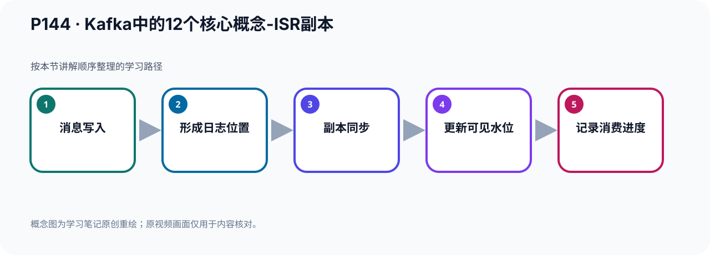

# P144：Kafka中的12个核心概念-ISR副本

> 笔记编号 144/156 · 时长 05:32 · [打开原视频 P144](https://www.bilibili.com/video/BV14J4m187jz?p=144)

[← P143: Kafka中的12个核心概念-ISR副本](../09-cluster-replication/p143-Kafka中的12个核心概念-ISR副本.md) · [返回本章](./README.md) · [P145: Kafka中的12个核心概念-LEO →](../09-cluster-replication/p145-Kafka中的12个核心概念-LEO.md)

## 先看结论

> 这节用“Kafka中的12个核心概念-ISR副本”区分日志位置、消费进度、副本末端和可见边界，避免把不同语境中的 Offset 混成一个数字。它服务于本章目标：搭建三节点集群，理解 Broker、Partition、Replica、ISR、LEO 与 HW 的协作关系。

## 老师怎么一步步讲

1. 第 1 步，围绕“Kafka中的12个核心概念-ISR副本”完成消息写入。
2. 第 2 步，围绕“Kafka中的12个核心概念-ISR副本”完成形成日志位置。
3. 第 3 步，围绕“Kafka中的12个核心概念-ISR副本”完成副本同步。
4. 第 4 步，围绕“Kafka中的12个核心概念-ISR副本”完成更新可见水位。
5. 第 5 步，围绕“Kafka中的12个核心概念-ISR副本”完成记录消费进度。

## 老师的补充说明

下面按原声顺序整理老师的完整讲解脉络。保留原因、案例、对比、操作过程、边界条件和口头提醒；删除重复语气词，并把长口语拆成适合阅读的短段落。

> 技术术语已经过统一校正；仍无法确认的人名或口头英文会保留原意，并通过右侧时间范围返回视频核对。

### 先明确：Kafka中的12个核心概念-ISR副本要解决什么 · 00:00–01:07

我们刚才对这个AASI-FUBE做了一个介绍，我们知道什么是AASI-FUBE。下面我们继续来看一下AASI-FUBE。在Kafka中，一个FUBE要想成为AASI-FUBE，它需要一定的条件。那么条件的话，总结是两个。第一个就是我们的这个主FUBE，它本身就是一个AASI-FUBE。因为我们知道这个AASI-FUBE的概率，它其实就是你的所有FUBE。只不过，因为某些条件导致它不能变成我的AASI-FUBE。比如说有个FUBE它好久不同步数据了，那么这个FUBE要提除掉。

比如说这个FUBE它好久都不同步数据了，所以把它提除掉。那么此时，我的这个AASI-FUBE集合里面就只剩两个FUBE了，本来是有三个，现在只剩两个了。那么这两个里面肯定是包含主FUBE的，主FUBE它说句，本来就是主FUBE，它不需要于什么同步。

### 对比不同情况，明确条件和边界 · 01:07–02:14

它本来就是主FUBE，那么它肯定是AASI-FUBE。再第一个，那么第二个就是另外这两个FUBE，那就有个要求。另外两个FUBE，就是重FUBE。那么另外两个重FUBE，你最后一条消息，它的这个AUSIDE和LID这个主FUBE的最后一条消息的AUSIDE之间，它的差值不能超过指定的这个预指。你超过这个预指，那么你这个重FUBE就会从AASI中提除，这个时候你不能变成我的这个AASI-FUBE了。

你如果和主FUBE保持同步的，好，你是AASI-FUBE，你如果和我主FUBE好久都不同步了，那你就不是，我得把它提除了，你就不是我的AASI-FUBE了。当然它有一个预指，它那个预指，你差多少，你没有同步的时候，你差有多少，是吧，这个差值有多少，你差太多了不行，它也允许你有点差值，但是它不能差太多。

### 老师用例子进一步解释 · 02:14–03:45

那么这差值里面有两个，一个就是它的replica.lag.time.max.ms 配置项，它默认是30秒，是这个时间配置所性，也就是说你这个FUBE在这个30秒这个监护内，一直没有追上内意的副本的所有消息，那你这个FUBE就会从ASI列表中提除，提除掉，就是它有30秒，就你延迟30秒了，就是我这个消息，就是你的重FUBE和我主FUBE，之间消息的同步有30秒延迟，有30秒，但是它默认的30秒延迟，就是说你30秒都没有去同步消息，延迟了30秒，你的数据和我有30秒延迟，那你就说明你这个FUBE可能不稳定，或者是网络断了，或者是你这个FUBE故障了等等，所以它一定会把你提除掉，它认为你这个户本不太正常，所以就把你从ASI中提除掉，这是一个时间条件，你超过了30秒了，就延迟了，另外一个就是消息调速的一个条件，

就是说你落后了多少条消息，比如说我现在主FUBE有100个消息了，你的重FUBE才80个消息，你落后了20条消息了，那这个时候我就把你提除掉，把你这个重FUBE从ASI中提除掉，。

### 最后验证结果，并收束本节结论 · 03:46–05:28

但是这个配置项在新版本中已经过时了，已经不能用了，我们可以搜下这个配置项，在官方回到里面搜索一下，然后在我们的Kafka，官方回到，打开一下，看一下，Kafka，点APA级，好，就这个网上打开，打开之后你点这个多个文档，点多个文档点进来，这就很大，我们直接搜索了这个配置，直接搜索了，就这个，这个Message，好，这个Message这个调速，消息调速，就说这个配置参数，就它是remote，是被删除了，就是不能用了，被删除了，是吧，这个Leader，分区的Leader将不再考虑这个什么，消息数量了，不再考虑这个消息数量了，所以这个消息数量已经过时了，遗处掉了，在新版本遗处掉了，原来老版本已久，另外一个就是这个配置项，我们搜一下，那么它呢，在这里吧，好，这个配置项呢，它有说明，那么我们看一下，

它的说明它下面有个默认值，我们走一下，不在这里，好，就这个指你看，这个说明，它的默认值以前它是30秒，单位是毫秒，所以它是30秒，默认30秒，延迟30秒，那么这个时候就把它从iSi中提出30秒，好，这是它要成为iSi副本，它的一个条件，是这样的，。

## 放进整套课

本节属于 **集群、副本机制与核心水位**。这一章要解决的是：搭建三节点集群，理解 Broker、Partition、Replica、ISR、LEO 与 HW 的协作关系。

这节围绕位置与进度展开。一定要区分日志中的位置、各副本的末端位置、可见水位和消费者提交进度。

### 记忆路线

```mermaid
flowchart LR
    N0["消息写入"]
    N1["形成日志位置"]
    N0 --> N1
    N2["副本同步"]
    N1 --> N2
    N3["更新可见水位"]
    N2 --> N3
    N4["记录消费进度"]
    N3 --> N4
```

## 用在工作里

| 项目 | 内容 |
|---|---|
| 先回答 | 先说明当前 Offset 属于生产者、消费者组还是某个副本。 |
| 立刻做 | 用命令或代码观察写入、提交、重启前后的数值变化。 |
| 留下证据 | 留下 Topic、Partition、Group 与 Offset 的对应关系图。 |

## 关键术语

- **Kafka：** Apache 开源的分布式事件流平台，常用于高吞吐消息传递、数据管道和流处理。
- **Replica：** Partition 的副本。Leader 对外服务，Follower 负责同步并提供故障接管基础。
- **ISR：** 与 Leader 保持足够同步的副本集合，是副本选举和可靠性判断的重要依据。

## 最容易踩的坑

“Offset”不是一个全局数字；它必须放在具体 Topic、Partition、消费者组或副本语境中解释。

## 自测

1. 不看笔记，用自己的话解释“Kafka中的12个核心概念-ISR副本”解决了什么问题。
2. 按顺序复述：消息写入、形成日志位置、副本同步、更新可见水位、记录消费进度。
3. 如果运行结果和老师不同，你会先检查哪三个输入或环境条件？

## 学完检查

- [ ] 我能不看视频复述本节完整思路
- [ ] 我能指出关键命令、配置、类或接口的作用
- [ ] 我能解释画面中的输入与输出为什么对应
- [ ] 我读完了老师的详细讲解正文，没有只看路线图和要点
- [ ] 我完成了本节自测或复现实验

## 需要核对原话时

[查看本节带时间戳的完整 ASR](./transcripts/p144-Kafka中的12个核心概念-ISR副本-ASR.md)。主笔记负责理解与实践；ASR 页面负责逐句完整性复核。
