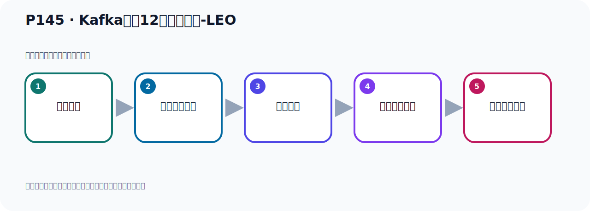
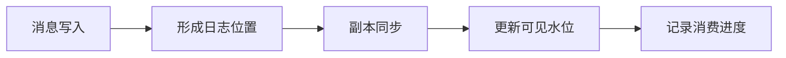

# P145：Kafka中的12个核心概念-LEO

> 笔记编号 145/156 · 时长 01:48 · [打开原视频 P145](https://www.bilibili.com/video/BV14J4m187jz?p=145)

[← P144: Kafka中的12个核心概念-ISR副本](../09-cluster-replication/p144-Kafka中的12个核心概念-ISR副本.md) · [返回本章](./README.md) · [P146: Kafka中的12个核心概念-HW →](../09-cluster-replication/p146-Kafka中的12个核心概念-HW.md)

## 这节到底讲什么

**核心主题：Kafka中的12个核心概念-LEO。**

这节围绕位置与进度展开。一定要区分日志中的位置、各副本的末端位置、可见水位和消费者提交进度。
本节属于“集群、副本机制与核心水位”这一章；放在全章里看，它的作用是：搭建三节点集群，理解 Broker、Partition、Replica、ISR、LEO 与 HW 的协作关系。

## 本节路线

## 老师的完整讲解（按视频顺序校正）

> 下面保留老师的完整讲解顺序，并修正 Kafka、Java、ZooKeeper、
> Topic、Partition、Offset 等常见识别错误。它不是压缩摘要；原始 ASR 在后面单独保留。

### 1. 00:00–01:10

前面我们介绍了Kafka中的一些重要概念，我们接着看下Kafka中LEO这个概念。LEO是什么呢？它的中文就是日志末端偏译量，因为全称是Norga and Outsight，首字母说写LEO。LEO它记录的是该副本消息日志中下一条消息的偏译量。注意一下，它是下一条消息的一个偏译量，也就是我下一条消息应该写在什么位置。它表示就是你下一条消息应该写的那个位置，是这个意思。所以如果说你LEO等于10，那表示我下一条消息要写在10这个位置。所以LEO等于10就表示，副本中它已经保存了0到9的这个10条消息，它已经有0到9这10个位置都有消息了，总共有10条。

### 2. 01:10–01:45

那么下次你写11条消息的时候，就写到10这个位置。所以LEO它指的就是你下一次写入消息的那个位置的那个偏译量那个值，那个Outsight的值，这就是LEO。好，那这个概念搞清楚之后它有什么用呢？我们先把这个概念认识一下，它在我们记起这个副本数据同步的时候会涉及到这个概念。所以先我们介绍一下这个概念，后面再消息副本记同步的时候会用到这个概念。

## 关键术语

- **Kafka：** Apache 开源的分布式事件流平台，常用于高吞吐消息传递、数据管道和流处理。
- **LEO：** Log End Offset，某个副本日志末端下一条消息的位置。

## 完整原声逐段记录

[查看本节带时间戳的本地 ASR](./transcripts/p145-Kafka中的12个核心概念-LEO-ASR.md)。主笔记负责可读性和术语校正；ASR 页面负责完整性复核。

## 读完记住

- 本节主题是 **Kafka中的12个核心概念-LEO**，它服务于本章目标：搭建三节点集群，理解 Broker、Partition、Replica、ISR、LEO 与 HW 的协作关系。
- 理解顺序是：消息写入 → 形成日志位置 → 副本同步 → 更新可见水位 → 记录消费进度。
- 学习时要同时核对老师的解释、画面中的配置/代码，以及最终运行结果。

## 最容易踩的坑

“Offset”不是一个全局数字；它必须放在具体 Topic、Partition、消费者组或副本语境中解释。

## 自测

1. 不看笔记，用自己的话解释“Kafka中的12个核心概念-LEO”解决了什么问题。
2. 按顺序复述：消息写入、形成日志位置、副本同步、更新可见水位、记录消费进度。
3. 如果运行结果和老师不同，你会先检查哪三个输入或环境条件？

## 学完检查

- [ ] 我能不看视频复述本节完整思路
- [ ] 我能指出关键命令、配置、类或接口的作用
- [ ] 我能解释画面中的输入与输出为什么对应
- [ ] 我核对过完整 ASR，没有跳过老师的补充说明
- [ ] 我完成了本节自测或复现实验
