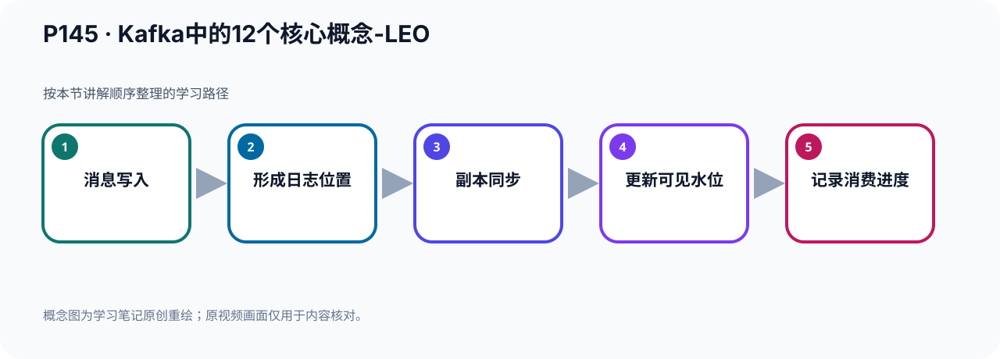
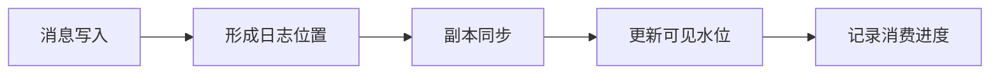

# P145：Kafka中的12个核心概念-LEO

> 笔记编号 145/156 · 时长 01:48 · [打开原视频 P145](https://www.bilibili.com/video/BV14J4m187jz?p=145)

[← P144: Kafka中的12个核心概念-ISR副本](../09-cluster-replication/p144-Kafka中的12个核心概念-ISR副本.md) · [返回本章](./README.md) · [P146: Kafka中的12个核心概念-HW →](../09-cluster-replication/p146-Kafka中的12个核心概念-HW.md)

## 先看结论

> 这节用“Kafka中的12个核心概念-LEO”区分日志位置、消费进度、副本末端和可见边界，避免把不同语境中的 Offset 混成一个数字。它服务于本章目标：搭建三节点集群，理解 Broker、Partition、Replica、ISR、LEO 与 HW 的协作关系。

## 老师怎么一步步讲

1. 第 1 步，围绕“Kafka中的12个核心概念-LEO”完成消息写入。
2. 第 2 步，围绕“Kafka中的12个核心概念-LEO”完成形成日志位置。
3. 第 3 步，围绕“Kafka中的12个核心概念-LEO”完成副本同步。
4. 第 4 步，围绕“Kafka中的12个核心概念-LEO”完成更新可见水位。
5. 第 5 步，围绕“Kafka中的12个核心概念-LEO”完成记录消费进度。

## 老师的补充说明

下面按原声顺序整理老师的完整讲解脉络。保留原因、案例、对比、操作过程、边界条件和口头提醒；删除重复语气词，并把长口语拆成适合阅读的短段落。

> 技术术语已经过统一校正；仍无法确认的人名或口头英文会保留原意，并通过右侧时间范围返回视频核对。

### 先明确：Kafka中的12个核心概念-LEO要解决什么 · 00:00–00:40

前面我们介绍了Kafka中的一些重要概念，我们接着看下Kafka中LEO这个概念。LEO是什么呢？它的中文就是日志末端偏译量，因为全称是Norga and Outsight，首字母说写LEO。LEO它记录的是该副本消息日志中下一条消息的偏译量。注意一下，它是下一条消息的一个偏译量，也就是我下一条消息应该写在什么位置。

### 对比不同情况，明确条件和边界 · 00:40–01:14

它表示就是你下一条消息应该写的那个位置，是这个意思。所以如果说你LEO等于10，那表示我下一条消息要写在10这个位置。所以LEO等于10就表示，副本中它已经保存了0到9的这个10条消息，它已经有0到9这10个位置都有消息了，总共有10条。那么下次你写11条消息的时候，就写到10这个位置。

### 最后验证结果，并收束本节结论 · 01:14–01:45

所以LEO它指的就是你下一次写入消息的那个位置的那个偏译量那个值，那个Outsight的值，这就是LEO。那这个概念搞清楚之后它有什么用呢？我们先把这个概念认识一下，它在我们记起这个副本数据同步的时候会涉及到这个概念。所以先我们介绍一下这个概念，后面再消息副本记同步的时候会用到这个概念。

## 放进整套课

本节属于 **集群、副本机制与核心水位**。这一章要解决的是：搭建三节点集群，理解 Broker、Partition、Replica、ISR、LEO 与 HW 的协作关系。

这节围绕位置与进度展开。一定要区分日志中的位置、各副本的末端位置、可见水位和消费者提交进度。

### 记忆路线

```mermaid
flowchart LR
    N0["消息写入"]
    N1["形成日志位置"]
    N0 --> N1
    N2["副本同步"]
    N1 --> N2
    N3["更新可见水位"]
    N2 --> N3
    N4["记录消费进度"]
    N3 --> N4
```

## 用在工作里

| 项目 | 内容 |
|---|---|
| 先回答 | 先说明当前 Offset 属于生产者、消费者组还是某个副本。 |
| 立刻做 | 用命令或代码观察写入、提交、重启前后的数值变化。 |
| 留下证据 | 留下 Topic、Partition、Group 与 Offset 的对应关系图。 |

## 关键术语

- **Kafka：** Apache 开源的分布式事件流平台，常用于高吞吐消息传递、数据管道和流处理。
- **LEO：** Log End Offset，某个副本日志末端下一条消息的位置。

## 最容易踩的坑

“Offset”不是一个全局数字；它必须放在具体 Topic、Partition、消费者组或副本语境中解释。

## 自测

1. 不看笔记，用自己的话解释“Kafka中的12个核心概念-LEO”解决了什么问题。
2. 按顺序复述：消息写入、形成日志位置、副本同步、更新可见水位、记录消费进度。
3. 如果运行结果和老师不同，你会先检查哪三个输入或环境条件？

## 学完检查

- [ ] 我能不看视频复述本节完整思路
- [ ] 我能指出关键命令、配置、类或接口的作用
- [ ] 我能解释画面中的输入与输出为什么对应
- [ ] 我读完了老师的详细讲解正文，没有只看路线图和要点
- [ ] 我完成了本节自测或复现实验

## 需要核对原话时

[查看本节带时间戳的完整 ASR](./transcripts/p145-Kafka中的12个核心概念-LEO-ASR.md)。主笔记负责理解与实践；ASR 页面负责逐句完整性复核。
