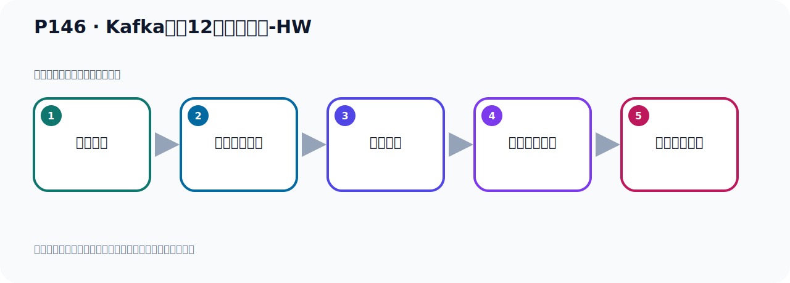
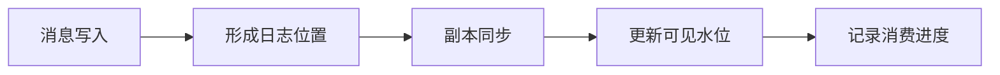

# P146：Kafka中的12个核心概念-HW

> 笔记编号 146/156 · 时长 04:10 · [打开原视频 P146](https://www.bilibili.com/video/BV14J4m187jz?p=146)

[← P145: Kafka中的12个核心概念-LEO](../09-cluster-replication/p145-Kafka中的12个核心概念-LEO.md) · [返回本章](./README.md) · [P147: Kafka中ISR、HW、LEO的关系 →](../09-cluster-replication/p147-Kafka中ISR、HW、LEO的关系.md)

## 这节到底讲什么

**核心主题：Kafka中的12个核心概念-HW。**

这节围绕位置与进度展开。一定要区分日志中的位置、各副本的末端位置、可见水位和消费者提交进度。
本节属于“集群、副本机制与核心水位”这一章；放在全章里看，它的作用是：搭建三节点集群，理解 Broker、Partition、Replica、ISR、LEO 与 HW 的协作关系。

## 本节路线

## 老师的完整讲解（按视频顺序校正）

> 下面保留老师的完整讲解顺序，并修正 Kafka、Java、ZooKeeper、
> Topic、Partition、Offset 等常见识别错误。它不是压缩摘要；原始 ASR 在后面单独保留。

### 1. 00:00–01:19

我们继续来看一下Kafka中的一些重要概念，接下来我们看一下HW。它是这个HiWaterMark的一个缩写，手字母缩写。翻译下就是高水位，高水位值这个意思。它代表的是一个偏移量Obset信息，它表示是一个偏移量，表示的是消息的复制进度，也就是这个消息你复制多少了，也是这个意思，也就是说消息已经成功复制到哪个位置了，复制到哪个Obset了，它表示这个含义。既在HW之前的所有消息都已经被成功写入复本中，并且可以在所有的复本中找到，也就是HW之前这个消息已经复制完了，因此消费者可以安全的消费这些已经成功复制的消息。通过这个文字描述的我们应该对HW应该有所认识，有所了解的，。

### 2. 01:19–02:22

它表示的是一个Obset的信息，那么在我这个Obset之前的所有消息，说明我都已经复制到这个复本中去了，复制到这个重复本去了，那么这些消息都是重复本都有，你可以安全消费的。所以对于同一个复本来言，小于等于HW值的所有消息都是已经备份的，已经成功备份了。消费者他只能拉取这个Obset的之前消息，因为这个Obset就是我们的HW，HW之前消息都已经备份过了，你可以正常的安全的拉取获取，那么这样的话可以确保数据的一个可靠性安全性。我们看一下下面这张图表示了这个含义，我们这个图里面就是一个什么消息的一个日志文件，我们知道卡布特的消息是写入一个日志文件中的，而且消息它有没有偏移量，。

### 3. 02:22–03:24

目前的话这个LEO是9，LEO表示我下一条消息应该写入的位置，就是我生产者如果再发个消息的话，那么这个消息写的什么位置呢，那我下一条消息应该写的9这个位置，好，9这个位置就是LEO，我们用虚线表示，就是下一次应该写入的消息的位置，这是LEO，目前的话我们这里面写了哪里，目前的消息已经写到8了，目前消息已经写到8这个位置了，那它从雷开始的，所以现在我们应该有9条消息的，已经有9条消息了，下次再写的话就第10条消息了，好，那现在我们这个黄色部分表示这个雷到5是什么呢，就是已经同步给从这个副本了，那么这消息有6条是吧，这个6条消息是可以安全的继续消费的，它都已经同步给从服气了，。

### 4. 03:24–04:05

但是后面这还有3条还没有同步给从服气，那还不离消费，那我们这个时候的高水位消渝到这个5这个位置，到5这个位置，这就是我们的高水位，这个O是我们的高水位，那就是雷到5之前的消息你可以安全的消费，6，7，8这个3号消息还没有同步给从，还没有同步给从这个副本，所以还不离消费，好，那我们这个HW这个高水位就代表了就是，已经成功复制了这个消息的一个OFZ的这个值，好，这就是我们这个高水位这个概念。

## 关键术语

- **Kafka：** Apache 开源的分布式事件流平台，常用于高吞吐消息传递、数据管道和流处理。
- **LEO：** Log End Offset，某个副本日志末端下一条消息的位置。
- **HW：** High Watermark，高水位；消费者只能读取 HW 之前已确认的消息。

## 完整原声逐段记录

[查看本节带时间戳的本地 ASR](./transcripts/p146-Kafka中的12个核心概念-HW-ASR.md)。主笔记负责可读性和术语校正；ASR 页面负责完整性复核。

## 读完记住

- 本节主题是 **Kafka中的12个核心概念-HW**，它服务于本章目标：搭建三节点集群，理解 Broker、Partition、Replica、ISR、LEO 与 HW 的协作关系。
- 理解顺序是：消息写入 → 形成日志位置 → 副本同步 → 更新可见水位 → 记录消费进度。
- 学习时要同时核对老师的解释、画面中的配置/代码，以及最终运行结果。

## 最容易踩的坑

“Offset”不是一个全局数字；它必须放在具体 Topic、Partition、消费者组或副本语境中解释。

## 自测

1. 不看笔记，用自己的话解释“Kafka中的12个核心概念-HW”解决了什么问题。
2. 按顺序复述：消息写入、形成日志位置、副本同步、更新可见水位、记录消费进度。
3. 如果运行结果和老师不同，你会先检查哪三个输入或环境条件？

## 学完检查

- [ ] 我能不看视频复述本节完整思路
- [ ] 我能指出关键命令、配置、类或接口的作用
- [ ] 我能解释画面中的输入与输出为什么对应
- [ ] 我核对过完整 ASR，没有跳过老师的补充说明
- [ ] 我完成了本节自测或复现实验
