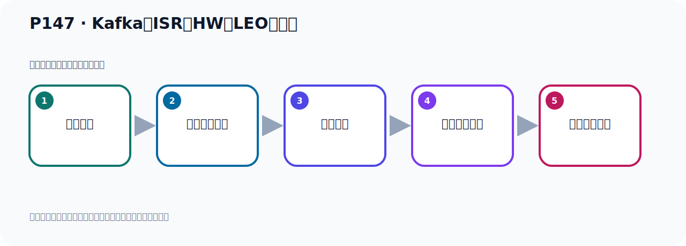
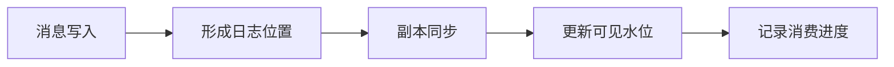

# P147：Kafka中ISR、HW、LEO的关系

> 笔记编号 147/156 · 时长 03:19 · [打开原视频 P147](https://www.bilibili.com/video/BV14J4m187jz?p=147)

[← P146: Kafka中的12个核心概念-HW](../09-cluster-replication/p146-Kafka中的12个核心概念-HW.md) · [返回本章](./README.md) · [P148: Kafka基于KRaft方式集群架构分析 →](../10-kraft-cluster/p148-Kafka基于KRaft方式集群架构分析.md)

## 这节到底讲什么

**核心主题：Kafka中ISR、HW、LEO的关系。**

这节围绕位置与进度展开。一定要区分日志中的位置、各副本的末端位置、可见水位和消费者提交进度。
本节属于“集群、副本机制与核心水位”这一章；放在全章里看，它的作用是：搭建三节点集群，理解 Broker、Partition、Replica、ISR、LEO 与 HW 的协作关系。

## 本节路线

## 先用白话读懂

LEO 是每个副本下一条记录的位置；HW 是已经确认、消费者可见的边界。Leader 新写入数据时自己的 LEO先前进，Follower 逐步复制；只有同步条件满足后 HW 才前进，因此 Leader LEO 和 HW 可以暂时不同。

## 老师的完整讲解（按视频顺序校正）

> 下面保留老师的完整讲解顺序，并修正 Kafka、Java、ZooKeeper、
> Topic、Partition、Offset 等常见识别错误。它不是压缩摘要；原始 ASR 在后面单独保留。

### 1. 00:00–01:15

下面来看一下前面介绍了ISR、HW、LEO的关系。我打算用一张图来描述一下。这个图片由于这里看不见，因为课件太小了，我们把原始图片打开在这里。我们看一下，首先看最上面，这里是三个副本，有一个主副本，两个从副本。刚开始的都是有三条消息，他们数据都同步了。这个时候相当于HW就是高水位，还有LEO都是一样的，都是在这个位置。接下来我们用开始往这个主副本，主副本，Leader，写一个消息3，写一个消息4，写两个消息3。你写完之后，从副本开下部的图，从副本需要同步了，从这边同步，你消息写了主副本之后，从副本就开始去同步。在这个时候，高水位其实在这个位置，高水位，然后LEO到这个位置来，。

### 2. 01:15–02:10

因为你主副本写了两条消息技能，那么他的LEO就到这个位置了，高水位还在这个位置。他们同步的时候，由于有些同步的快一些，有些副本同步慢一些，那可能会出现一个什么情况呢？出现我们下面这个图，这个样子。这个图，这个图，我们的这个第一个图，你看它已经同步完了，和我们左边三、四消息都同步完了，但是我们右边这个，第二个这个从副本，他没有同步完，他只同步个三，还有第四个消息没有同步，这个没有同步，只同步了部分的消息。那么此时，他的高水位是哪里来的？高水位也是在这个位置的，因为高水位记录的是你所有副本都同步完了的那个位置，对吧？好，但是这个时候的LEO还是在这个位置，还是这个位置，。

### 3. 02:11–03:05

那是LEO，LEO是你下次需要写入消息的位置，那下次写入消息可以在这个位置写入了，所以他LEO还在这里，还在这里，好，在这个关系。那接着我来看，接着我那就是你最后，最后到这里是吧，最后那就是你这个副本也同步完了，把这个消息 4也同步完了，同步完之后，那么此时你这个LEO和HW又在这个位置，他们又相同了，那说明此时你整个这个一个副本，两个副本，他们的数据全部都复制结束了，都是同步的。好，那以上这个图呢，其实就动态展示在下，我们的这个LEO和HW，它的一个这个变化一个过程，那通过这个过程，我们对它这个概念有更加的一个深入的一个认识。

### 4. 03:06–03:16

好，这就是我们这个HWLEO，通过这个图呢，动态的带大家去认识一下，它这个点的概念。

## 关键术语

- **Kafka：** Apache 开源的分布式事件流平台，常用于高吞吐消息传递、数据管道和流处理。
- **ISR：** 与 Leader 保持足够同步的副本集合，是副本选举和可靠性判断的重要依据。
- **LEO：** Log End Offset，某个副本日志末端下一条消息的位置。
- **HW：** High Watermark，高水位；消费者只能读取 HW 之前已确认的消息。

## 关键画面核对

课件用多个副本日志的连续状态图对比 ISR、HW 与各副本 LEO，强调 Leader 已写入和消费者可见之间还隔着副本同步与高水位推进。

[查看课程关键画面核对总表](../../sources/visual-checks.md)。

## 完整原声逐段记录

[查看本节带时间戳的本地 ASR](./transcripts/p147-Kafka中ISR、HW、LEO的关系-ASR.md)。主笔记负责可读性和术语校正；ASR 页面负责完整性复核。

## 读完记住

- 本节主题是 **Kafka中ISR、HW、LEO的关系**，它服务于本章目标：搭建三节点集群，理解 Broker、Partition、Replica、ISR、LEO 与 HW 的协作关系。
- 理解顺序是：消息写入 → 形成日志位置 → 副本同步 → 更新可见水位 → 记录消费进度。
- 学习时要同时核对老师的解释、画面中的配置/代码，以及最终运行结果。

## 最容易踩的坑

“Offset”不是一个全局数字；它必须放在具体 Topic、Partition、消费者组或副本语境中解释。

## 自测

1. 不看笔记，用自己的话解释“Kafka中ISR、HW、LEO的关系”解决了什么问题。
2. 按顺序复述：消息写入、形成日志位置、副本同步、更新可见水位、记录消费进度。
3. 如果运行结果和老师不同，你会先检查哪三个输入或环境条件？

## 学完检查

- [ ] 我能不看视频复述本节完整思路
- [ ] 我能指出关键命令、配置、类或接口的作用
- [ ] 我能解释画面中的输入与输出为什么对应
- [ ] 我核对过完整 ASR，没有跳过老师的补充说明
- [ ] 我完成了本节自测或复现实验
