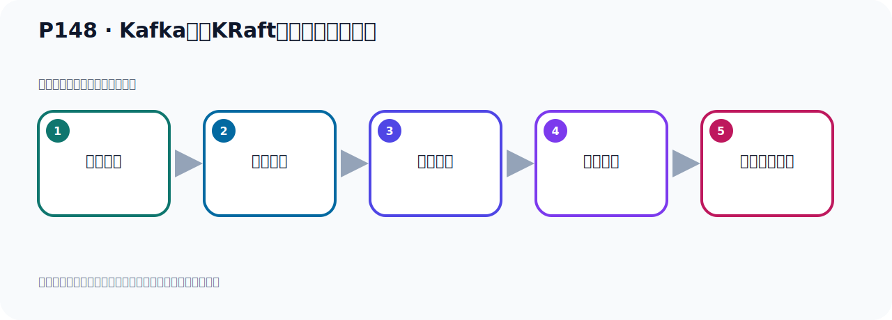
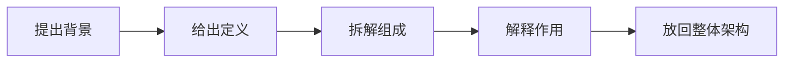

# P148：Kafka基于KRaft方式集群架构分析

> 笔记编号 148/156 · 时长 04:07 · [打开原视频 P148](https://www.bilibili.com/video/BV14J4m187jz?p=148)

[← P147: Kafka中ISR、HW、LEO的关系](../09-cluster-replication/p147-Kafka中ISR、HW、LEO的关系.md) · [返回本章](./README.md) · [P149: Kafka基于KRaft方式集群架构分析 →](../10-kraft-cluster/p149-Kafka基于KRaft方式集群架构分析.md)

## 这节到底讲什么

**核心主题：Kafka基于KRaft方式集群架构分析。**

这是一节概念课。老师先交代背景，再给出定义、组成和作用，最后把概念放回 Kafka 整体架构。
本节属于“KRaft 集群实战”这一章；放在全章里看，它的作用是：用 KRaft 取代 ZooKeeper，完成角色规划、Broker 配置、启动、测试与收尾。

## 本节路线

## 先用白话读懂

这一节先复盘 ZooKeeper 架构：Broker 中选出 Controller，Controller 把 Topic、Partition 等元数据写入 ZooKeeper。后续 KRaft 的变化点是把这套元数据控制面迁入 Kafka 自身的 Controller Quorum；Producer、Consumer、Broker 分区日志等数据面仍然存在。

## 老师的完整讲解顺序（ASR 辅助复核）

> 下面按时间顺序保留经过基础术语替换的 ASR，方便核对老师是否提到某个细节。
> 人名、命令、代码和英文参数仍可能识别错误；准确结论以本节白话说明、代码块和实操速查表为准。

### 1. 00:00–00:49

接下来我们来看一下Kafka基于KRaft方式的集群。之前我们有一张图，是我们之前搭建基于ZooKeeper方式集群的手，画了一张图。那就是我们现在把ZooKeeper这个位置把它要替换成KRaft。之前我们这里搭置ZooKeeper，现在我们这里也相对是用KRaft来取代就可以了。好，这是我们这个图。那下面我们具体的看一下，我们有另外一张图，大家看一下。那我们下一张PPT，把这个稍微放大一点。好，那我们重点看一下这张图。原来我们是用ZooKeeper方式搭建，那就是左侧这个图。现在我们是KRaft的方式，那就是右侧这个图。

### 2. 00:49–01:37

那我们先看左侧这个图。左侧这个图就是我们Kafka2.x系列，就是R这个版本，它的一种方式。那么从Kafka2.8开始，它就新增了这个KRaft的方式，只不过在Kafka2.8的时候，KRaft的方式还是一个体验测试的一个状态。那后面到3点了以后，那么这个KRaft的方式就变成了稳定的版本。所以在3这个版本的时候，就可以完全使用KRaft的方式来搭建集群。好，那左侧，原来这个老版本，2这个版本，它需要有一个ZooKeeper集群。ZooKeeper，你要搭一个ZooKeeper集群。好，然后下面是我们的Kafka，这个Kafka什么意思呢？

### 3. 01:37–02:25

我们其实Kafka我们就只有3个，3个Kafka节点。那么这个3个Kafka节点里面有一个，它会成为一个特殊的节点，叫Controller节点。那么这个我们这里虽然的话有4个Kafka这个图，是吧？有4个，其实我们是3个，只不过这个3个里面其中某一个，比如说这个啊，咦，然后把Lin取出来，Lin出来之后，它变成了一个什么？变成了一个Controller节点，叫控制节点，控制器节点。就是这3个里面有一个节点，是控制器节点。那么这个哪个节点它会成为控制器节点呢？一般机会下，就是哪个节点你先启动，哪个节点它就会成为控制器节点。

### 4. 02:25–03:08

是这样的，因为它这个有点类似一样分布的所一样，你比如说我把这个节点我先启动，我先启动之后，它就会在ZooKeeper上创建一个什么？创建一个ZooKeeper的目录节点，就会创建目录节点。那接下来你第1个节点和第3个节点启动的时候，你就创建不了了，因为这个目录节点啊，那个ZooKeeper上那个节点它已经创建了，那你第2个，第3个就创建不了了，因为它已经占用了。所以第1个起动这个Kafka节点，它往往都是我们的控制器节点，就是我们Ctrl的节点。好，那下面一个意思啊，我们下面有个备注啊，那我们这个集群之中有3个节点，。

### 5. 03:08–03:55

它们刚开始都是Broker节点，都是Broker角色，就是一个普通的Kafka角色。那么其中有一个Broker，这个Hexer的，这个Hexer变Hexer了，从这3个里面相应于拿出的一个，拿出的一个之后呢，它变成了一个Ctrl控制器节点，那么控制器节点它会将集群的这个元数据，比如说你这个Topic啊，分区啊，这些信息，然后保存在我们这个ZooKeeper中，用于集群各节点之间分布式交互，进行分布式的协调，也就是我们的这个一些元数据信息，那么控制器节点，它会把它放到ZooKeeper里面去，帮你写入ZooKeeper中，写入ZooKeeper中是这样的。

### 6. 03:56–04:03

好，这是我们原来的这个ZooKeeper系列，基于ZooKeeper方式集群，当年集群就是这个样子。

## 关键术语

- **Kafka：** Apache 开源的分布式事件流平台，常用于高吞吐消息传递、数据管道和流处理。
- **Topic：** 事件的逻辑分类。生产者向 Topic 写数据，消费者从 Topic 读取数据。
- **Broker：** 运行 Kafka 服务的节点；多个 Broker 组成 Kafka 集群。
- **ZooKeeper：** 旧版 Kafka 用于集群元数据和控制器协调的外部服务。
- **KRaft：** Kafka 自带的 Raft 元数据仲裁模式，可在新架构中摆脱 ZooKeeper。

## 关键画面核对

KRaft 架构图保留 Broker、Partition/Replica、Producer 与 Consumer Group 的数据面，把变化集中在 Kafka 自身的控制器仲裁和元数据管理。

[查看课程关键画面核对总表](../../sources/visual-checks.md)。

## 完整原声逐段记录

[查看本节带时间戳的本地 ASR](./transcripts/p148-Kafka基于KRaft方式集群架构分析-ASR.md)。主笔记负责可读性和术语校正；ASR 页面负责完整性复核。

## 读完记住

- 本节主题是 **Kafka基于KRaft方式集群架构分析**，它服务于本章目标：用 KRaft 取代 ZooKeeper，完成角色规划、Broker 配置、启动、测试与收尾。
- 理解顺序是：提出背景 → 给出定义 → 拆解组成 → 解释作用 → 放回整体架构。
- 学习时要同时核对老师的解释、画面中的配置/代码，以及最终运行结果。

## 最容易踩的坑

不要只背术语定义；需要同时说清它解决什么问题、与哪些组件交互、失效时会出现什么现象。

## 自测

1. 不看笔记，用自己的话解释“Kafka基于KRaft方式集群架构分析”解决了什么问题。
2. 按顺序复述：提出背景、给出定义、拆解组成、解释作用、放回整体架构。
3. 如果运行结果和老师不同，你会先检查哪三个输入或环境条件？

## 学完检查

- [ ] 我能不看视频复述本节完整思路
- [ ] 我能指出关键命令、配置、类或接口的作用
- [ ] 我能解释画面中的输入与输出为什么对应
- [ ] 我核对过完整 ASR，没有跳过老师的补充说明
- [ ] 我完成了本节自测或复现实验
