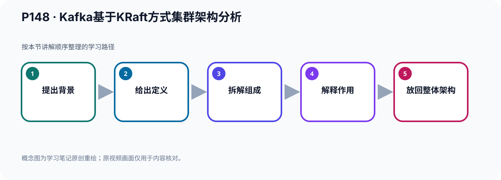
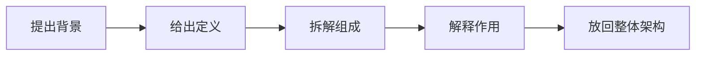

# P148：Kafka基于KRaft方式集群架构分析

> 笔记编号 148/156 · 时长 04:07 · [打开原视频 P148](https://www.bilibili.com/video/BV14J4m187jz?p=148)

[← P147: Kafka中ISR、HW、LEO的关系](../09-cluster-replication/p147-Kafka中ISR、HW、LEO的关系.md) · [返回本章](./README.md) · [P149: Kafka基于KRaft方式集群架构分析 →](../10-kraft-cluster/p149-Kafka基于KRaft方式集群架构分析.md)

## 先看结论

> 这节通过“Kafka基于KRaft方式集群架构分析”回答概念从哪里来、由什么组成、解决什么问题，以及它在 Kafka 整体架构中的位置。它服务于本章目标：用 KRaft 取代 ZooKeeper，完成角色规划、Broker 配置、启动、测试与收尾。

## 老师怎么一步步讲

1. 第 1 步，围绕“Kafka基于KRaft方式集群架构分析”完成提出背景。
2. 第 2 步，围绕“Kafka基于KRaft方式集群架构分析”完成给出定义。
3. 第 3 步，围绕“Kafka基于KRaft方式集群架构分析”完成拆解组成。
4. 第 4 步，围绕“Kafka基于KRaft方式集群架构分析”完成解释作用。
5. 第 5 步，围绕“Kafka基于KRaft方式集群架构分析”完成放回整体架构。

## 先用白话读懂

这一节先复盘 ZooKeeper 架构：Broker 中选出 Controller，Controller 把 Topic、Partition 等元数据写入 ZooKeeper。后续 KRaft 的变化点是把这套元数据控制面迁入 Kafka 自身的 Controller Quorum；Producer、Consumer、Broker 分区日志等数据面仍然存在。

## 老师的补充说明

下面按原声顺序整理老师的完整讲解脉络。保留原因、案例、对比、操作过程、边界条件和口头提醒；删除重复语气词，并把长口语拆成适合阅读的短段落。

> 技术术语已经过统一校正；仍无法确认的人名或口头英文会保留原意，并通过右侧时间范围返回视频核对。

### 先明确：Kafka基于KRaft方式集群架构分析要解决什么 · 00:00–01:23

接下来我们来看一下Kafka基于KRaft方式的集群。之前我们有一张图，是我们之前搭建基于ZooKeeper方式集群的手，画了一张图。那就是我们现在把ZooKeeper这个位置把它要替换成KRaft。之前我们这里搭置ZooKeeper，现在我们这里也相对是用KRaft来取代就可以了。这是我们这个图。那下面我们具体的看一下，我们有另外一张图，大家看一下。那我们下一张PPT，把这个稍微放大一点。那我们重点看一下这张图。原来我们是用ZooKeeper方式搭建，那就是左侧这个图。

现在我们是KRaft的方式，那就是右侧这个图。那我们先看左侧这个图。左侧这个图就是我们Kafka2.x系列，就是R这个版本，它的一种方式。那么从Kafka2.8开始，它就新增了这个KRaft的方式，只不过在Kafka2.8的时候，KRaft的方式还是一个体验测试的一个状态。那后面到3点了以后，那么这个KRaft的方式就变成了稳定的版本。所以在3这个版本的时候，就可以完全使用KRaft的方式来搭建集群。

### 老师用例子进一步解释 · 01:23–02:40

那左侧，原来这个老版本，2这个版本，它需要有一个ZooKeeper集群。ZooKeeper，你要搭一个ZooKeeper集群。然后下面是我们的Kafka，这个Kafka什么意思呢？我们其实Kafka我们就只有3个，3个Kafka节点。那么这个3个Kafka节点里面有一个，它会成为一个特殊的节点，叫Controller节点。那么这个我们这里虽然的话有4个Kafka这个图，是吧？

有4个，其实我们是3个，只不过这个3个里面其中某一个，比如说这个啊，咦，然后把Lin取出来，Lin出来之后，它变成了一个什么？变成了一个Controller节点，叫控制节点，控制器节点。就是这3个里面有一个节点，是控制器节点。那么这个哪个节点它会成为控制器节点呢？一般机会下，就是哪个节点你先启动，哪个节点它就会成为控制器节点。是这样的，因为它这个有点类似一样分布的所一样，你比如说我把这个节点我先启动，我先启动之后，它就会在ZooKeeper上创建一个什么？

创建一个ZooKeeper的目录节点，就会创建目录节点。

### 最后验证结果，并收束本节结论 · 02:40–04:03

那接下来你第1个节点和第3个节点启动的时候，你就创建不了了，因为这个目录节点啊，那个ZooKeeper上那个节点它已经创建了，那你第2个，第3个就创建不了了，因为它已经占用了。所以第1个起动这个Kafka节点，它往往都是我们的控制器节点，就是我们Ctrl的节点。那下面一个意思啊，我们下面有个备注啊，那我们这个集群之中有3个节点，它们刚开始都是Broker节点，都是Broker角色，就是一个普通的Kafka角色。

那么其中有一个Broker，这个Hexer的，这个Hexer变Hexer了，从这3个里面相应于拿出的一个，拿出的一个之后呢，它变成了一个Ctrl控制器节点，那么控制器节点它会将集群的这个元数据，比如说你这个Topic啊，分区啊，这些信息，然后保存在我们这个ZooKeeper中，用于集群各节点之间分布式交互，进行分布式的协调，也就是我们的这个一些元数据信息，那么控制器节点，它会把它放到ZooKeeper里面去，帮你写入ZooKeeper中，写入ZooKeeper中是这样的。

这是我们原来的这个ZooKeeper系列，基于ZooKeeper方式集群，当年集群就是这个样子。

## 放进整套课

本节属于 **KRaft 集群实战**。这一章要解决的是：用 KRaft 取代 ZooKeeper，完成角色规划、Broker 配置、启动、测试与收尾。

这是一节概念课。老师先交代背景，再给出定义、组成和作用，最后把概念放回 Kafka 整体架构。

### 记忆路线

```mermaid
flowchart LR
    N0["提出背景"]
    N1["给出定义"]
    N0 --> N1
    N2["拆解组成"]
    N1 --> N2
    N3["解释作用"]
    N2 --> N3
    N4["放回整体架构"]
    N3 --> N4
```

## 用在工作里

| 项目 | 内容 |
|---|---|
| 先回答 | 先用一句话说明这个概念解决的问题。 |
| 立刻做 | 把它与 Topic、Partition、Broker、Producer 或 Consumer 的关系画出来。 |
| 留下证据 | 用一个正常场景和一个失败场景检验自己是否真正理解。 |

## 关键术语

- **Kafka：** Apache 开源的分布式事件流平台，常用于高吞吐消息传递、数据管道和流处理。
- **Topic：** 事件的逻辑分类。生产者向 Topic 写数据，消费者从 Topic 读取数据。
- **Broker：** 运行 Kafka 服务的节点；多个 Broker 组成 Kafka 集群。
- **ZooKeeper：** 旧版 Kafka 用于集群元数据和控制器协调的外部服务。
- **KRaft：** Kafka 自带的 Raft 元数据仲裁模式，可在新架构中摆脱 ZooKeeper。

## 关键画面核对

KRaft 架构图保留 Broker、Partition/Replica、Producer 与 Consumer Group 的数据面，把变化集中在 Kafka 自身的控制器仲裁和元数据管理。

[查看课程关键画面核对总表](../../sources/visual-checks.md)。

## 最容易踩的坑

不要只背术语定义；需要同时说清它解决什么问题、与哪些组件交互、失效时会出现什么现象。

## 自测

1. 不看笔记，用自己的话解释“Kafka基于KRaft方式集群架构分析”解决了什么问题。
2. 按顺序复述：提出背景、给出定义、拆解组成、解释作用、放回整体架构。
3. 如果运行结果和老师不同，你会先检查哪三个输入或环境条件？

## 学完检查

- [ ] 我能不看视频复述本节完整思路
- [ ] 我能指出关键命令、配置、类或接口的作用
- [ ] 我能解释画面中的输入与输出为什么对应
- [ ] 我读完了老师的详细讲解正文，没有只看路线图和要点
- [ ] 我完成了本节自测或复现实验

## 需要核对原话时

[查看本节带时间戳的完整 ASR](./transcripts/p148-Kafka基于KRaft方式集群架构分析-ASR.md)。主笔记负责理解与实践；ASR 页面负责逐句完整性复核。
