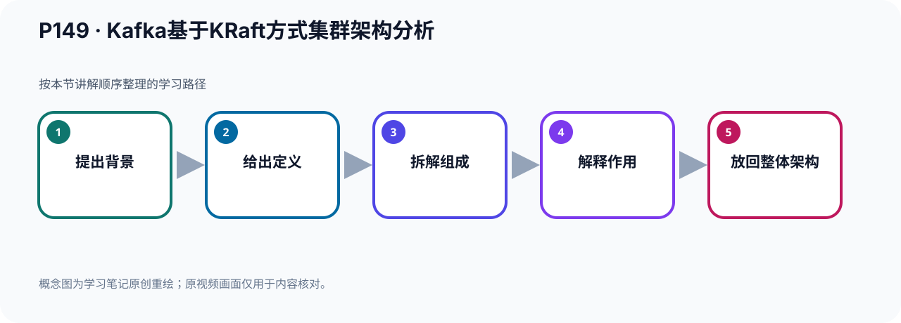
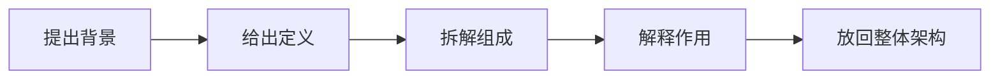

# P149：Kafka基于KRaft方式集群架构分析

> 笔记编号 149/156 · 时长 04:52 · [打开原视频 P149](https://www.bilibili.com/video/BV14J4m187jz?p=149)

[← P148: Kafka基于KRaft方式集群架构分析](../10-kraft-cluster/p148-Kafka基于KRaft方式集群架构分析.md) · [返回本章](./README.md) · [P150: Kafka基于KRaft方式集群服务器规划 →](../10-kraft-cluster/p150-Kafka基于KRaft方式集群服务器规划.md)

## 先看结论

> 这节通过“Kafka基于KRaft方式集群架构分析”回答概念从哪里来、由什么组成、解决什么问题，以及它在 Kafka 整体架构中的位置。它服务于本章目标：用 KRaft 取代 ZooKeeper，完成角色规划、Broker 配置、启动、测试与收尾。

## 老师怎么一步步讲

1. 第 1 步，围绕“Kafka基于KRaft方式集群架构分析”完成提出背景。
2. 第 2 步，围绕“Kafka基于KRaft方式集群架构分析”完成给出定义。
3. 第 3 步，围绕“Kafka基于KRaft方式集群架构分析”完成拆解组成。
4. 第 4 步，围绕“Kafka基于KRaft方式集群架构分析”完成解释作用。
5. 第 5 步，围绕“Kafka基于KRaft方式集群架构分析”完成放回整体架构。

## 老师的补充说明

下面按原声顺序整理老师的完整讲解脉络。保留原因、案例、对比、操作过程、边界条件和口头提醒；删除重复语气词，并把长口语拆成适合阅读的短段落。

> 技术术语已经过统一校正；仍无法确认的人名或口头英文会保留原意，并通过右侧时间范围返回视频核对。

### 先明确：Kafka基于KRaft方式集群架构分析要解决什么 · 00:00–01:11

现在我们是Kafka 3，那么3以后我们用KRaft的方式。KRaft的方式就是我们首先有4个Kafka，这4个Kafka里边有3个，我们会人为止地，它是一个控制器，这个Ctrl，从这4个里面拿出3个，比如说我拿出这3个Kafka，把它拿出来，拿出来之后我把它变成一个Ctrl节点，叫控制器节点。

控制器节点它是负责控制管理协调的，管理你的一些元数据的，那就是其中有3个它是控制器节点，那么这3个控制器节点里面它又会选择出一个主控制器，会选一个主控制器节点，那么它就变成这个模式，那么这个模式就是我们的KRaft的方式，那KRaft是什么，KRaft就是你自己Kafka本身充当ZooKeeper角色，你自己就是ZooKeeper，。

### 继续拆解给出定义 · 01:11–02:12

所以把这个ZooKeeper不需要了，你自己本身就是ZooKeeper，就取代了ZooKeeper的功能，你自己本身就可以进一服节点的协调元素的管理，所以我没到处，Kafka本身具备2个角色，一个是说Kafka自己要存储消息，接收消息，转发消息，成了这个任务，另外Kafka自己本身要负责数据的协调，服务协调，然后再进一步，然后这个元素的管理，它相对于一个节点就具备2重功能，2个角色，2个功能，这就是我们KRaft的方式，KRaft的方式并不说你要搭建一个KRaft的服务器，或者下载一个KRaft软件，不是这样，就是自己Kafka本身就充当了，数据存储还有服务协调，节点协调，这个功能，既充当消息的存储，又充当ZooKeeper的功能，这就是我们的KRaft的方式，。

### 老师用例子进一步解释 · 02:13–03:25

所以我们看这个文字，我们有个集群里面有4个block接点，然后我们人为子弟其中3个是控制器接点，就是controller接点，也就是我们这个蓝色，表示的，也就是从这里面拿出3个，这3个倒是把取出来人为子弟，他是一个控制器接点，当然这3个它同时也是一个消息存储的节点，所以这3个它既存储消息，同时它又是控制器，就2成功能，2个角色，那么从这3个控制器中，然后会选举出一个控制器，它作为主控制器，就是这个褐色的，变成主控制器，也就是说这3个里面，它是控制器，同时，比如说这个，它也是主控制器，主控制器，那么其他两个，另外还有两个，还有两个，另外两个它备用，你主控制器如果故障的，那我还有备用的，底上的，所以这种话，它不需要ZooKeeper了，不需要ZooKeeper了，相关的这个元数据，以Kafka日志的形式来存在，

也就是它以消息对立的方式来存在，就自己这个Kafka节点，。

### 最后验证结果，并收束本节结论 · 03:26–04:46

即使ZooKeeper的功能又是Kafka自己本身消息存存的功能，就两个功能，这是我们这个新的模式的这个集群，可谅方式集群，那么这个控制器节点，它在集群中，它扮演着这个管理和协调这个角色，这是控制器节点，管理整个集群中，所有分区和副本的这个状态，当某个分区的这个lead副本，出现故障的时候，那么控制器的，它负责给这个分区选举新的lead副本，所以我们这个控制器节点在我们的集群中，它附着一个协调管理的这个作用这个功能，那么除了这个控制器节点之外，那么其他节点就是Broker节点，就是普通的这个伏气的Broker节点，那么Broker节点，它主要在我们集群中呢，承担这个消息的存储，保存消息存储转发功能，所以它有两类角色，两类角色，那么通过这个解读呢，我们对这两种方式的这个集群，它的这个角色，节点的作用功能，

也有所了解了，我们下面就是去搭建这样一个基于couple的方式的集群，关于与主q方式集群，我们在前面已经搭建过了，所以下面就是搭建以后的基于couple的方式的这个集群模式。

## 放进整套课

本节属于 **KRaft 集群实战**。这一章要解决的是：用 KRaft 取代 ZooKeeper，完成角色规划、Broker 配置、启动、测试与收尾。

这是一节概念课。老师先交代背景，再给出定义、组成和作用，最后把概念放回 Kafka 整体架构。

### 记忆路线

```mermaid
flowchart LR
    N0["提出背景"]
    N1["给出定义"]
    N0 --> N1
    N2["拆解组成"]
    N1 --> N2
    N3["解释作用"]
    N2 --> N3
    N4["放回整体架构"]
    N3 --> N4
```

## 用在工作里

| 项目 | 内容 |
|---|---|
| 先回答 | 先用一句话说明这个概念解决的问题。 |
| 立刻做 | 把它与 Topic、Partition、Broker、Producer 或 Consumer 的关系画出来。 |
| 留下证据 | 用一个正常场景和一个失败场景检验自己是否真正理解。 |

## 关键术语

- **Kafka：** Apache 开源的分布式事件流平台，常用于高吞吐消息传递、数据管道和流处理。
- **Broker：** 运行 Kafka 服务的节点；多个 Broker 组成 Kafka 集群。
- **ZooKeeper：** 旧版 Kafka 用于集群元数据和控制器协调的外部服务。
- **KRaft：** Kafka 自带的 Raft 元数据仲裁模式，可在新架构中摆脱 ZooKeeper。

## 最容易踩的坑

不要只背术语定义；需要同时说清它解决什么问题、与哪些组件交互、失效时会出现什么现象。

## 自测

1. 不看笔记，用自己的话解释“Kafka基于KRaft方式集群架构分析”解决了什么问题。
2. 按顺序复述：提出背景、给出定义、拆解组成、解释作用、放回整体架构。
3. 如果运行结果和老师不同，你会先检查哪三个输入或环境条件？

## 学完检查

- [ ] 我能不看视频复述本节完整思路
- [ ] 我能指出关键命令、配置、类或接口的作用
- [ ] 我能解释画面中的输入与输出为什么对应
- [ ] 我读完了老师的详细讲解正文，没有只看路线图和要点
- [ ] 我完成了本节自测或复现实验

## 需要核对原话时

[查看本节带时间戳的完整 ASR](./transcripts/p149-Kafka基于KRaft方式集群架构分析-ASR.md)。主笔记负责理解与实践；ASR 页面负责逐句完整性复核。
