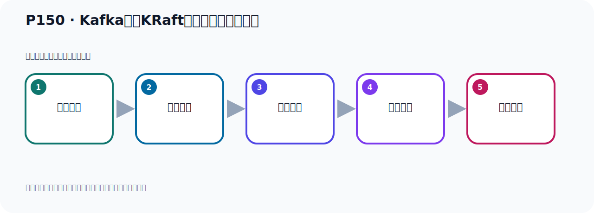

# P150：Kafka基于KRaft方式集群服务器规划

> 笔记编号 150/156 · 时长 04:08 · [打开原视频 P150](https://www.bilibili.com/video/BV14J4m187jz?p=150)

[← P149: Kafka基于KRaft方式集群架构分析](../10-kraft-cluster/p149-Kafka基于KRaft方式集群架构分析.md) · [返回本章](./README.md) · [P151: Kafka基于KRaft方式集群准备Broker服务器 →](../10-kraft-cluster/p151-Kafka基于KRaft方式集群准备Broker服务器.md)

## 这节到底讲什么

**核心主题：Kafka基于KRaft方式集群服务器规划。**

这节继续完善 Kafka 的完整知识链。请按老师的讲解顺序理解动机、做法和结果。
本节属于“KRaft 集群实战”这一章；放在全章里看，它的作用是：用 KRaft 取代 ZooKeeper，完成角色规划、Broker 配置、启动、测试与收尾。

## 本节路线

## 老师的完整讲解（按视频顺序校正）

> 下面保留老师的完整讲解顺序，并修正 Kafka、Java、ZooKeeper、
> Topic、Partition、Offset 等常见识别错误。它不是压缩摘要；原始 ASR 在后面单独保留。

### 1. 00:00–01:06

Kafka基于Karaft方式的集群的各个节点和角色功能作了介绍。我们对这个了解之后就开始搭集群。我们刚才有一个叫KIP500，这个是什么意思？没有介绍是吧？这个是一个Kafka，它每次新增一些新功能、新特性的时候，它有一个提案。这个提案，这个提案，提案，提案。或者叫建议，建议，那编号500，编号是500。在这个建议提案一下，然后新增了这个Korom的方式。之前是没有Korom的方式的，之前是有RK，后面在这个建议下新增了Korom的方式，是这个意思。好，那下面我们去搭这个集群，搭这个集群的话，我们首先要把这个服务器规划一下。

### 2. 01:06–02:01

好，那这个时候我做一下服务器规划，好，那这个时候我们就把之前这个500提案，它这个基于Korom的方式模式的这个节点，我变成我右边这个东西，我改了一下。因为我搭三个节点，它原来其实搭了四个节点，这个图里面是四个Block节点，就是Kafka节点。我这边是搭三个，我就准备三个Kafka，我们之前搭RK集群的时候也是搭三个，所以我们这次也搭三个，好，那你走这边减少一个。那你想想，我这搭三个，那我这三个它既是消息存出的节点，同时又是控制节点，又是控制器节点。这三个它到时又都是控制器节点，是这样的。之前它是四个，四个里面其实有一个它不是控制器，另外的三个是控制器，是这样的。

### 3. 02:01–02:57

所以我到时我这三个节点就是既是消息节点，又是控制器节点，就这个意思，对吧。好，那这样我就去搭，去搭的话我这有三个，这一个是吧，两个三个，三个。好，那我现在是搭在一台机器上，你也可以搭三个机器，就你到时安装三个蓄力机，搭三个也可以。那我现在就装在一台机器上，装在一台机器上它有一个区别例子，端口号不能冲突，其他都一样，就是端口号你不要冲突。你如果搭在三台机器上，那你端口号是可以一样的，因为它在三台机器，那么它的端口就不会冲突。我现在是搭一台机器上，所以我需要端口号不冲突。好，那你看一下我们第一台机器是这样的。第二台机器就在我们这个11.119这个IP，这是我们的IP，那么它的端口是9091，那么第二台它是9092，端口9092。

### 4. 02:58–03:48

第三台是9093，所以保证端口不冲突。它IP都是一样的。好，这台IP，然后这个肉是角色，我现在这三台它既是消息节点，又是控制器节点。所以这个是一样，它既是Broker节点，又是Cauture节点，所以两个机器都一样，所以这就有斗号分隔，用斗号分隔就可以了。好，那么下面这台也是一样，它既是Broker消息节点，又是控制器节点，那么这台也是既是消息节点，又是控制器节点，好，这是我们这个角色。好，另外一个就是集群里面的，每个Kafka它的ID不能重复，这个和我们之前的机器如KIM方式搭建是一样的，每个Broker，就是每个Kafka，它有个唯一的ID，唯一的编号，这个编号是一，这个是二，这个是三。

### 5. 03:48–04:04

当然这个你也可以试，这个是一时，这是二时，这是三时，都是可以的。好，这是我们的服务器规划，到时候我得在一台机上搭三个Kafka，好，这规划好了，接下来我们就实际动手去搭一下。

## 关键术语

- **Kafka：** Apache 开源的分布式事件流平台，常用于高吞吐消息传递、数据管道和流处理。
- **Broker：** 运行 Kafka 服务的节点；多个 Broker 组成 Kafka 集群。
- **KRaft：** Kafka 自带的 Raft 元数据仲裁模式，可在新架构中摆脱 ZooKeeper。

## 完整原声逐段记录

[查看本节带时间戳的本地 ASR](./transcripts/p150-Kafka基于KRaft方式集群服务器规划-ASR.md)。主笔记负责可读性和术语校正；ASR 页面负责完整性复核。

## 读完记住

- 本节主题是 **Kafka基于KRaft方式集群服务器规划**，它服务于本章目标：用 KRaft 取代 ZooKeeper，完成角色规划、Broker 配置、启动、测试与收尾。
- 理解顺序是：问题背景 → 关键对象 → 处理过程 → 结果验证 → 应用边界。
- 学习时要同时核对老师的解释、画面中的配置/代码，以及最终运行结果。

## 最容易踩的坑

不要把孤立 API 或配置项当成完整能力；始终把它放回生产、存储、消费或集群链路中理解。

## 自测

1. 不看笔记，用自己的话解释“Kafka基于KRaft方式集群服务器规划”解决了什么问题。
2. 按顺序复述：问题背景、关键对象、处理过程、结果验证、应用边界。
3. 如果运行结果和老师不同，你会先检查哪三个输入或环境条件？

## 学完检查

- [ ] 我能不看视频复述本节完整思路
- [ ] 我能指出关键命令、配置、类或接口的作用
- [ ] 我能解释画面中的输入与输出为什么对应
- [ ] 我核对过完整 ASR，没有跳过老师的补充说明
- [ ] 我完成了本节自测或复现实验
