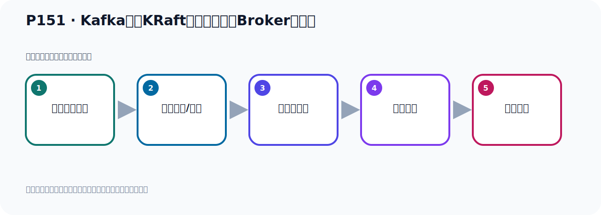

# P151：Kafka基于KRaft方式集群准备Broker服务器

> 笔记编号 151/156 · 时长 02:57 · [打开原视频 P151](https://www.bilibili.com/video/BV14J4m187jz?p=151)

[← P150: Kafka基于KRaft方式集群服务器规划](../10-kraft-cluster/p150-Kafka基于KRaft方式集群服务器规划.md) · [返回本章](./README.md) · [P152: Kafka基于KRaft方式集群配置Broker服务器 →](../10-kraft-cluster/p152-Kafka基于KRaft方式集群配置Broker服务器.md)

## 这节到底讲什么

**核心主题：Kafka基于KRaft方式集群准备Broker服务器。**

这是一节动手课。不要只记命令，要把前置条件、操作步骤、关键参数和成功信号连成一条验证链。
本节属于“KRaft 集群实战”这一章；放在全章里看，它的作用是：用 KRaft 取代 ZooKeeper，完成角色规划、Broker 配置、启动、测试与收尾。

## 本节路线

## 老师的完整讲解（按视频顺序校正）

> 下面保留老师的完整讲解顺序，并修正 Kafka、Java、ZooKeeper、
> Topic、Partition、Offset 等常见识别错误。它不是压缩摘要；原始 ASR 在后面单独保留。

### 1. 00:00–00:50

前面我们把一些准备工作都准备好了。那我们接下来就开始正式来搭建Kafka的集群，基于Korobl的方式。我们往下看一下。我们要搭建一个基于Korobl的模式的集群，它整体上分为三步。第一步就是准备三个Kafka。Kafka它是个压缩包，所以我们直接解压三个Kafka的第一步。第二步就是配置Kafka这个配置文件。它这个配置文件在Korobl的这个模式下，KafkaKorobl的这个模式下，让一个server这个配置文件在我们PPT里面有小细的配置，怎么配都有。第三步就是启动并且测试。所以这个也非常简单，第一步准备三个Kafka，。

### 2. 00:50–01:36

第二步配置那个server文件，第三步测试。这三步，那首先我们去完成第一步。第一步那就是准备三个Kafka，是吧？好，那我们接下来我要看，那第一步我们开始解压三个Kafka，准备第一步。那我们在这个服务器，就是我这边的这个服务器，我现在用的是这个129这个服务器，用这个服务器。好，那这个服务器已经启动好了，启动好了以后呢，我们就开始去搭，那在这个地方呢，我连开三个窗口都是你的这个129机器，我开三个窗口。好，那我们这个129机器，它启动好的，然后我们这个地方都把它连上去的，对吧？都连的是129机器，下面我们开始去安装啊。

### 3. 01:36–02:16

安装的话呢，首先我们看一下我们软件在哪里的，我的软件呢，在这地方啊，都准备好了在这里。好，就是3.7这个版本，那我们解压三个TAR，Gunz CXVF，然后Kafka，把它解压到这个U字轮轮口目录下，所以Gunz C，指定目录，就U字轮轮口下。好，这件解压一下，好，这样我们就解压了啊，解压之后呢，就在我们U的轮口目录下，我们看一下U的轮口目录下在这里，好，这就是我们的第一个Kafka，第一个Kafka，对吧？当我们用U为了区分，我们取个名字，MV，Kafka，给它名字叫Kafka，Gunz CXVF，Gunz CXVF，危危危危危。

### 4. 02:45–02:53

好，那我们接下来就开始第一步了，第一步是配繪件，配繪件稍微多一点，要做一些配置好，那我们接下来来看一下。

## 关键术语

- **Kafka：** Apache 开源的分布式事件流平台，常用于高吞吐消息传递、数据管道和流处理。
- **Broker：** 运行 Kafka 服务的节点；多个 Broker 组成 Kafka 集群。
- **KRaft：** Kafka 自带的 Raft 元数据仲裁模式，可在新架构中摆脱 ZooKeeper。

## 完整原声逐段记录

[查看本节带时间戳的本地 ASR](./transcripts/p151-Kafka基于KRaft方式集群准备Broker服务器-ASR.md)。主笔记负责可读性和术语校正；ASR 页面负责完整性复核。

## 读完记住

- 本节主题是 **Kafka基于KRaft方式集群准备Broker服务器**，它服务于本章目标：用 KRaft 取代 ZooKeeper，完成角色规划、Broker 配置、启动、测试与收尾。
- 理解顺序是：确认前置条件 → 执行安装/配置 → 启动或应用 → 观察输出 → 排查失败。
- 学习时要同时核对老师的解释、画面中的配置/代码，以及最终运行结果。

## 最容易踩的坑

只照抄命令而不核对当前目录、版本、端口和配置文件路径，最容易造成“命令没报错但服务不可用”。

## 自测

1. 不看笔记，用自己的话解释“Kafka基于KRaft方式集群准备Broker服务器”解决了什么问题。
2. 按顺序复述：确认前置条件、执行安装/配置、启动或应用、观察输出、排查失败。
3. 如果运行结果和老师不同，你会先检查哪三个输入或环境条件？

## 学完检查

- [ ] 我能不看视频复述本节完整思路
- [ ] 我能指出关键命令、配置、类或接口的作用
- [ ] 我能解释画面中的输入与输出为什么对应
- [ ] 我核对过完整 ASR，没有跳过老师的补充说明
- [ ] 我完成了本节自测或复现实验
