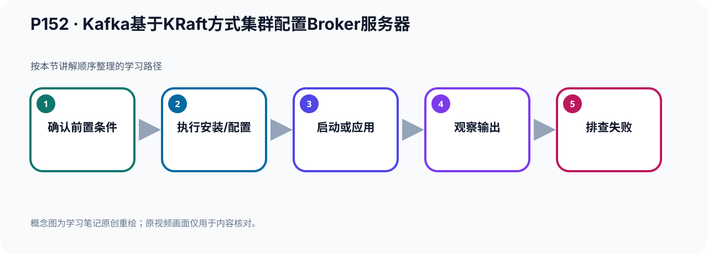

# P152：Kafka基于KRaft方式集群配置Broker服务器

> 笔记编号 152/156 · 时长 06:39 · [打开原视频 P152](https://www.bilibili.com/video/BV14J4m187jz?p=152)

[← P151: Kafka基于KRaft方式集群准备Broker服务器](../10-kraft-cluster/p151-Kafka基于KRaft方式集群准备Broker服务器.md) · [返回本章](./README.md) · [P153: Kafka基于KRaft方式集群配置Broker服务器 →](../10-kraft-cluster/p153-Kafka基于KRaft方式集群配置Broker服务器.md)

## 先看结论

> 这节通过“Kafka基于KRaft方式集群配置Broker服务器”完成一条可验证的操作链：先核对前置条件，再执行配置或命令，最后用日志和运行结果确认环境真正可用。它服务于本章目标：用 KRaft 取代 ZooKeeper，完成角色规划、Broker 配置、启动、测试与收尾。

## 老师怎么一步步讲

1. 第 1 步，围绕“Kafka基于KRaft方式集群配置Broker服务器”完成确认前置条件。
2. 第 2 步，围绕“Kafka基于KRaft方式集群配置Broker服务器”完成执行安装/配置。
3. 第 3 步，围绕“Kafka基于KRaft方式集群配置Broker服务器”完成启动或应用。
4. 第 4 步，围绕“Kafka基于KRaft方式集群配置Broker服务器”完成观察输出。
5. 第 5 步，围绕“Kafka基于KRaft方式集群配置Broker服务器”完成排查失败。

## 老师的补充说明

下面按原声顺序整理老师的完整讲解脉络。保留原因、案例、对比、操作过程、边界条件和口头提醒；删除重复语气词，并把长口语拆成适合阅读的短段落。

> 技术术语已经过统一校正；仍无法确认的人名或口头英文会保留原意，并通过右侧时间范围返回视频核对。

### 先明确：Kafka基于KRaft方式集群配置Broker服务器要解决什么 · 00:00–01:32

接下来我们就来看一下棘群的DI步。我们配置ServerProposal文件。我们就开始操作。这是我们的服务器。进入到第一台Kafka 能一这里面进来。进入到它Kafka目录下，然后进入它的KRaft目录下。这里面有个Server文件进来。这是我们配Server.Proble文件。配上我们就打开这个文件，Server.Proble文件打开。打开之后，我们第一个修改它的BrokerAD。第一台是1，第二台是2，第三台是3。第一台我们找到Broker1，我们走到最上面。

最上面，然后BrokerAD。AD它都是1，它这个是1，所以它不用动。接下来我们配置第二台。第二台我们在这里用着lockerKafka，然后第二台02，然后再进来进入到Kafka目录下进入到KRaft目录下。VM打开Server文件，打开。这一台这里面写了2，再把你改一下，再写个2。第二台，然后这边第三台。第三台我们就用着lockerKafka03，然后Kafka目录下，KRaft目录下进来。

### 继续拆解执行安装/配置 · 01:32–02:58

接下来我们打开Server文件，打开。那么这一台我们看一下，在这个位置，好，那么它就是3，它就是3。改了。

这是第一个，改这个3个，这个Broker分别改123，然后第二个就开始来，三台Broker要配置角色，那么这三台我们都是Broker和culturer角色，也就是它既是Broker角色又是culturer角色，我们可以看一下我们之前这个图在这里，就是我们规划的就是我们这三个Broker，它既是消息存储，它又是控制器节点，又取代ZooKeeper功能，所以它是有两重功能，所以这三个Broker既是Broker又是culturer，又是控制器。

所以我们这里在配置的时候这里，就要配上既是Broker又是culturer，好，那这个我们看一下它的process-rose这个配置项，改一下。那么第一台这里，第一台那就是找到那这里，process-rose这个Brokerculturer，它有的就是这个这么配的，所以不用动，那接下来看第二台，第二台它这里有的也是这样的，。

### 继续拆解启动或应用 · 02:58–04:08

所以不用动，然后第三台，第三台它有的也是Brokerculturer，所以这个不用动，好，那么这一项就可以了，不用动，不用修改，好，那么这个我们接下来配置三台这个参与投票的节点，参与投票节点，那这什么意思呢？就是我们这个图，我们现在用的是这个图，对吧？用的这个图，那你配置投票节点就是把这三台都参与投票，投票干嘛呢？

投票它要选一个组的这个控制器节点，从三个里面要选个组，它需要一个投票，基于投票的那种算法，选个组控的器，所以你要指令哪些节点参与投票，哪些节点参与投票，那我们现在这三个节点都参与投票，所以这里我们投票的时候，比较三台机器都配上，那么三台机器都配上，那我就说我们这地方第一台机器就是一，这个一是什么呢？一就是我们的bockerad，一atap加端口，然后这个二atap加端口，。

### 对比不同情况，明确条件和边界 · 04:08–05:20

然后三atap加端口，这里面这个一和三就代表我们的bockerad，分别这三台，然后at，它的就第一台，它的ap和端口是多少，第二台ap端口多少，第三台ap端口是多少，它参与这个投票，好，那么这个投票的时候呢，它的这个后面这个端口我写是9081，9082，9083，因为我要在同一台机器上部署，所以我们这三个bockerad它的ap，它的端口是不能重复的，所以三台，那我们这个时候看一下它的配置在这边，配置就在这里，那那么它这个投票这个端口，它并不是我们之前那个Kafka对外公开的9092端口，它原来是9093，它原来默认是9093，但是我现在这里在同一台机器上我改一下，所以我改的是9081，9082，9083，是这样的，好，那我三台都参与投票，那此时，那我这边就是把这段复制一下，我这个ap都写好的，

把这段复制一下，我们这个复制一下，复制一下之后呢，就把它之前这个呢，给它删掉，。

### 最后验证结果，并收束本节结论 · 05:20–06:36

这段删掉，这样，删掉这一段，第一台参与投票，第二台参与投票，第三台参与投票，好，当然是斗合分隔，斗合分隔的，好，这我们参与投票的这个机器，好，那这样我们就把这个配好了，那另外的这几台也是一样，那这边呢，参与投票的这里也要改一下，好，那这边也是改一下，参与投票是它，然后这边呢，参与投票，那就是在这个位置，好，它也改一下，好，参与投票是它，好，那这样的话我就把这几个，这三个配好了，这三个，这三台，这三个配好了，这三个，然后还这边，这三个配好了，好，配好了之后，那我们这里的这三部呢，这三个配置项就配好了，这里是投票的，参与投票，这三个节点都参与投票，好，那这样的话呢，我就把这个一二三，这三个配置，我们就配置完了，那接下来呢，我们还需要再做几项配置，然后这个集群呢，才大家完成，那接下来我们继续看一下，。

## 放进整套课

本节属于 **KRaft 集群实战**。这一章要解决的是：用 KRaft 取代 ZooKeeper，完成角色规划、Broker 配置、启动、测试与收尾。

这是一节动手课。不要只记命令，要把前置条件、操作步骤、关键参数和成功信号连成一条验证链。

### 记忆路线

```mermaid
flowchart LR
    N0["确认前置条件"]
    N1["执行安装/配置"]
    N0 --> N1
    N2["启动或应用"]
    N1 --> N2
    N3["观察输出"]
    N2 --> N3
    N4["排查失败"]
    N3 --> N4
```

## 用在工作里

| 项目 | 内容 |
|---|---|
| 先回答 | 先确认版本、目录、端口和依赖服务是否满足本节前置条件。 |
| 立刻做 | 按老师的顺序复现安装或配置，并记录每条命令的输入与输出。 |
| 留下证据 | 留下一份包含成功信号和失败排查过程的实验记录。 |

## 关键术语

- **Kafka：** Apache 开源的分布式事件流平台，常用于高吞吐消息传递、数据管道和流处理。
- **Broker：** 运行 Kafka 服务的节点；多个 Broker 组成 Kafka 集群。
- **ZooKeeper：** 旧版 Kafka 用于集群元数据和控制器协调的外部服务。
- **KRaft：** Kafka 自带的 Raft 元数据仲裁模式，可在新架构中摆脱 ZooKeeper。

## 最容易踩的坑

只照抄命令而不核对当前目录、版本、端口和配置文件路径，最容易造成“命令没报错但服务不可用”。

## 自测

1. 不看笔记，用自己的话解释“Kafka基于KRaft方式集群配置Broker服务器”解决了什么问题。
2. 按顺序复述：确认前置条件、执行安装/配置、启动或应用、观察输出、排查失败。
3. 如果运行结果和老师不同，你会先检查哪三个输入或环境条件？

## 学完检查

- [ ] 我能不看视频复述本节完整思路
- [ ] 我能指出关键命令、配置、类或接口的作用
- [ ] 我能解释画面中的输入与输出为什么对应
- [ ] 我读完了老师的详细讲解正文，没有只看路线图和要点
- [ ] 我完成了本节自测或复现实验

## 需要核对原话时

[查看本节带时间戳的完整 ASR](./transcripts/p152-Kafka基于KRaft方式集群配置Broker服务器-ASR.md)。主笔记负责理解与实践；ASR 页面负责逐句完整性复核。
