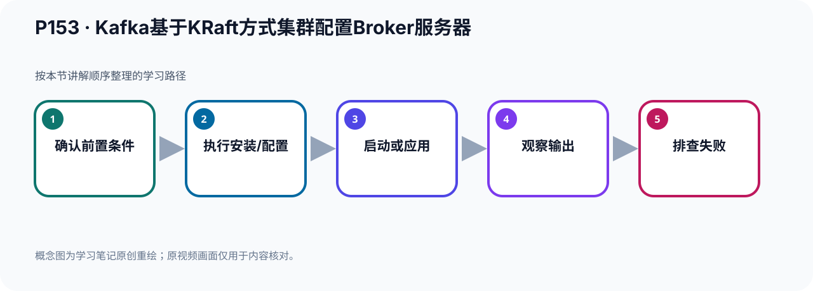

# P153：Kafka基于KRaft方式集群配置Broker服务器

> 笔记编号 153/156 · 时长 07:16 · [打开原视频 P153](https://www.bilibili.com/video/BV14J4m187jz?p=153)

[← P152: Kafka基于KRaft方式集群配置Broker服务器](../10-kraft-cluster/p152-Kafka基于KRaft方式集群配置Broker服务器.md) · [返回本章](./README.md) · [P154: Kafka基于KRaft方式集群启动Broker服务器 →](../10-kraft-cluster/p154-Kafka基于KRaft方式集群启动Broker服务器.md)

## 先看结论

> 这节通过“Kafka基于KRaft方式集群配置Broker服务器”完成一条可验证的操作链：先核对前置条件，再执行配置或命令，最后用日志和运行结果确认环境真正可用。它服务于本章目标：用 KRaft 取代 ZooKeeper，完成角色规划、Broker 配置、启动、测试与收尾。

## 老师怎么一步步讲

1. 第 1 步，围绕“Kafka基于KRaft方式集群配置Broker服务器”完成确认前置条件。
2. 第 2 步，围绕“Kafka基于KRaft方式集群配置Broker服务器”完成执行安装/配置。
3. 第 3 步，围绕“Kafka基于KRaft方式集群配置Broker服务器”完成启动或应用。
4. 第 4 步，围绕“Kafka基于KRaft方式集群配置Broker服务器”完成观察输出。
5. 第 5 步，围绕“Kafka基于KRaft方式集群配置Broker服务器”完成排查失败。

## 老师的补充说明

下面按原声顺序整理老师的完整讲解脉络。保留原因、案例、对比、操作过程、边界条件和口头提醒；删除重复语气词，并把长口语拆成适合阅读的短段落。

> 技术术语已经过统一校正；仍无法确认的人名或口头英文会保留原意，并通过右侧时间范围返回视频核对。

### 先明确：Kafka基于KRaft方式集群配置Broker服务器要解决什么 · 00:00–01:24

刚才把这三个配置相配好之后，接下来我们继续看一下，我们下面还需要配一下第四步、第五步、第六步。还是配我们KRUMP的下面的社会文件。那第四步就是我们三台Broker各自GNT的本机IP和端口，配置下Lizzer二十。那我们是GNT本机所有的IP网卡，它的端口，9091、9092、9093，我们是三台，因为在同一台机器上，所以我们的端口不能重复。那么前面这个能的能是表示保留IP，不管你这个机器上是有一张网卡、两张网卡，多个IP，那我都可以GNT。所以这些能能能能能。

第一台9091、第二台9092、9093。那后面这个Cutula，那么这个呢就是我们这个Cutula的那个GNT的那个端口，是9081、9082、9083。我们这几个端口其实在我们前面这个选举节点的时候，它是用上的。9081、9082，我们看一下呢，在这个地方，是吧，我们进去投票选举的时候，它会用到你这个Cutula这个IP端口，9081、9082、9083，是这样的。

### 对比不同情况，明确条件和边界 · 01:24–02:15

所以我们这个地方就这样配置这个IP是保留IP，然后端口分别不一样，不一样。它原来默认都是9093，默认是9093。前面这个GNT端口，它默认是9092，但是我们现在一台机器上，所以我把端口给改一下。如果说你不说是三台这个利率式机器，那这个端口其实就不用改，不用动，因为它不会冲突。那下面我们去操作，去操作，我们第一台在这里。那么改这个GNT端口，那就是这个位置。那这个位置呢就在这个地方加上。这里讲什么？

保留IP就是0A，进入输入模式，然后就是0.0.0.0，好，第一台我们是9091这里吧，。

### 继续拆解启动或应用 · 02:15–03:32

然后这边也是0.0.0.0，然后这里我们是9081，端口不一样，9081，好，这样我们把它配好了。然后我们配第二台，第二台这里。第二台在这个地方，是吧，这地方。那么它就是0.0.0.0.0，然后是9082，这台9082，好，然后后面就是0.0.0.0.0，然后9082，这台9082，前面是9081，这台是9082，好，这个漂亮，然后这边第三台。

第三台来找一下这个位置，那这里就是0.0.0.0，等一下我这个没有进入编辑模式啊，不见了，看一下，好，我反回一下，让我上面给弄坏了，这边应该是9081，我开个，我上面，我反回之后，把上面这一方给弄丢了，把上面这个加上了，这个投票，投票这个位置给弄丢了，好，加上，投票这个加一下，投票就是这一段，。

### 继续拆解观察输出 · 03:33–04:49

再加上，好，加好了，然后下面就是这个位置，开始改一下，0.0.0.0，90，这台是9093，好，后面就是0.0.0.0.0，然后它就是9083，好，这样应该可以了，看一下，9093，9092，9082，这是9091，9081，好，那这一块就配完了，这个地方配完了，好，它配完了，它配完了之后，接下来配置对外开放了这个，开放访问的这个IP和端口，就是我们通过扣端去连接卡不开的时候，通过哪个IP去连，那就是通过我们这个端口去连，这个端口去连，那我们三台分别是9091，9092，9093，前面是它的对外高开的这个IP，那就是我们服务器的IP，利率过10IP，往11.119这个IP，好，那我们就改一下，这个地方的第一台就是它，我们复制一下，好，那这边改一下，GNT对外接着端口，那就是这个地方，。

### 继续拆解排查失败 · 04:50–06:01

那把这个地方改一下，这台是9091，好，这小小的，那这边这台，对外GNT，好，GNT就是这个地方，好，这就是9092，第二台，第三台9093，好，那这里就是9093，9093，好，这样的话我们就把它就配好了，哎，这个配好了，好，接下来就是什么，接下来就是我们配那个，消息它存放的那个日志的路径，它默认是放了这个TMP，然后这个路过是下，我们给这个目录来加一个GNT这个端口，GNT这个端口，GNT这个区分，不然的话，你三台机器在同一台服务器上到时候会相互覆盖它的文件，啊，避免它出现这个覆盖文件的情况，所以我们把它这个改一下，好，第一台是后面加个GNT，9091，好，那这个准备改一下这个日志存放路径，好，那这边这台来看一下，什么路径呢，在哪里的，在下面一点，就这里面，给它后面这个GNT9091就行的，。

### 最后验证结果，并收束本节结论 · 06:01–07:11

那这第一台，那第二台也是一样，GNT9092，好，那这里面加一个GNT9092，在第二台啊，那第三台，第三台，这个GNT9093，GNT9093，好，那这样的话，我们就把该配的这个配置项就配完了，这个配置项我们之前在搭集群机遇书Q的时候也用过这个配置项，好，这些其实也用过，其实我们现在这个端口定义的不一样，这个几个在搭入PIPO机群的时候也使用过，也使用过，好，那至少我们就把它配完了，好，配完了呢，那我们这些就可以把文件保存，保留之后呢，然后下一步啊，就去启动，去验证有测试了，好，这我们保存一下，大面可保存，那这边也是一样，大面可保存，好，那这边呢也是一样，大面可保存，好，那至此我们整个这个配置就配结束了，就是按照这个配置，配完了，好，配完了，我们接下来就开始启动服务器，然后去测试，。

## 放进整套课

本节属于 **KRaft 集群实战**。这一章要解决的是：用 KRaft 取代 ZooKeeper，完成角色规划、Broker 配置、启动、测试与收尾。

这是一节动手课。不要只记命令，要把前置条件、操作步骤、关键参数和成功信号连成一条验证链。

### 记忆路线

```mermaid
flowchart LR
    N0["确认前置条件"]
    N1["执行安装/配置"]
    N0 --> N1
    N2["启动或应用"]
    N1 --> N2
    N3["观察输出"]
    N2 --> N3
    N4["排查失败"]
    N3 --> N4
```

## 用在工作里

| 项目 | 内容 |
|---|---|
| 先回答 | 先确认版本、目录、端口和依赖服务是否满足本节前置条件。 |
| 立刻做 | 按老师的顺序复现安装或配置，并记录每条命令的输入与输出。 |
| 留下证据 | 留下一份包含成功信号和失败排查过程的实验记录。 |

## 关键术语

- **Kafka：** Apache 开源的分布式事件流平台，常用于高吞吐消息传递、数据管道和流处理。
- **Broker：** 运行 Kafka 服务的节点；多个 Broker 组成 Kafka 集群。
- **KRaft：** Kafka 自带的 Raft 元数据仲裁模式，可在新架构中摆脱 ZooKeeper。

## 最容易踩的坑

只照抄命令而不核对当前目录、版本、端口和配置文件路径，最容易造成“命令没报错但服务不可用”。

## 自测

1. 不看笔记，用自己的话解释“Kafka基于KRaft方式集群配置Broker服务器”解决了什么问题。
2. 按顺序复述：确认前置条件、执行安装/配置、启动或应用、观察输出、排查失败。
3. 如果运行结果和老师不同，你会先检查哪三个输入或环境条件？

## 学完检查

- [ ] 我能不看视频复述本节完整思路
- [ ] 我能指出关键命令、配置、类或接口的作用
- [ ] 我能解释画面中的输入与输出为什么对应
- [ ] 我读完了老师的详细讲解正文，没有只看路线图和要点
- [ ] 我完成了本节自测或复现实验

## 需要核对原话时

[查看本节带时间戳的完整 ASR](./transcripts/p153-Kafka基于KRaft方式集群配置Broker服务器-ASR.md)。主笔记负责理解与实践；ASR 页面负责逐句完整性复核。
