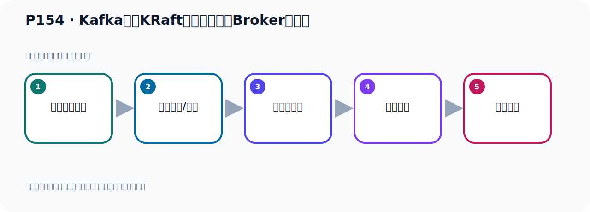

# P154：Kafka基于KRaft方式集群启动Broker服务器

> 笔记编号 154/156 · 时长 08:25 · [打开原视频 P154](https://www.bilibili.com/video/BV14J4m187jz?p=154)

[← P153: Kafka基于KRaft方式集群配置Broker服务器](../10-kraft-cluster/p153-Kafka基于KRaft方式集群配置Broker服务器.md) · [返回本章](./README.md) · [P155: Kafka基于KRaft方式集群测试 →](../10-kraft-cluster/p155-Kafka基于KRaft方式集群测试.md)

## 这节到底讲什么

**核心主题：Kafka基于KRaft方式集群启动Broker服务器。**

这是一节动手课。不要只记命令，要把前置条件、操作步骤、关键参数和成功信号连成一条验证链。
本节属于“KRaft 集群实战”这一章；放在全章里看，它的作用是：用 KRaft 取代 ZooKeeper，完成角色规划、Broker 配置、启动、测试与收尾。

## 本节路线

## 老师的完整讲解（按视频顺序校正）

> 下面保留老师的完整讲解顺序，并修正 Kafka、Java、ZooKeeper、
> Topic、Partition、Offset 等常见识别错误。它不是压缩摘要；原始 ASR 在后面单独保留。

### 1. 00:00–01:02

我们基于KROP的方式集群全部都配置好了，我们下面就开始去启动然后运行，启动运行这个集群。那么它的步骤就是这么几步。第一步我们要生成一个集群的唯一的UUID，集群UID。用它里面一个脚本叫Storign，这个脚本，后面加一个参数RundableUID。这样的话就可以生成一个集群UID。那么这个操作我们原来在启动单机环境的时候也用过，用KROP的方式启动一个单节点的Kafka当时也用过，比较熟悉。好，那我们去操作一下，我们现在是三台，那首先第一台我们去操作一下，这个时候我们切换到这个并步路下，切换到并步路下。好，这并步路下，那么它下面有一个Kafka十多级这个脚本，通过这个脚本去操作。那就是我们这个脚本，然后后面跟一个参数叫RundableUID，这样我们就生成一个UID，执行一下。

### 2. 01:02–02:04

好，等下走完，走完之后我们就生成一个UID，那么它的值就是这个值，那么这个值我们就复制出来，待会我们需要用它，复制一下。复制一下之后，我们进行第二步，第二步就是我们去格式化日志这个目录，格式化日志目录就是我们到这里面要传一个UID参数，那就是我们参数放在这位置，就这个参数放起来。那么格式化日志目录什么意思呢，就是我们在前面的我们配置了Kafka它的这个消息日志的数据都是放在这个目录的，它的所有的消息它以日志的方式来存放的，放在这个目录的，放在这个目录，放在这个目录，那就是你分别需要把它删个目录来格式换一下。格式换一下以后呢，它会在这个目录下，会生成一个Mata点Problems文件，生成这样一个文件，所以我们需要做一个格式化程序，那就是我们这个时候啊，就是十多一级，然后format了这个参数，然后这个Gaunt T表示Cluster，Cluster后面是跟上我们这个急取的UID，这个UID就是刚才生成的UID。

### 3. 02:05–02:46

后面这个Gaunt C，Gaunt C是跟我们这个Curve的那个下面的配置文件，就是sort.problems文件，这个文件我们刚才已经修改过，好，那么执行这个命令就可以了。那我们这个时候来去执行一下这个命令，好，整个这个复正一下，执行，那么执行需要在三台里面都执行，那第一台要执行一下，执行这个命令，好，回车执行了，这是第一台它执行了，执行之后你看一下啊，这9091下面它会多一些这个信息，你看格式化的时候，好，我们IoIo看一下这个目录，你看一下，你看它下面会多点个文件，对吧，这个叫格式化，好，这个格式化它又成功了，它没有报错又成功了。

### 4. 02:46–04:02

那接下来我们需要在另外两台也需要格式化一下，把它复制一下，那么在这一台呢，也格式化一下，那我们也是一样需要切换到并布一下，切换并布一下，这是并布一下，然后我们执行这个脚本，执行一下，好，那么它也格式化了，它格式化之后呢，那么在这个9092这个目录下，它会产生对应到这个文件，接下来把9093这台也格式化一下，就用它并布一下，好，把这个执行一下，执行，执行之后，那么9093下面它也会格式化，我们可以在这里看一下，你看我们IoIo看一下这个目录，你看一下，是吧，它有这个文件，那这边这个IoIo看一下9092这个目录下，看一下都有这个文件，好，那么我们第二步这个格式化就格式化好了，啊，格式化好了，好，那格式化好之后，接下来我们第三步就是启动，啊，启动这个并布下，这个server Stardt的脚本，然后后面跟上配置文件，配置里面是我们可乱红下面的那个server文件，后面加个语号，摆着后台启动，啊，也不加语号就是前台启动，好，那下面还有关闭，那关闭就先进行，好，那下面还有关闭，那关闭就先。

### 5. 04:02–04:53

那边的话就掉这个十多步的脚本，然后后面跟配置文件，好，那么启动的话，我们用这个启动，啊，当然我们在启动的时候呢，你也可以在这里吧，你不加这个语号啊，加个Diamond也可以啊，这个Diamond，加这个参数，表示后台守护进程启动，啊，也可以，好，那我现在呢，先不加这个啊，我们现在直接前台启动一下，好，前台启动，启动三台啊，三台分别启动，那有第一台启动，在这里启动，在并不加自行，啊，它，在启动第一台，启动之后我们开始字，对吧，开始字，哎，我看一下，我们没有这个脚本，那我这个是不是写错了啊，看一下啊，啊，我前面多加那个帽号，啊，多加个帽号，。

### 6. 04:54–05:47

多加个帽号，这个帽号去掉下，好，这样就可以了，对吧，然后我们这个回车，好，在第一台启动啊，然后呢，现在我们在第二台启动，站进来，前面这个帽号去掉下，帽号，多么帽号，第二台启动，好，两次行，然后第三台启动，第三台，前面帽号去掉，好，那么自此我们就把这三台服务系，我是用前台方式启动的，我们真正在线上我们倒是后台启动，现在我是前台启动啊，因为我是观察一下它的日志，看一下，所以前台启动，前台启动你倒是按一个COLOR C，它就提下来啊，好，而前方之后呢，我们可以看一下，这是它的这个日日的信息，和我们之前基于，就Publ方式也差不多，显示这个日日信息下差不多啊，。

### 7. 05:48–06:43

好，那现在我们就启动好了，启动后呢，我们看一下，我们这个位置啊，它有一个警告日志在打印啊，就是我们第一台这个机器啊，它说这个地方有个汪地门，有个警告，连到我们Node3，9.3，9083，它说不能建立连接，它说这个节点可能是不可用的，我们去观察一下，它会不会，是因为我刚才启动的时候呢，我这个第三台是在最后启动，最后启动它是不是当时连不上，是吧，现在看还打不打日志啊，如果它不打日志的话，就是我们当时因为这台在最后启动，所以它是最先启动，它最先启动它可能连不上，会报这个一个一个一个信息啊，好，那我们看个待会它也还报报，这个可以，可以等一会，因为我们现在这个Node3也启动了，对吧，希望它现在报报，现在没报了啊，没报的话呢，我们可以再开个窗口来检查一下，。

### 8. 06:43–07:37

它说年9083年不上，我们可以看一下STAT是吧，看一下端口号呢，我们这个机器上，我们通过这个长端端的时候，它看不到这个密立不能用啊，密立不能用呢，我们需要把这个什么安装一下，一个工具啊，亚蒙一十多，叫light-toosh这个工具，装进来的工具啊，好，装上之后呢，我们就开始去用light-stat-blpt回车，回到之后我们看一下端口啊，我们这个9083是有的啊，所以没有问题，因为我们这台是最后启动，可能当时我们这个最先启动，它可能连它连不上，因为这个最后启动对吧，好，我等于我这个第三台型之后，它第一台就可以连了，就没有问题了啊，好，那我们看看啊，我们这个9083，9093，9091，9092都有在三台型，。

### 9. 07:38–08:22

然后它那个空置器节点选举，9081，9082，9083也有，没有问题，这是9081，9083，下面是908929293都有，没有问题，没问题之后呢，我这个机器就7号了，7号以后，下一步就干过来，就是去测试一下，这个机器7号了啊，上面这个地方它不是报错，这个是它一些配置信息打印的，这个我们前面对见过，你看一下，这个不是报错，是它这个配置值，configure values，所以这个不是错误，好，那我们整个三台都正在启动了，好，那我接下来开始测试，测试一下。

## 关键术语

- **Kafka：** Apache 开源的分布式事件流平台，常用于高吞吐消息传递、数据管道和流处理。
- **Broker：** 运行 Kafka 服务的节点；多个 Broker 组成 Kafka 集群。
- **KRaft：** Kafka 自带的 Raft 元数据仲裁模式，可在新架构中摆脱 ZooKeeper。

## 完整原声逐段记录

[查看本节带时间戳的本地 ASR](./transcripts/p154-Kafka基于KRaft方式集群启动Broker服务器-ASR.md)。主笔记负责可读性和术语校正；ASR 页面负责完整性复核。

## 读完记住

- 本节主题是 **Kafka基于KRaft方式集群启动Broker服务器**，它服务于本章目标：用 KRaft 取代 ZooKeeper，完成角色规划、Broker 配置、启动、测试与收尾。
- 理解顺序是：确认前置条件 → 执行安装/配置 → 启动或应用 → 观察输出 → 排查失败。
- 学习时要同时核对老师的解释、画面中的配置/代码，以及最终运行结果。

## 最容易踩的坑

只照抄命令而不核对当前目录、版本、端口和配置文件路径，最容易造成“命令没报错但服务不可用”。

## 自测

1. 不看笔记，用自己的话解释“Kafka基于KRaft方式集群启动Broker服务器”解决了什么问题。
2. 按顺序复述：确认前置条件、执行安装/配置、启动或应用、观察输出、排查失败。
3. 如果运行结果和老师不同，你会先检查哪三个输入或环境条件？

## 学完检查

- [ ] 我能不看视频复述本节完整思路
- [ ] 我能指出关键命令、配置、类或接口的作用
- [ ] 我能解释画面中的输入与输出为什么对应
- [ ] 我核对过完整 ASR，没有跳过老师的补充说明
- [ ] 我完成了本节自测或复现实验
