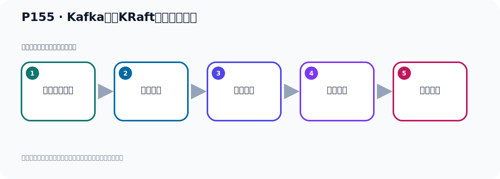

# P155：Kafka基于KRaft方式集群测试

> 笔记编号 155/156 · 时长 06:45 · [打开原视频 P155](https://www.bilibili.com/video/BV14J4m187jz?p=155)

[← P154: Kafka基于KRaft方式集群启动Broker服务器](../10-kraft-cluster/p154-Kafka基于KRaft方式集群启动Broker服务器.md) · [返回本章](./README.md) · [P156: Kafka基于KRaft方式集群测试与总结 →](../10-kraft-cluster/p156-Kafka基于KRaft方式集群测试与总结.md)

## 这节到底讲什么

**核心主题：Kafka基于KRaft方式集群测试。**

这节用实验验证前面的配置或机制。重点是记录输入、预期、实际输出，以及两者不一致时如何定位。
本节属于“KRaft 集群实战”这一章；放在全章里看，它的作用是：用 KRaft 取代 ZooKeeper，完成角色规划、Broker 配置、启动、测试与收尾。

## 本节路线

## 老师的完整讲解（按视频顺序校正）

> 下面保留老师的完整讲解顺序，并修正 Kafka、Java、ZooKeeper、
> Topic、Partition、Offset 等常见识别错误。它不是压缩摘要；原始 ASR 在后面单独保留。

### 1. 00:00–00:52

我们的基于KRaft的方式搭建了Kafka集群，它已经启动好了。我们下面就是用这个程序连接去测试一下它。那这个程序我们可以继续使用之前我们测试基于ZooKeeper方式集群的代码。那这里我们只需要改一下什么呢？改一下这个连接的信息，我们现在用的是129这个IP，之前是128，我们把它128改为129。然后这里面改成129，然后第一个是9091、9092、9093。好，IP改一下，那其他地方都一样，是吧？不用动啊，然后这个多余的，这个没写上多余的。好，那我们这样就可以了，把IP改了。好，改了之后呢，我们就可以测试，测试的话，我们第一步干嘛呢？

### 2. 00:53–01:47

第一步就是在这个用这个创建一下它的这个主题分区，还有它的副本，最主要这个副本。我们三个节点，那这个所谓创建三个副本，可以有没有问题，能不能创造成空，那我们这个主题让我们改一下我们的叫Korovt，Korovt这个Tomic，叫这个名字。好，那我们是给它两个分区，我们给它三个分区吧，三个分区，然后三个副本，这是三个副本。好，写好了。写好了之后呢，我们现在先别做这个消费，消费者这个先做试一下。好，它这个方已经做为了，没问题啊，它没有消费，这个做为了。好，那我们就是把这个成语启动。其头以后呢，它就会加在这个配置内，那么它就会创造这个B，创造这个B的话，它会创造这个Tomic，然后给三个副本，看看它正不正常，那此时呢，我们可以跑一下的代码。

### 3. 01:47–02:33

通过内方运行啊，好，那这次就在内方运行，那我们这个手就直接在这里运行啊，下面这些东西是之前测试的，现在不管它，这个不影响啊，这是测试它里面的一些B的，不影响，我们直接这样运行一下，右键，然后这个运行一下。好，看看它能否通过这个配置方式创建Tomic，给它指定这个副本。好，那么启动运行，运行之后呢，在运行完了啊，这个没有提下来，这个，你让它红色了没有提下来，它还运行完了，运完之后你看这里也没有爆什么错误啊，正常的，是吧，正常的，没有报错，好，那现在我们可以去看一下呢，它的这个，有没有什么问题啊，那就在我们这里面卡网这里，连一下。

### 4. 02:34–03:32

那我们之前这个是连的是128啊，128那我们现在要连一个129啊，那我们这里改一下啊，好，那我们这里就是写上192.168.11.129啊，第一台是9091，我们这样连一下。这个名字也用这个IP做名字，好，然后我们这个地方就直接点一下测试，测试一下。测试一下我们是199091，测试好像半天没连上啊，我们看看我们这边这个，开个通通看一下它是不是方向没关，我们看一下。防火墙SOSTM，防火墙，啊，这个防火墙它确实没有关啊，防火墙没有关，防火墙没有关的话我们在Windows里面是连不上的啊，确实是连不上，你看。就是我那个时候的防火墙要关一下，或者说你把它这个端口给开放，比如说9091啊，9092啊，9093要开放端口。

### 5. 03:32–04:22

要么是关防火墙，要么是开放端口，不能的话你这个Windows是连不上的，好，那这样的话我直接把这个防火墙先关一下。关下来我们就直接Store Pro，Store Pro，关掉啊，Store Pro，File One，然后把以后我就避免我以后再次去操作它还是有问题我们直接把它进用啊，把防火墙进用，Disciple一下，把防火墙进用了，好，以后的话这个防火墙就不会再起要起了，它已经进用了。这个时候我们再出去测一下，看能不能连上，点一下，你看，防火墙关了之后，这边就连上了啊，连上了，好，OK。好，那我们再连一下第二台，第二台，那9092，那这边9092，第二台啊，然后这下面啊，下面不能动，测试一下，连上去了，OK一下。

### 6. 04:23–05:28

第三台我先连上去啊，连上去之后，93，这台93，测试一下，可以连上，OK一下，好，那我这三台都连上了啊，连上了，连上之后呢，我们刚才我启动的时候，我的日志是这种的啊，看一下这里。好，那我刚才启动的时候呢，我这个程序啊，它应该是，应该在于报错了，测试了，那就是什么呢？这就是它连上的Linux，因为之前Linux的伏隙防火墙没有关，所以它在于报错了，所以我们现在这个没有出来成功，脱一个没有出来成功，也测试报错了嘛，连上，这是因为我防火墙没有关，现在我把防火墙之前是开着的，现在已经关了，好，关了之后，我们重新在运行代码，那此时呢，它这边这个，这个Topic，应该就可以看到了啊，应该就可以看到了，好，再来测一下啊，再来走一下，那就是把妹风啊，再运行，好，又进，运行一下。

### 7. 05:32–06:11

好，运行完了，是吧，结束了，好，这一次它没报错啊，之前好像在这个一直停在这里的，是吧，卡住了啊，停在这里的，好，现在它进程了，你走完了，走完之后，啊，上面这个是正常的，不是错误啊，是打一些这个信息啊，打一些信息，这不是异常啊，是正常的，好，完了之后呢，我们这个时候再看一下这个Kafka，那我们在这里呢，呃，129这个机器，我们先刷新一下，刷新，可以看到Topic，Topic，可以看到，对吧，我们是三个副本啊，三个副本，是可以看到的啊，三个副本，然后这一台在这个刷新，那也是可以看到的吧，可以看到啊，三个副本，然后这一台，刷新，刷新，。

### 8. 06:12–06:44

也可以看到，好，那我们创建这个Topic啊，就正常了，没有问题，啊，这是创建Topic，好，Topic出来了之后，我们下一步啊，就是收发消息，看着它是不是正常的，好，那我们这个Topic啊，包括分区，包括它的这个副本的设置，创建成功，那我们这个棘取呢，是可以使用的，没有问题的，看一下我们这边的日志，没有报错，这边的日志，没报错，这个日志没报错啊，好，那我们接下来就开始去发消息，接消息，再接下来，再。

## 关键术语

- **Kafka：** Apache 开源的分布式事件流平台，常用于高吞吐消息传递、数据管道和流处理。
- **Topic：** 事件的逻辑分类。生产者向 Topic 写数据，消费者从 Topic 读取数据。
- **ZooKeeper：** 旧版 Kafka 用于集群元数据和控制器协调的外部服务。
- **KRaft：** Kafka 自带的 Raft 元数据仲裁模式，可在新架构中摆脱 ZooKeeper。

## 完整原声逐段记录

[查看本节带时间戳的本地 ASR](./transcripts/p155-Kafka基于KRaft方式集群测试-ASR.md)。主笔记负责可读性和术语校正；ASR 页面负责完整性复核。

## 读完记住

- 本节主题是 **Kafka基于KRaft方式集群测试**，它服务于本章目标：用 KRaft 取代 ZooKeeper，完成角色规划、Broker 配置、启动、测试与收尾。
- 理解顺序是：准备测试条件 → 执行操作 → 读取结果 → 对照预期 → 形成结论。
- 学习时要同时核对老师的解释、画面中的配置/代码，以及最终运行结果。

## 最容易踩的坑

测试前残留的 Topic、Offset、缓存或旧进程会污染结果；每次实验都要先确认初始状态。

## 自测

1. 不看笔记，用自己的话解释“Kafka基于KRaft方式集群测试”解决了什么问题。
2. 按顺序复述：准备测试条件、执行操作、读取结果、对照预期、形成结论。
3. 如果运行结果和老师不同，你会先检查哪三个输入或环境条件？

## 学完检查

- [ ] 我能不看视频复述本节完整思路
- [ ] 我能指出关键命令、配置、类或接口的作用
- [ ] 我能解释画面中的输入与输出为什么对应
- [ ] 我核对过完整 ASR，没有跳过老师的补充说明
- [ ] 我完成了本节自测或复现实验
