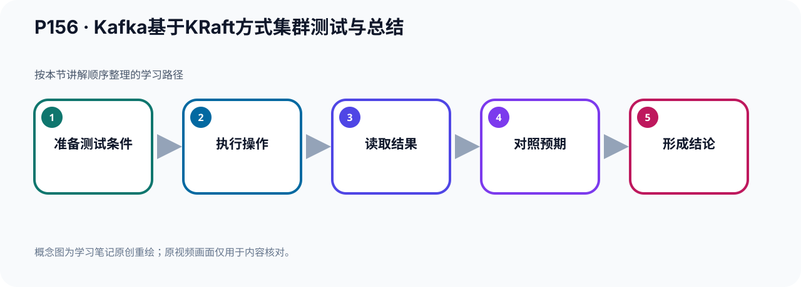

# P156：Kafka基于KRaft方式集群测试与总结

> 笔记编号 156/156 · 时长 03:19 · [打开原视频 P156](https://www.bilibili.com/video/BV14J4m187jz?p=156)

[← P155: Kafka基于KRaft方式集群测试](../10-kraft-cluster/p155-Kafka基于KRaft方式集群测试.md) · [返回本章](./README.md)

## 先看结论

> 这节围绕“Kafka基于KRaft方式集群测试与总结”做实验验证，重点不是看见一次成功，而是说清输入、预期、实际输出以及不一致时的排查顺序。它服务于本章目标：用 KRaft 取代 ZooKeeper，完成角色规划、Broker 配置、启动、测试与收尾。

## 老师怎么一步步讲

1. 第 1 步，围绕“Kafka基于KRaft方式集群测试与总结”完成准备测试条件。
2. 第 2 步，围绕“Kafka基于KRaft方式集群测试与总结”完成执行操作。
3. 第 3 步，围绕“Kafka基于KRaft方式集群测试与总结”完成读取结果。
4. 第 4 步，围绕“Kafka基于KRaft方式集群测试与总结”完成对照预期。
5. 第 5 步，围绕“Kafka基于KRaft方式集群测试与总结”完成形成结论。

## 老师的补充说明

下面按原声顺序整理老师的完整讲解脉络。保留原因、案例、对比、操作过程、边界条件和口头提醒；删除重复语气词，并把长口语拆成适合阅读的短段落。

> 技术术语已经过统一校正；仍无法确认的人名或口头英文会保留原意，并通过右侧时间范围返回视频核对。

### 先明确：Kafka基于KRaft方式集群测试与总结要解决什么 · 00:00–01:10

我们基于KRaft的方式的Kafka集群，通过配置Beyon创建主题、分区和副版已经成功创建了。我们这边的数据显示正常，下面我们去做一个发消息和接消息的测试。我们这个程序连累了就是我们搭访了这三台Kafka集群，我们去发个消息。发消息的话，我们在这个消费者这里，首先把消费者关闭，先不接收，先不接收，我们先去发，先去发的话，我们现在在这里发，那这里就发两条消息。那么这个托比卡我们换个名字，因为刚才我们创建这个托比卡叫做KRaft的托比卡，叫这个名字。

那我们就发到这个托比卡里面去，发这里面去。那我们发的话，我们在这个Task里面去调一下它，去发两条消息。大家这里右键的预期发送一下，发两条消息。这个是看一下。那么它消息就发出去了，这个日志这边都显示正常的，正常日志这边都两个钩打钩的。

### 跟着老师操作，并观察运行结果 · 01:11–02:20

那我们在这里可以看一下，之前这边是空的，我们现在刷新一下，看看它里面有没有消息，看一下，这边有两条消息，对吧，有两条消息。然后这一台也可以刷新看一下，有两条消息，这一台，911这一台，刷新两条消息，消息已经发出去了，然后我们去接收消息，去接收。去接收消息，我们这个时候就是把这个接收这里打开，这个消息打开。那我们的托比卡名字是叫KRaft的托比卡，就是名字。到我们的分组来到，我们改名字，分组比较多。那么分组就是叫KRaft这个Golub，这个名字，好，去消费。

那现在我们去消费的时候，我们知道，它默认是从最新的位置开始消费，起头以后，从最新位置开始消费。所以我为了消费之前发的这个消息，我应该在这边去读取它最早的消息，是吧，读取最早消息，说明加这个配置读取最早的消息。那我们这个地方就写好了，写好了中了，我们现在就在这个内方运行，运行之后到这个接电器就起头了，起头之后它就可以接收消息。

### 最后验证结果，并收束本节结论 · 02:20–03:15

那我们运行这个内方法，右键的，让这个运行一下。运行以后，我们看一下我们的这个消息，你们接到了吗？看一下我们这个消息，诶，接到了，这是在下面，在下面，我们刚发的是两条消息，我们接收到就是两条消息。那么我们这个测试是正确的，没有问题。那这就是我们基于可绕的方式，它的一个集群，它的一个搭建，以及它的一个测试。那么本课程，我们就给它先讲到这个位置。如果大家需要学习卡木卡的话，可以多回来，看一看本套视频，同时给本套视频点点赞。那么本课程，我们就到这里，就结束了。

我们在下面的新的课程中，再与大家见面。

## 放进整套课

本节属于 **KRaft 集群实战**。这一章要解决的是：用 KRaft 取代 ZooKeeper，完成角色规划、Broker 配置、启动、测试与收尾。

这节用实验验证前面的配置或机制。重点是记录输入、预期、实际输出，以及两者不一致时如何定位。

### 记忆路线

```mermaid
flowchart LR
    N0["准备测试条件"]
    N1["执行操作"]
    N0 --> N1
    N2["读取结果"]
    N1 --> N2
    N3["对照预期"]
    N2 --> N3
    N4["形成结论"]
    N3 --> N4
```

## 用在工作里

| 项目 | 内容 |
|---|---|
| 先回答 | 先写下测试输入、前置状态和预期结果。 |
| 立刻做 | 执行测试并同时观察日志、Topic、Partition 与 Offset 变化。 |
| 留下证据 | 留下实际结果、差异原因和重新验证的证据。 |

## 关键术语

- **Kafka：** Apache 开源的分布式事件流平台，常用于高吞吐消息传递、数据管道和流处理。
- **KRaft：** Kafka 自带的 Raft 元数据仲裁模式，可在新架构中摆脱 ZooKeeper。

## 最容易踩的坑

测试前残留的 Topic、Offset、缓存或旧进程会污染结果；每次实验都要先确认初始状态。

## 自测

1. 不看笔记，用自己的话解释“Kafka基于KRaft方式集群测试与总结”解决了什么问题。
2. 按顺序复述：准备测试条件、执行操作、读取结果、对照预期、形成结论。
3. 如果运行结果和老师不同，你会先检查哪三个输入或环境条件？

## 学完检查

- [ ] 我能不看视频复述本节完整思路
- [ ] 我能指出关键命令、配置、类或接口的作用
- [ ] 我能解释画面中的输入与输出为什么对应
- [ ] 我读完了老师的详细讲解正文，没有只看路线图和要点
- [ ] 我完成了本节自测或复现实验

## 需要核对原话时

[查看本节带时间戳的完整 ASR](./transcripts/p156-Kafka基于KRaft方式集群测试与总结-ASR.md)。主笔记负责理解与实践；ASR 页面负责逐句完整性复核。
